```{r setup, echo = F}
knitr::opts_chunk$set(
  comment = "#",
  collapse = TRUE,
  warning = FALSE,
  message = FALSE,
  fig.width=5, fig.height=5, fig.retina=3,
  fig.align = 'center'
)
```

```{r, echo =F}
options(repos=structure(c(CRAN="http://cran.r-project.org")))
```

```{r, include = FALSE}
if (!require(DiagrammeR)) install.packages("DiagrammeR")
library(DiagrammeR)
if (!require(widgetframe)) install.packages("widgetframe")
library(widgetframe)
if (!require(ggplot2)) install.packages("ggplot2")
library(ggplot2)
```


## Workshop 1: Introduction to R

<br>

.center[

]


Website: http://qcbs.ca/wiki/r/workshop1


---
class: inverse, center, middle

# Introduction

---
## What is R?

.pull-left[
R is an open source programming language designed for statistical analysis, data mining, and data visualization.
]

.pull-right[

]

---
## Why use R?

**It's open source**

 Improved **by** the public, **for** the public!

 **Free!**

.right[

]


---
## Why use R?

.center[

]


**It's compatible**

R works on most existing operating systems

---
## Why use R?

What people have traditionally done to analyze their data:

```{r, echo = FALSE}
  grViz("
      digraph {

      node [shape = oval, fillcolor = PaleTuruoise]
      Data; Graphs; Tables; Statistics

      node [shape = box]
      Sigmaplot; Excel; SAS

      ##add arrows
      edge [arrowhead = none]
      Data -> Sigmaplot; Data -> Excel; Data -> SAS;

      edge [arrowhead = normal]
      Sigmaplot -> Graphs; Excel -> Tables; SAS -> Statistics;

      }")

```

---
## Why use R?

R allows you to do everything with one program, which is nice!
```{r, echo = FALSE}
grViz("
      digraph {

      node [shape = oval, fillcolor = PaleTuruoise]
      Data; Graphs; Tables; Statistics

      node [shape = box]
      R

      ##add arrows
      edge [arrowhead = none]
      Data -> R;

      edge [arrowhead = normal]
      R -> Graphs; R -> Tables; R -> Statistics;

      }")

```


---
## Why use R?

- More and more scientists use it every year!
- Increasing capacities

.center[]


---
## Challenge

.pull-left2[
- Throughout these workshops you will be presented with a series of challenges that will be indicated by these rubik's cubes
- During challenges, collaborate with your neighbours!
]


.pull-right2[

]


---
## Challenge 1  

.center[Open Rstudio]

<br>

.center[

]


---
## The Rstudio console


---

## Note for Windows user

If the restriction `unable to write on disk` appears when you try to open R-Studio or to install a package,

.center[.alert[don't worry!]]

.large[We have the solution!]

- Close the application.
- Right-click on your R-Studio icon and chose: "Execute as administrator" to open the program.

---
## How to read the console

Text in the console typically looks like this:

.comment[You always have to push "enter" for the input to run in the console.]

```{r, include = FALSE}
output <- "This is the output"
```

```{r}
output
```

---
## How to read the console

```{r}
output
```

What does this bracket `[]` in the output means?

---
## How to read the console

```{r}
output
```

The bracket help you to locate *where* you are in the output

```{r, echo = FALSE}
c(1:40)
```

---
## Error and Warning

- .alert[Warning message] cautions users without halting the execution of a function. Although the function can and will give you an answer, there might be a problem with your inputs. Thus, the computation could be flawed.

- .alert[Error message] will stop the current execution because R can’t carry it out. It indicates a problem in your code

.center[
**To solve *error*, google is your bestfriend!**
]


---
class: inverse, center, middle

# Using R as a calculator &nbsp; 

---
## AArithmetic Operators

- Additions and Substractions

```{r}
1+1

10-1
```

---
## Arithmetic Operators

- Multiplications and Divisions

```{r}
2*2

8/2
```

---
## Arithmetic Operators

- Exponents

```{r}
2^3
```

---
## Challenge 2 


Use R to calculate the following skill testing question:

$$
2+16*24-56
$$

<br>
<br>

.comment[**Hint**: The `*` symbol is used to multiply]

---
## Challenge 2: Solution 


$$
2+16*24-56
$$


```{r}
2+16*24-56
```

---
## Challenge 3 

Use R to calculate the following skill testing question:

$$
2+16*24-56 / (2+1)-457
$$

<br>
<br>

.comment[**Hint**: Think about the order of the operation.]

---
## Challenge 3: Solution 

Use R to calculate the following skill testing question:

$$
2+16*24-56 / (2+1)-457
$$


```{r}
2+16*24-56/(2+1)-457
```

<br>
<br>

.comment[Note that R respects the order of the operations]

---
## R command line tip


Use the  and  arrow keys to reproduce previous commands.

Give it a try!


.center[
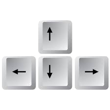
]


---
## Challenge 4 

What is the area of this circle which has a radius of $5\ cm$?

```{r echo = F}
radius <- 1
theta <- seq(0, 2*pi, length = 200)
plot(c(-1, 1), c(-1, 1), type = "n", ann = F, axes = F, asp = 1)
lines(x = radius * cos(theta), y = radius * sin(theta))
arrows(0, 0, x1 = 1, length = 0)
text(.5, .1, "radius = 5 cm", cex = 1)
```

---
## Challenge 4: Solution 


What is the area of this circle which has a radius of $5\ cm$?


```{r}
3.1416*5^2
```

.comment[**Hint**: Note that `R` has some built-in constant such as &pi;, so you can write:]

```{r}
pi*5^2
```

---
class: inverse, center, middle

# Objects

---
## Objects

- One of the most useful concept in `R`!
- You can store values as named objects using the assignment operator `<-`

```{r, eval = F}
object name <- assigned value
```

The value on the **right** is assigned to the name on the **left** with the assignement operator `<-`

.comment[It is also possible to use the `=` sign, but it is better to **avoid it** as it is also used for other purposes.]

---
## Objects names

- Objects names can only include:

|  Type      |  Symbol |
|------------|:-------:|
| Letters    | a-z A-Z |
| Numbers    |     0-9 |
| Period     |       . |
| Underscore |       _ |

- Objects names should **always** begin with a letter.
- `R` is **case sensitive**, the names `Data1` and `data1` are not the same.
- You can **not** use special characters! (@, /, etc.)

---
## Good practices in R code

**Name**
- Try having short and explicit names for your variables. Naming a variable `var`  is not very informative.
- Use an underscore `_` to separate words within a name or try to be consistent!
- Avoid using names of existing functions and variables (e.g. `c` or `table`)

**Space**
- Add spaces around all operators (`=`, `+`, `-`, `<-`, etc.) to make the code more readable.
- Always put a space after a comma, and never before (just like in regular English).

```{r}
mean_x <- (2 + 6) / 2

mean_x
```

---
## Challenge 5 

<br>

Create an object with a value of 1+1.718282 (Euler's number) and name it `euler_value`.

---
## Challenge 5: Solution 


<br>

Create an object with a value of 1+1.718282 (Euler's number) and name it `euler_value`.


```{r}
euler_value <- 1+1.718282

euler_value
```

---
## Challenge 6 

Create a second object (you decide the name) with a name that starts with a number. What happens?

---
## Challenge 6: Solution 


Create a second object (you decide the name) with a name that starts with a number. What happens?

<br>

Creating an object name that starts with a number returns the following error:

```{r, eval = F}
Error: unexpected symbol in "[your object name]"
```

---
## R command line tip

- Use the tab key to autocomplete scripts
- This helps avoid spelling errors and speeds up command entering

<br>

Let's try it!

---
## R command line tip

- Enter `eu`
- Push tab
- Use the arrow keys and push enter to select the correct autocomplete

---
class: inverse, center, middle

# Types of data structures in R

---
## Types of data structures in R

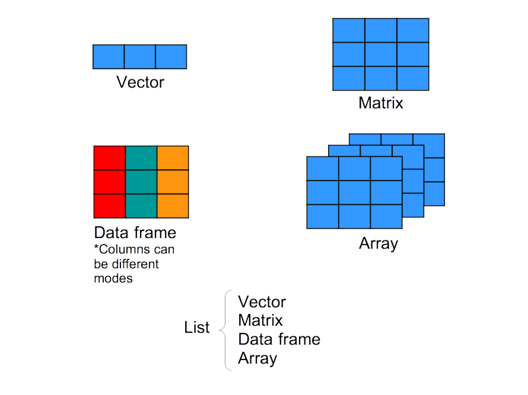

---
## Types of data structures in R

`vector`  A combination of elements of the same data type. Basic data structure of R; all other objects consist of one or more vectors.

--

`matrix`  2D object generated by combining multiple vectors of the same type. We can do operations on matrices in R (+, -, *, ...).

--

`array`  3D object generated by combining multiple matrices of the same type. Vector = 1D array. Matrix = 2D array.

--

`data.frame`  2D object generated by combining several vectors of any type. Each column must be of the same type, but a dataframe may contain columns of different types. Several statistical functions (eg regression) use dataframes.

--

`list`  A list store collections of objects of any types.

---
## Types of data structures in R

`vector`  A combination of elements of the same data type. Basic data structure of R; all other objects consist of one or more vectors.

`matrix`  A matrix is a 2D object, i.e. a combination of vectors all of the same data type. We can do operations such as addition and multiplication on matrices in R.

`array`  An array is a 3D object, i.e. a combination of  matrices all of the same data type. So, a vector is a special case of array with 1D and a matrix is a special case of array with 2D. An array with 3 or more dimensions is an n-dimensional array.

`data.frame`  A dataframe is a 2D object generated by combining multiple vectors of any data type. Each column must be of the same data type, but data type may vary by column. Regression and other statistical functions usually use dataframes.

`list` A list store collections of objects of any types.
---
## Vectors

- An entity consisting of a sequence of elements of the same basic type
- A single value is called an *atomic value*
- All values of a vector must have the **same mode** (or class).
      * Numeric: only numbers
      * Logical: True/False entries
      * Character: Text, or a mix of text and other modes

---
## Vectors

- Creating vectors usually require the `c` function

.comment[`c` stands for *combine* or *concatenate*.]

- The syntax is:

```{r, eval = F}
vector <- c(value1, value2, ...)
```

---
## Vectors

- Numeric vectors

```{r}
num_vector <- c(1, 4, 3, 98, 32, -76, -4)

num_vector
```

- Character vectors

```{r}
char_vector <- c("blue", "red", "green")

char_vector
```

---
## Vectors

- Logical vectors

```{r}
bool.vector <- c(TRUE, TRUE, FALSE)

bool.vector
```

You can just write T for TRUE and F for FALSE, it's exactly the same
```{r}
bool.vector2 <- c(T, T, F)

bool.vector2
```

---
## Challenge 7 

- Create a vector containing the first 5 odd numbers, starting from 1
- Name it `odd_n`

---
## Challenge 7: Solution 


- Create a vector containing the first 5 odd numbers, starting from 1
- Name it `odd_n`


```{r}
 odd_n <- c(1,3,5,7)
```

---
## Vectors

We can use vectors for calculations

```{r}
  x <- c(1:5)
  y <- 6
```

.comment[The colon symbol `:` is used to combine all values between the first and the second provided numbers. `c(1:5)` returns `1, 2, 3, 4, 5`]

```{r}
x+y

x*y
```

---
## Data frames

- Used to store data tables
- A list of vectors of the same length
- Columns = variables
- Rows = observations, sites, cases, replicates, ...
- Differents columns can have different modes

---
## Data frames

Let's say you want to store this table in `R`:

<br>

|ID of the site|soil pH|# of species|treatment|
|---|---|---|---|
|A1.01|5.6|17|Fert|
|A1.02|7.3|23|Fert|
|B1.01|4.1|15|No Fert|
|B1.02|6.0|7|No Fert|

---
## Data frames

One way of doing it is:
- Start by creating vectors

```{r}
site_id <- c("A1.01", "A1.02", "B1.01", "B1.02")
soil_pH <- c(5.6, 7.3, 4.1, 6.0)
num_sp <- c(17, 23, 15, 7)
treatment <- c("Fert", "Fert", "No_fert", "No_fert")
```

- We then combine them using the function `data.frame`

```{r}
my_df <- data.frame(site_id, soil_pH, num_sp, treatment)
```

.comment[We will come back to the `data.frame` function later.]

---
## Data frames

```{r}
my_df
```

---
## Matrices, Arrays and Lists

.center[

]


---
## Indexing objects

To look at or extract part of our data, you can use **brackets** `[]`

We indicate the **position** of the values we want to see between the brackets. It's called *indexing*.

---
## Indexing vectors


You can use indexing to chose a particular position, let's say we want to see the second value of our `odd_n` vector


```{r}
odd_n[2]
```

It also work with multiple position:


```{r}
odd_n[c(2,4)]
```

It can be used to remove some values at particular positions


```{r}
odd_n[-c(1,2)]
```

---
## Indexing vectors


If you select a position that is not in the vector it will return:

```{r}
odd_n[c(1,5)]
```

You can also use conditions to select values:


```{r}
odd_n[odd_n > 4]
```


```{r}
char_vector[char_vector == "blue"]
```


.comment[Logical statements such as `>` will be described in more details later.]


---
## Challenge 8 

Using the vector `num_vector`

- Extract the 4th value
- Extract the 1st and 3rd values
- Extract all values except for the 2nd and the 4th

---
## Challenge 8: Solution 

- Extract the 4th value

```{r}
num_vector[4]
```

- Extract the 1st and 3rd values

```{r}
num_vector[c(1,3)]
```

- Extract all values except for the 2nd and the 4th

```{r}
num_vector[c(-2,-4)]
```

---
## Challenge 9 

Explore the difference between these 2 lines of code:

```{r, eval = F}
char_vector == "blue"

char_vector[char_vector == "blue"]
```

---
## Challenge 9: Solution 

```{r}
char_vector == "blue"
```

In this line of code, you **test a logical statement**. For each entry in the `char_vector`,  `R` checks whether the entry is equal to `blue` or not.

```{r}
char_vector[char_vector == "blue"]
```

In this line of code, you ask `R` to extract all values within the `char_vector` vector that are exactly equal to `blue`.

---
## A quick note on logical statements

`R` allows testing of logical statements, *i.e.* testing whether a statement is true or false.

You need to use logical operators for that.

<br>

|Operator|Description|Example|
|-------------|-------------------------|-------------------------------|
|`<` and `>`  |less than or greater than|`odd_n > 3`                    |
|`<=` and `>=`|less/greater or equal to |`odd_n >= 3`                   |
|`==`         |exactly equal to         |`odd_n == 3`                   |
|`!=`         |not equal to             |`odd_n != 3`                   |
|`x`&#124;`y` |x OR y                   |`odd_n[odd_n >= 5` &#124; `odd_n < 3]`|
|`x & y`      |x AND y                  |`odd_n[odd_n >=3 & odd_n < 7]` |

---
## Indexing data frames

To index a data frame you must specify two dimensions: row and column number, using the following syntax:

```r
data.frame.name[row, column]
```

---
## Indexing data frames: examples

`my_df[1,]`  Extracts the first line


.comment[Note that an empty index select **all** the values.]

`my_df[,3]`  Extracts the third column


`my_df[2,4]`  Extracts the second element of the fourth column


---
## Indexing data frames: examples

`my_df[c(2,4),]`  Extracts lines 2 to 4

.comment[The examples given so far are also valid for indexing matrices, this is not the case for the following examples.]


`my_df$site_id`  Extracts the variable `site_id` from the data frame

`my_df$site_id[2]`  Extracts the second value of the variable `siteID` from the data frame


`my_df[c("site_id", "soil_pH")]`  Extracts the `site_id` and `soil_pH` variables from the data frame.


---
## Challenge 10 

1. Extract the `num_sp` column from `my_df` and multiply its value by  the first four values of `num_vec`.

2. After that, write a statement that checks if the values you obtained are greater than 25.

---
## Challenge 10: Solution 

1. Extract the `num_sp` column from `my_df` and multiply its value by  the first four values of `num_vec`.

```{r}
my_df$num_sp * num_vector[c(1:4)]
# or
my_df[,3] * num_vector[c(1:4)]
```

2. After that, write a statement that checks if the values you obtained are greater than 25.


```{r}
(my_df$num_sp * num_vector[c(1:4)]) > 25
```

---
class: inverse, center, middle

# Functions

---
## Functions

.pull-left2[
A function is a tool to simplify your life.

It allows you to quickly execute operations on objects without having to write every mathematical step.

A function needs entry values called **arguments** (or parameters). It then performs hidden operations using these arguments and gives a **return value**.
]

.pull.right2[

]

---
## Functions

To use (call) a function, the command must be structured properly, following the "grammar rules" of the `R` language: the syntax.

```{r, eval = F}
function_name(argument 1, argument 2)
```

---
## Arguments

Arguments are **values** and **instructions** the function needs to run.

Objects storing these values and instructions can be used in functions:

```{r}
a <- 3
b <- 5
sum(a,b)
```

---
## Challenge 11 

- Create a vector `a` that contains all the numbers from 1 to 5
- Create an object `b` with a value of 2
- Add `a` and `b` together using the basic `+` operator and save the result in an object called `result_add`
- Add `a` and `b` together using the `sum` function and save the result in an object called `result_sum`
- Compare `result_add` and `result_sum`. Are they different?
- Add 5 to `result_sum` using the `sum` function

---
## Challenge 11: Solution  

```{r}
a <- c(1:5)
b <- 2

result_add <- a + b

result_sum <- sum(a,b)
```

```{r}
result_add

result_sum

sum(result_sum, 5)
```

---
## Challenge 11: Solution  

The operation `+` on the vector `a` adds 2 to each element. The result is a vector.

The function `sum` concatenates all the values provided and then sum them. It is the same as doing 1+2+3+4+5+2.

---
## Arguments

- Arguments each have a **name** that can be provided during a function call.

- If the name is not present, the order of the arguments does matter.

- If the name is present, the order does not matter.

---
## Challenge 12 

`plot` is a function that draws a graph of y as a function of x. It requires two arguments names `x` and `y`. What are the differences between the following lines?

```{r, eval = F}
a <- 1:100
b <- a^2
plot(a,b)
plot(b,a)
plot(x = a, y = b)
plot(y = b, x = a)
```

---
## Challenge 12: Solution 

```{r, echo = F}
a <- 1:100
b <- a^2
par(mfrow = c(2,2),mar=c(4,4,1,1))
plot(a,b)
plot(b,a)
plot(x = a, y = b)
plot(y = b, x = a)
```

---
## Challenge 12: Solution

.pull-left[
```{r,eval=F}
plot(a,b)
```

```{r, echo = FALSE, fig.width=3.6, fig.height=3.6}
par(mar=c(4,4,1,1))
plot(a,b)
```
]

.pull-right[
```{r,eval=F}
plot(b,a)
```

```{r, echo = FALSE, fig.width=3.6, fig.height=3.6}
par(mar=c(4,4,1,1))
plot(b,a)
```
]

The shape of the plot changes, as we did not provided the arguments names, the order is important.

---
## Challenge 12: Solution

.pull-left[
```{r,eval=F}
plot(x = a, y = b)
```

```{r, echo = FALSE, fig.width=3.6, fig.height=3.6}
par(mar=c(4,4,1,1))
plot(x = a, y = b)
```
]

.pull-right[
```{r,eval=F}
plot(y = b, x = a)
```

```{r, echo = FALSE, fig.width=3.6, fig.height=3.6}
par(mar=c(4,4,1,1))
plot(y = b, x = a)
```
]

Same as `plot(a,b)`. The argument names are provided, the order is not important.

---
class: inverse, center, middle

# Packages

---
## Packages

Packages are a **grouping of functions** and/or **datasets** that share a similar **theme**, e.g. statistics, spatial analysis, plotting, etc.

**Everyone** can develop packages and make them available to others.

Many packages available through the *Comprehensive R Archive Network* [CRAN](http://cran.r-project.org/web/packages/) and now many more on GitHub ](https://github.com/)

<br>

.alert[Guess how many packages are available?]

---

<iframe height=100% width=100% src="images/R Package Documentation.htm" style="border:none;"></iframe>

---
## Packages

To install packages on your computer, use the function `install.packages`.

```r
install.packages("package name")
```

Installing a package is not enough to use it. You need to load it into your workspace before using it using the `library` function.

```r
library(package name)
```

---
## Package: an example

```{r, eval = F}
install.packages("ggplot2")
```

```{r, eval = F}
Installing package into '/home/labo/R/x86_64-redhat-linux-gnu-library/3.3'
(as 'lib' is unspecified)
```

```{r, eval = F}
qplot(1:10, 1:10)
```

```{r, eval = F}
## Error: could not find function "qplot"
```

---
## Package name: an example


```{r, fig.width=4, fig.height=4}
library(ggplot2)
qplot(1:10, 1:10)
```

---
class: inverse, center, middle

# Getting help

---
## Searching for functions

WOW! `R` is so great! So many functions to do what I want!

But... how do I find them?

---
## Searching for functions

To find a function that does something specific in your installed packages, you can use `??` followed by a search term.

Let's say we want to create a *sequence* of odd numbers between 0 and 10 as we did earlier. We can search in our packages all the functions with the word "sequence" in them:

```{r, eval = F}
??sequence
```

---
## Search results


---
## Search results


---
## Search results

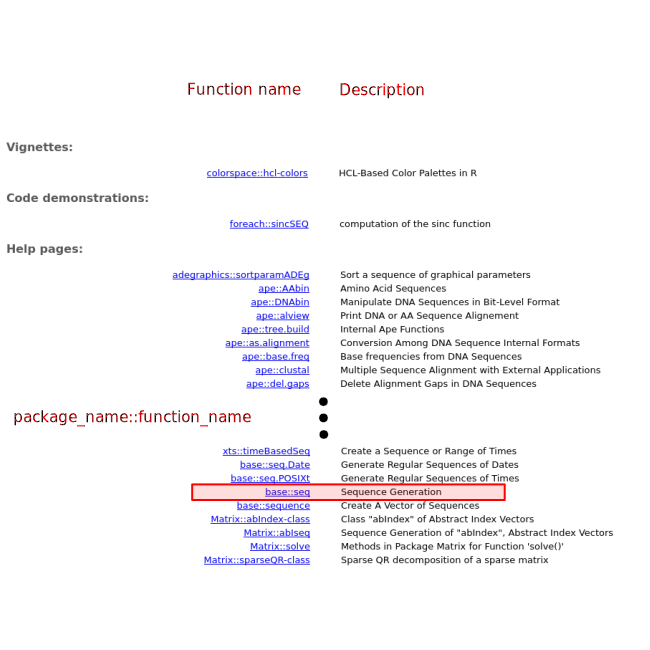

---
## Getting help with functions

OK! SO let's use the `seq` function!!

But wait... how does it work? What arguments does it need?

To find information about a function in particular, use `?`

```{r, eval = F}
  ?seq
```

---
## Help pages

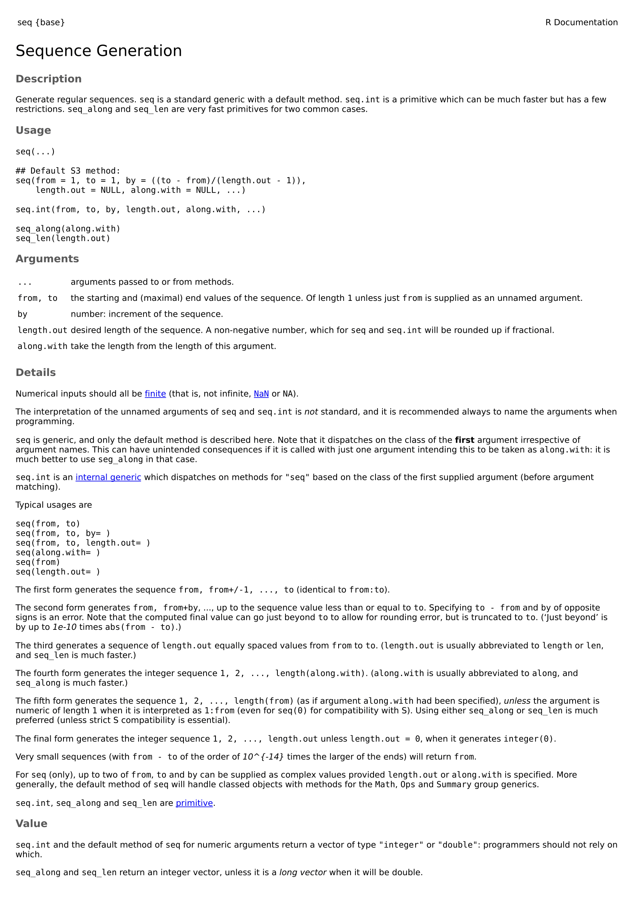

---
## Description

- `function_name {package_name}`
- Description: a short description of what the function does.

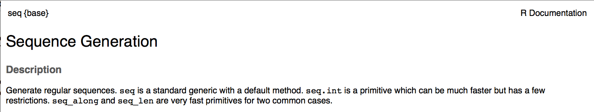

---
## Usage

- How to call the function
- If `name = value` is present, a default value is provided if the argument is missing. The argument becomes optional.
- Other related functions described in this help page

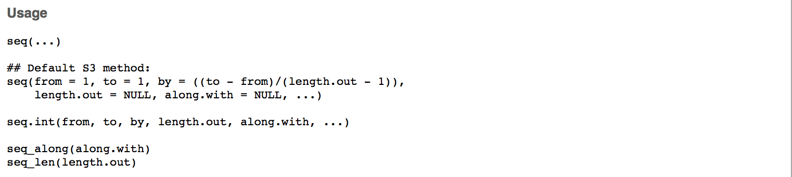


---
## Arguments

- Description of all the arguments and what they are used for

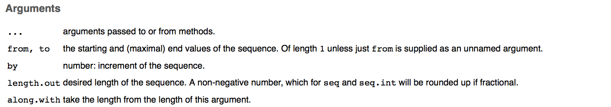

---
## Details

- A detailed description of how the functions work and their characteristics


---
## Value

- A description of the return value

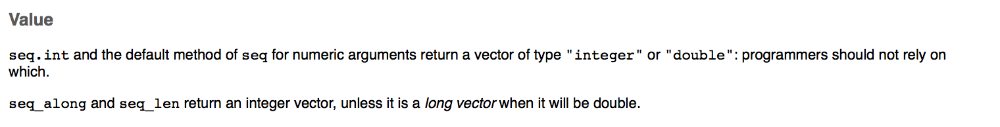

---
## See Also

- Other related functions that can be useful


---
## Examples

- Reproducibles examples

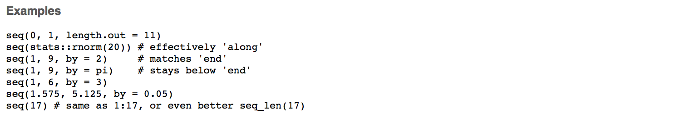

---
## Challenge 13 

1. Create a sequence of even numbers from 0 to 10 using the `seq` function.

2. Create a unsorted vector of your favourite numbers, then sort your vector in reverse order.

---
## Challenge 13: Solutions 

1. Create a sequence of even numbers from 0 to 10 using the `seq` function.

.pull-left[
```{r class="fragment"}
seq(from=0, to=10, by=2)
```
]

.pull-right[
```{r class="fragment"}
seq(0,10,2)
```
]


2. Create a unsorted vector of your favourite numbers, then sort your vector in reverse order.

```{r class="fragment"}
numbers <- c(2,4,22,6,26)
sort(numbers, decreasing = T)
```

---
## Other ways to get help

Usually, your best source of information will be your favorite search engine!

Here are some tips on how to use them efficiently:
- Search in English
- Use the keyword "R" at the beginning of your search
- Define precisely what you are looking for
- Learn to read discussion forums, such as .comment[StackOverflow]. Chances are other people already had your problem and asked about it.
- Don't hesitate to search again using different keywords!

---
## Challenge 14 

Find the appropriate functions to perform the following operations:

- Square root
- Calculate the mean of numbers
- Combine two data frames by columns
- List availables objects in your workspace

---
## Challenge 14: Solutions 

- Square root
  - `sqrt`
- Calculate the mean of numbers
  - `mean`
- Combine two data frames by columns
  - `cbind`
- List availables objects in your workspace
  - `ls`

---
class: inverse, center, middle

# Additional resources

---
## Cheat 4ever

.center[

]


Lot of .alert[cheat sheets] are available online [](https://www.rstudio.com/resources/cheatsheets/)

Open it directly from **Rstudio**: Help  Cheatsheets


---
## Cheat 4ever

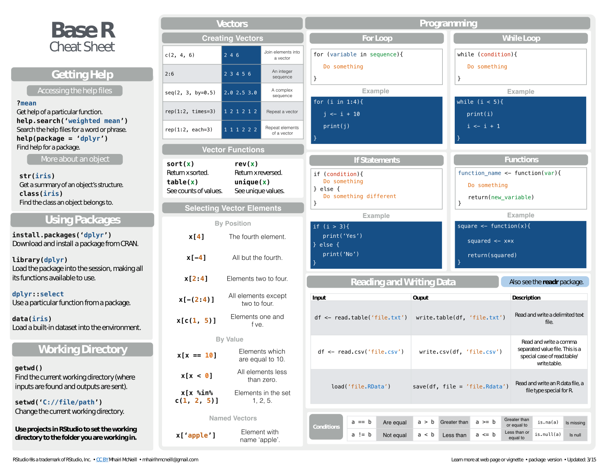

---
## Some useful R books

.center[
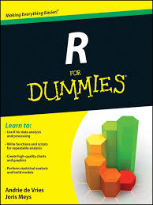 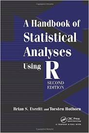 
]
.center[
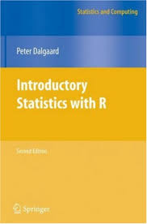  
]

---
## Some useful R websites

.pull-left[
 [](http://r4ds.had.co.nz/index.html)

**An Introduction to R** [](https://cran.r-project.org/doc/manuals/r-release/R-intro.html)

**R Reference card 2.0** [](http://cran.r-project.org/doc/contrib/Baggott-refcard-v2.pdf)

]

.pull-right[
 [](http://statmethods.net/)

 [](https://support.rstudio.com/hc/en-us/categories/200035113-Documentation)

**Cookbook for R** [](http://cookbook-r.com/)
]


---
class: inverse, center, bottom

# Thank you for attending!


