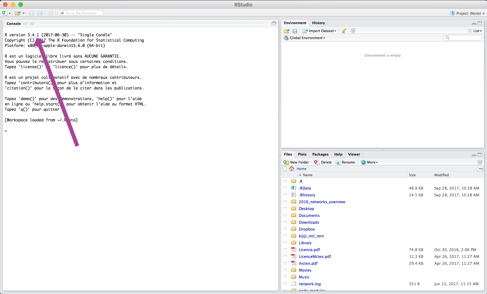
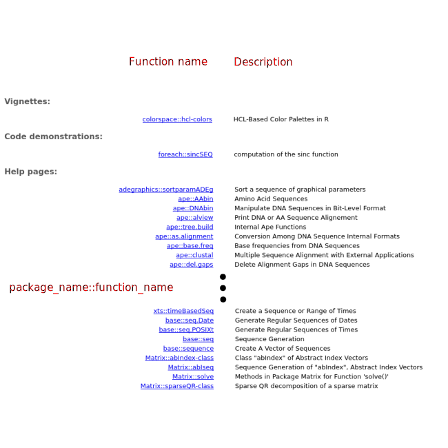
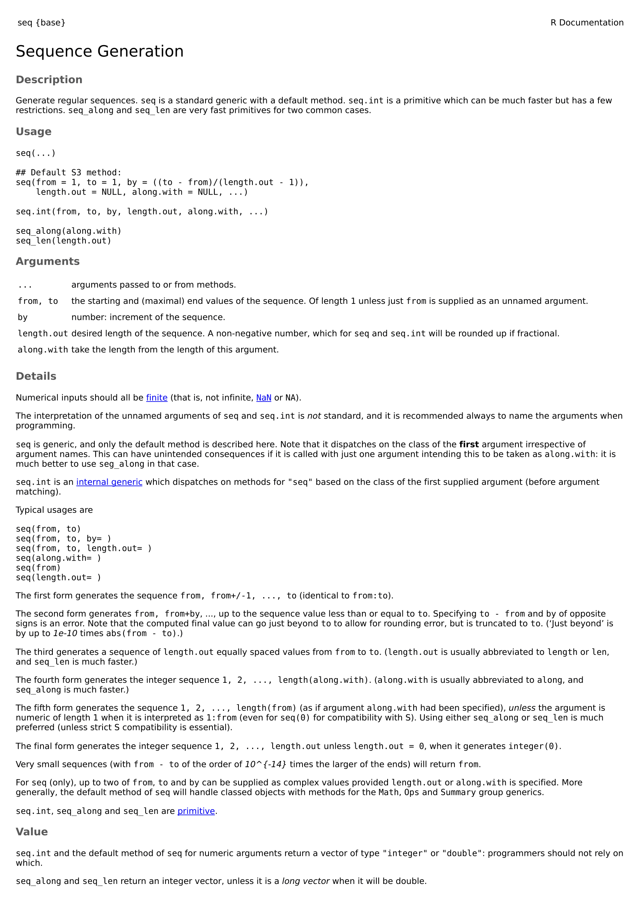
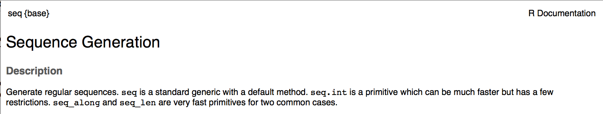
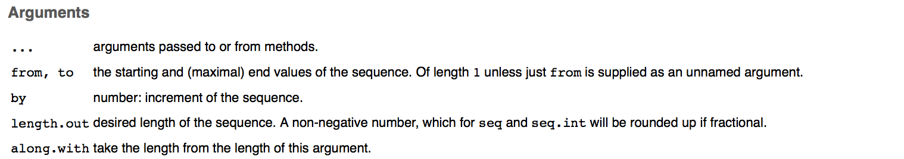
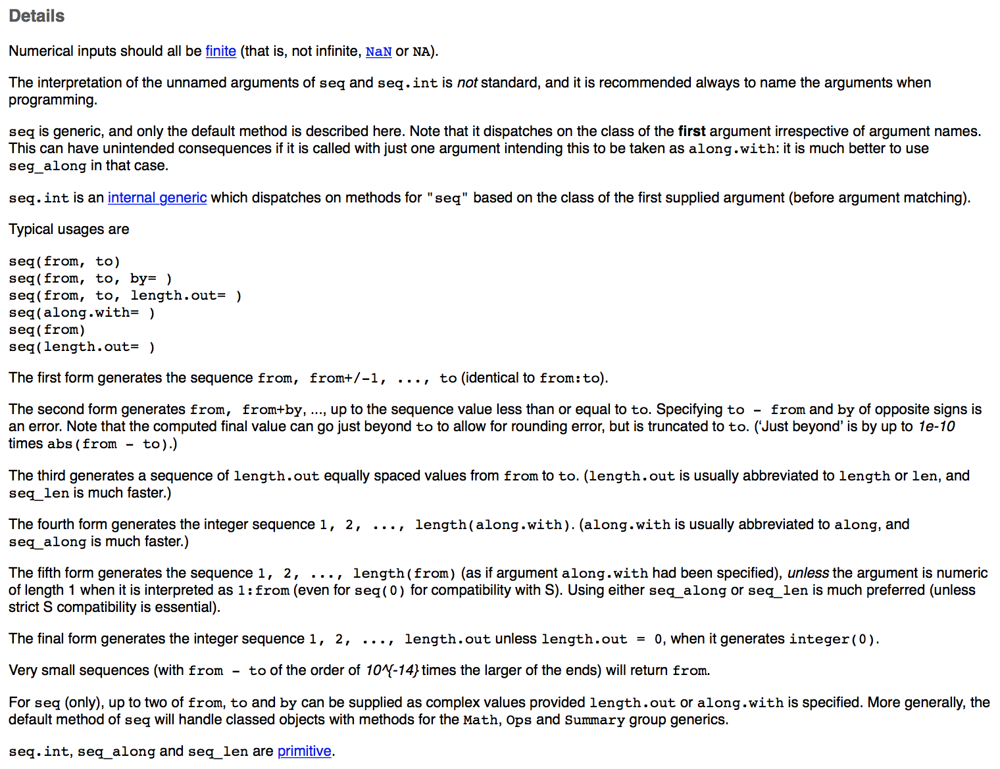
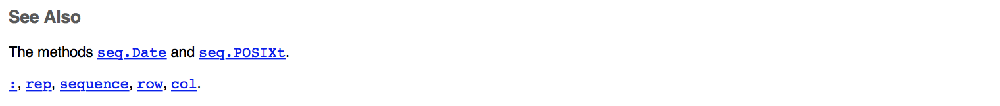
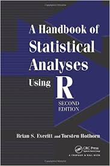
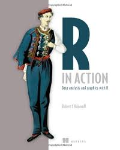

```{r setup, echo = F}
knitr::opts_chunk$set(
  comment = "#",
  collapse = TRUE,
  warning = FALSE,
  message = FALSE,
  cache = TRUE,
  fig.width=5, fig.height=5, fig.retina=3,
  fig.align = 'center'
)
```

```{r, echo =F}
options(repos=structure(c(CRAN="http://cran.r-project.org")))
```

```{r, include = FALSE}
if (!require(DiagrammeR)) install.packages("DiagrammeR")
library(DiagrammeR)
if (!require(widgetframe)) install.packages("widgetframe")
library(widgetframe)
if (!require(ggplot2)) install.packages("ggplot2")
library(ggplot2)
```


## Atelier 1: Introduction à R

<br>

.center[

]


Site: http://qcbs.ca/wiki/r/workshop1


---
class: inverse, center, middle

# Introduction

---
## Qu'est-ce que R?

.pull-left[
R est un langage de programmation open source conçu pour l'analyse statistique, l'exploration de données et la visualisation de données.
]

.pull-right[

]

---
## Pourquoi utiliser R?

**R est en source libre, open source**

 Amélioré **par** le public, **pour** le public!

 **Gratuit!**

.right[

]


---
## Pourquoi utiliser R?

.center[

]


**C'est compatible**

R fonctionne avec la majorité des systèmes d'exploitation

---
## Pourquoi utiliser R?

Ce que les gens faisaient traditionnellement pour analyser leurs données:

```{r, echo = FALSE}
  grViz("
      digraph {

      node [shape = oval, fillcolor = PaleTuruoise]
      Data; Graphs; Tables; Statistics

      node [shape = box]
      Sigmaplot; Excel; SAS

      ##add arrows
      edge [arrowhead = none]
      Data -> Sigmaplot; Data -> Excel; Data -> SAS;

      edge [arrowhead = normal]
      Sigmaplot -> Graphs; Excel -> Tables; SAS -> Statistics;

      }")

```

---
## Pourquoi utiliser R?

R permet de tout (ou presque) faire avec un seul programme!
```{r, echo = FALSE}
grViz("
      digraph {

      node [shape = oval, fillcolor = PaleTuruoise]
      Data; Graphs; Tables; Statistics

      node [shape = box]
      R

      ##add arrows
      edge [arrowhead = none]
      Data -> R;

      edge [arrowhead = normal]
      R -> Graphs; R -> Tables; R -> Statistics;

      }")

```


---
## Pourquoi utiliser R?

- De plus en plus de scientifiques l'utilisent chaque année!
- Des possibilités qui augmentent chaque année

.center[]


---
## Défi

.pull-left2[
- Tout au long de ces ateliers, vous aurez à compléter plusieurs défis qui sont indiqués par des Rubik's Cube
- Pendant les  défis, collaborez avec vos voisins!
]


.pull-right2[

]


---
## Défi 1  

.center[Ouvrez Rstudio]

<br>

.center[

]


---
## La console Rstudio




---

## Note pour les utilisateurs Windows

Si la restriction `unable to write on disk`apparaît quand vous ouvrez R Studio ou que vous installez une bibliothèque,

.center[.alert[pas de panique!]]

.large[On a la solution!]

- Fermez l'application.
- Faites un clic-droit sur l'icône RStudio et choissisez: "Execute as administrator" pour ouvrir le programme.


---
## Comment lire la console

Le texte dans la console ressemble typiquement à ceci:

.comment[Vous devez toujours appuyer sur "enter" pour que le code soit exécutée dans la console.]

```{r, include = FALSE}
output <- "Ceci est la sortie"
```

```{r}
output
```

---
## Comment lire la console

```{r}
output
```

Que signifient les crochets `[]` dans la sortie?

---
## Comment lire la console

```{r}
output
```

Les crochets vous aident à localiser *où* vous êtes dans la sortie

```{r, echo = FALSE}
c(1:40)
```

---
## Erreur et avertissement


.alert[Warning message]

Met en garde l'utilisateur sans arrêter l'exécution d'une fonction.

Bien que la fonction puisse vous donner une réponse, il pourrait y avoir un problème avec vos entrées. Ainsi, le calcul pourrait être erroné.


.alert[Error message]

Arrêtera l'exécution en cours car R est incapable de réaliser le calcul.

Il indique un problème dans votre code.

<br>
.center[
**Pour résoudre une *erreur*, les internets sont votre meilleur ami!**
]


---
class: inverse, center, middle

# Utiliser R comme une calculatrice &nbsp; 

---
## Opérateurs arithmétiques

- Additions et soustractions

```{r}
1+1

10-1
```

---
## Opérateurs arithmétiques

- Multiplications et divisions

```{r}
2*2

8/2
```

---
## Opérateurs arithmétiques

- Exposants

```{r}
2^3
```

---
## Défi 2 


Utilisez R pour résoudre l'équation suivante:

$$
2+16*24-56
$$

<br>

.comment[**Astuce**: Le symbole `*` est utilisé pour multiplier]

---
## Défi 2: Solution 


$$
2+16*24-56
$$


```{r}
2+16*24-56
```

---
## Défi 3 

Utilisez R pour résoudre l'équation suivante:

$$
2+16*24-56 / (2+1)-457
$$

<br>
<br>

.comment[**Astuce**: Pensez à l'ordre des opérations]

---
## Défi 3: Solution 

Utilisez R pour résoudre l'équation suivante:

$$
2+16*24-56 / (2+1)-457
$$


```{r}
2+16*24-56/(2+1)-457
```

.comment[Notez que R respecte l'ordre des opérations]

---
## Astuce sur la ligne de commande R


Utilisez les touches fléchées  et  pour copier et reproduire les commandes précédentes.


.center[

]


---
## Défi 4 

Quel est l'aire de ce cercle dont le rayon est de $5\ cm$?

```{r echo = F}
radius <- 1
theta <- seq(0, 2*pi, length = 200)
plot(c(-1, 1), c(-1, 1), type = "n", ann = F, axes = F, asp = 1)
lines(x = radius * cos(theta), y = radius * sin(theta))
arrows(0, 0, x1 = 1, length = 0)
text(.5, .1, "radius = 5 cm", cex = 1)
```

---
## Défi 4: Solution 


Quel est l'aire de ce cercle dont le rayon est de $5\ cm$?

```{r}
3.1416*5^2
```

.comment[**Astuce**: Notez que `R` a des constantes intégrées, telle que &pi;, vous pouvez donc écrire:]

```{r}
pi*5^2
```

---
class: inverse, center, middle

# Objets

---
## Objets

- Un concept très important en `R`!
- Vous pouvez stocker des valeurs dans un objet nommé à l'aide de l'opérateur d'assignation `<-`

```{r, eval = F}
nom_objet <- valeurs
```

Les valeurs à **droite** sont assignées à l'objet à **gauche** grâce à l'opérateur d'assignement `<-`

.comment[Bien qu'il soit aussi possible d'utiliser le signe `=`, il est préférable de l'éviter puisque sa signification est différente.]

---
## Nom d'objet

- Les noms d'objets peuvent inclure :

|  Type      |  Symbol |
|------------|:-------:|
| Lettres    | a-z A-Z |
| Nombres    |     0-9 |
| Point      |       . |
| Tiret bas  |       _ |

- Les noms d'objets doivent **toujours commencer par une lettre**.
- `R` est **sensible à la casse**, les noms `Data1` et `data1` ne sont pas équivalents.
- Les **caractères spéciaux sont interdits**! (@, /, etc.)

---
## Bonnes pratiques du code R

**Nom**:
- Essayez d'avoir des noms courts et explicites pour vos variables. Nommer une variable `var` n'est pas très instructif.
- Utilisez un trait de soulignement `_` pour séparer les mots d'un nom ou essayez d'être constant!
- Évitez les noms d'objets de fonction qui existe dans R (e.g. `c` ou `table`)

**Espace**:
- Ajoutez des espaces autour de tous les opérateurs (`=`, `+`, `-`, `<-`, etc.) pour rendre le code plus lisible
- Mettez un espace après une virgule, mais jamais avant (comme en français).

```{r}
moy_x <- (2 + 6) / 2

moy_x
```

---
## Défi 5 

<br>

Créez un objet avec une valeur de 1+1.718282 (Euler's number) et nommez le `euler_value`.

---
## Défi 5: Solution 


<br>

Créez un objet avec une valeur de 1+1.718282 (Euler's number) et nommez le `euler_value`.


```{r}
euler_value <- 1+1.718282

euler_value
```

---
## Défi 6 

Créez un deuxième objet avec un nom qui commence par un nombre. Qu'est-ce qui se produit?

---
## Défi 6: Solution 


Créez un deuxième objet avec un nom qui commence par un nombre. Qu'est-ce qui se produit?

<br>

La création d'un nom d'objet commençant par un nombre renvoie l'erreur suivante:

```{r, eval = F}
Error: unexpected symbol in "[nom de votre objet]"
```

---
## Astuce sur la ligne de commande R

- Utilisez la touche de tabulation pour effectuer une saisie semi-automatique
- Cela permet d'éviter les fautes d'orthographe et accélère la saisie des commandes

<br>

Essayons!

---
## Astuce sur la ligne de commande R

- Tapez `eu`
- Appuyez sur tab
- utilisez les flêches et la touche enter pour sélectionner la bonne saisie semi-automatique

---
class: inverse, center, middle

# Types de structures de données en R

---
## Types de structures de données en R


---
## Types de structures de données en R

`vector`  Combinaison d'éléments du même type de données. Structure de base en R; tous les autres objets sont formés à partir d'un ou plusieurs vecteurs.

--

`matrix`  Objet 2D généré en combinant plusieurs vecteurs du même type. On peut faire des opérations sur des matrices en R (+, -, *, ...).

--

`array`  Objet 3D généré en combinant plusieurs matrices de même type. Vecteur = array 1D. Matrice = array 2D.

--

`data.frame`  Objet 2D généré en combinant plusieurs vecteurs de n'importe quel type. Chaque colonne doit être du même type, mais un dataframe peut contenir des colonnes de différents types. Plusieurs fonctions statistiques (e.g. régression) utilisent des dataframes.

--

`list`  Une liste stocke des collections d'objets de tous types.


---
## Vecteurs

- Entité consistant en une séquence d'éléments du même type de base
- Une valeur seule est appelée une *atomic value*
- Toutes les valeurs d'un vecteur doivent avoir le **même mode** (ou classe).
      * `numeric`: seulement des nombres
      * `logical`: entrées True/False
      * `character`: Texte, ou un mélange de texte et d'autres modes

---
## Vecteurs

- La création de vecteurs nécessite généralement la fonction `c`

> `c` signifie *combiner* ou *concaténer*

- La syntaxe est:

```{r, eval = F}
vecteur <- c(valeur1, valeur2, ...)
```

---
## Vecteurs

- Vecteurs numeriques

```{r}
num_vector <- c(1, 4, 3, 98, 32, -76, -4)

num_vector
```

- Vecteurs de charactères

```{r}
char_vector <- c("blue", "red", "green")

char_vector
```

---
## Vecteurs

- Vecteurs logiques ou booléens

```{r}
bool_vector <- c(TRUE, TRUE, FALSE)

bool_vector
```

Vous pouvez écrire `T` pour `TRUE` et `F` pour `FALSE`, c'est équivalent.
```{r}
bool_vector2 <- c(T, T, F)

bool_vector2
```

---
## Défi 7 

- Créez un vecteur contenant les 5 premiers nombres impairs, à partir de 1
- Nommez-le `impair`.

---
## Défi 7: Solution 


- Créez un vecteur contenant les 5 premiers nombres impairs, à partir de 1
- Nommez-le `impair`.

```{r}
impair <- c(1, 3, 5, 7)
```

---
## Vecteurs

On peut utiliser des vecteurs pour faire des calculs:

```{r}
x <- c(1:5)
y <- 6
```

.comment[Le symbole de deux-points `:` est utilisé pour combiner toutes les valeurs entre le premier et le deuxième nombre fournis. `c(1:5)` retourne `1, 2, 3, 4, 5`]

```{r}
x + y

x * y
```

---
## Data frames

- Utilisé pour stocker des tables de données
- une liste de vecteurs de même longueur
- Chaque colonne = une variable
- Chaque ligne = une observation, un site, un réplicat...
- Différentes colonnes peuvent avoir différents modes

---
## Data frames

Disons que vous voulez stocker ce tableau dans `R`:

<br>

|ID of the site|soil pH|# of species|treatment|
|---|---|---|---|
|A1.01|5.6|17|Fert|
|A1.02|7.3|23|Fert|
|B1.01|4.1|15|No Fert|
|B1.02|6.0|7|No Fert|

---
## Data frames

Une façon de faire est de:
- Créer des vecteurs

```{r}
site_id <- c("A1.01", "A1.02", "B1.01", "B1.02")
soil_pH <- c(5.6, 7.3, 4.1, 6.0)
num_sp <- c(17, 23, 15, 7)
treatment <- c("Fert", "Fert", "No_fert", "No_fert")
```

- Puis les combiner en utilisant la fonction `data.frame`

```{r}
my_df <- data.frame(site_id, soil_pH, num_sp, treatment)
```

.comment[Nous reviendrons plus tard sur la fonction `data.frame`.]

---
## Data frames

```{r}
my_df
```

---
## Matrices, Arrays and Lists

.center[

]


---
## Indexer des objets

Pour regarder ou extraire une partie de nos données, on peut utiliser des **[crochets]**

Nous indiquons la ou les **position(s)** des valeurs que nous voulons voir entre crochets. Il s'agit d'*indexation*.

Par exemple, si on veut voir la 2ième valeur de notre vecteur `impair`

```{r}
impair[2]
```

---
## Indexer des objets

On peut sélectionner plusieurs positions:

```{r}
impair[c(2, 4)]
```

On peut utiliser l'indexation pour supprimer certaines valeurs à des positions particulières:

```{r}
impair[-c(1,2)]
```

---
## Indexer des objets


Si on sélectionne une position qui n'existe pas dans le vecteur, on obtient:

```{r}
impair[c(1,5)]
```

On peut également utiliser des conditions pour sélectionner des valeurs:

```{r}
impair[impair > 4]
```


```{r}
char_vector[char_vector == "blue"]
```


.comment[Les déclarations logiques telles que `>` seront décrites en détail plus loin]


---
## Défi 8 

À l'aide du vecteur `num_vector`

- Extraire la 4ème valeur
- Extraire les 1ère et 3ème valeurs
- Extraire toutes les valeurs sauf la 2ème et la 4ème

---
## Défi 8: Solution 

- Extraire la 4ème valeur

```{r}
num_vector[4]
```

- Extraire les 1ère et 3ème valeurs

```{r}
num_vector[c(1,3)]
```

- Extraire toutes les valeurs sauf la 2ème et la 4ème

```{r}
num_vector[c(-2,-4)]
```

---
## Défi 9 

Explorez la différence entre ces 2 lignes de code:

```{r, eval = F}
char_vector == "blue"

char_vector[char_vector == "blue"]
```

---
## Défi 9: Solution 

```{r}
char_vector == "blue"
```

Dans cette ligne de code, vous **testez une déclaration logique**. Pour chaque entrée dans le `char_vector`, `R` vérifie si l'entrée est égale à `blue` ou non.

```{r}
char_vector[char_vector == "blue"]
```

Dans cette ligne de code, vous demandez à `R` d'extraire toutes les valeurs du vecteur `char_vector` qui sont exactement égales à `blue`.

---
## Note sur les déclarations logiques

`R` permet de tester les déclarations logiques, *i.e.* tester si une déclaration est vraie ou fausse.

Vous devez utiliser des opérateurs logiques pour cela.

<br>

|Operator     |Description              |Example|
|-------------|-------------------------|-------------------------------|
|`<` and `>`  |less than or greater than|`impair > 3`                    |
|`<=` and `>=`|less/greater or equal to |`impair >= 3`                   |
|`==`         |exactly equal to         |`impair == 3`                   |
|`!=`         |not equal to             |`impair != 3`                   |
|`x`&#124;`y` |x OR y                   |`impair[impair >= 5` &#124; `impair < 3]`|
|`x & y`      |x AND y                  |`impair[impair >=3 & impair < 7]` |

---
## Indexer un `data.frame`

Pour indexer un `data.frame`, vous devez spécifier deux dimensions: numéro de ligne et de colonne, en utilisant la syntaxe suivante:

```r
nom.du.data.frame[ligne, colonne]
```

---
## Indexer un `data.frame`: exemples

<br>

`my_df[1,]`  Extrait la 1ère ligne

<br>
.comment[Notez qu'un index vide sélectionne **toutes les valeurs**.]

<br>
`my_df[,3]`  Extrait la 3ème colonne

<br>
`my_df[2,4]`  Extrait la 2ème ligne de la 4ème colonne


---
## Indexer un `data.frame`: exemples

<br>
`my_df[c(2,4),]`  Extrait les 2ème et 4ème lignes

<br>

.comment[Les exemples donnés jusqu'ici sont également valables pour indexer les matrices, ce n'est pas le cas pour les exemples suivants.]

<br>

`my_df$site_id`  Extrait la variable `site_id` du data frame

<br>

`my_df$site_id[2]`  Extrait la 2ème valeur de la variable `site_id` du data frame

<br>

`my_df[c("site_id", "soil_pH")]`  Extrait les variables `site_id` et `soil_pH` du data frame.


---
## Défi 10 

1. Extrayez la colonne `num_sp` de `my_df` et multipliez ses valeurs par les premières quatre valeurs de `num_vec`.

2. Ensuite, écrivez une déclaration logique qui vérifie si les valeurs obtenues sont supérieures à 25.

---
## Défi 10: Solution 

1. Extrayez la colonne `num_sp` de `my_df` et multipliez ses valeurs par les premières quatre valeurs de `num_vec`.

```{r}
my_df$num_sp * num_vector[c(1:4)]
# or
my_df[,3] * num_vector[c(1:4)]
```

\2. Ensuite, écrivez une déclaration logique qui vérifie si les valeurs obtenues sont supérieures à 25.

```{r}
(my_df$num_sp * num_vector[c(1:4)]) > 25
```

---
class: inverse, center, middle

# Fonctions

---
## Fonctions

.pull-left2[
Une fonction est un outil pour simplifier votre vie.

Il vous permet d'exécuter rapidement des opérations sur des objets sans avoir à écrire toutes les étapes mathématiques.

Une fonction nécessite des valeurs d'entrée appelées **arguments** (ou paramètres). Elle effectue ensuite des opérations cachées en utilisant ces arguments et donne une **valeur de retour**.
]

.pull.right2[

]

---
## Fonctions

Pour utiliser (appeler) une fonction, la commande doit être structurée correctement, en suivant les **règles de grammaire** du langage `R`, i.e. la syntaxe.

```{r, eval = F}
function_name(argument1, argument2)
```

---
## Arguments

Les arguments sont **valeurs** et des **instructions** que la fonction doit exécuter.

Les objets stockant ces valeurs et ces instructions peuvent être utilisés dans des fonctions, par exemple:

```{r}
a <- 3
b <- 5
sum(a,b)
```

---
## Défi 11 

- Créez un vecteur `a` qui contient tous les nombres de 1 à 5
- Créez un objet b qui a une valeur de 2
- Additionnez `a` et` b` en utilisant l'opérateur de base `+` et enregistrez le résultat dans un objet appelé `result_add`
- Additionnez `a` et` b` ensemble en utilisant la fonction `sum` et enregistrez le résultat dans un objet appelé` result_sum`
- Comparez `result_add` et` result_sum`. Sont-ils différents?
- Additionnez 5 à `result_sum` en utilisant la fonction` sum`


---
## Défi 11: Solution  

```{r}
a <- c(1:5)
b <- 2

result_add <- a + b

result_sum <- sum(a,b)
```

```{r}
result_add

result_sum

sum(result_sum, 5)
```

---
## Défi 11: Solution  

<br>

L'opération `+` sur le vecteur `a` ajoute 2 à chaque élément. Le résultat est un vecteur.

La fonction `sum` concatène toutes les valeurs fournies puis les somme. C'est la même chose que de faire 1+2+3+4+5+2.

---
## Arguments

- Les arguments ont chacun un **nom** pouvant être spécifié lors d'un appel de fonction.

- Si le nom n'est pas spécifié, l'ordre des arguments est important.

- Si le nom est spécifié, l'ordre n'a pas d'importance.

---
## Défi 12 

`plot` est une fonction qui dessine un graphe de y en fonction de x. Il nécessite deux noms d'argument `x` et `y`. Quelles sont les différences entre les lignes suivantes?

```{r, eval = F}
a <- 1:100
b <- a^2
plot(a,b)
plot(b,a)
plot(x = a, y = b)
plot(y = b, x = a)
```

---
## Défi 12: Solution

```{r, echo = F}
a <- 1:100
b <- a^2
par(mfrow = c(2,2),mar=c(4,4,1,1))
plot(a,b)
plot(b,a)
plot(x = a, y = b)
plot(y = b, x = a)
```

---
## Défi 12: Solution

.pull-left[
```{r,eval=F}
plot(a,b)
```

```{r, echo = FALSE, fig.width=3.6, fig.height=3.6}
par(mar=c(4,4,1,1))
plot(a,b)
```
]

.pull-right[
```{r,eval=F}
plot(b,a)
```

```{r, echo = FALSE, fig.width=3.6, fig.height=3.6}
par(mar=c(4,4,1,1))
plot(b,a)
```
]

.comment[La forme du graphe change, car nous n'avons pas spécifié le nom des arguments, alors l'ordre devient important.]

---
## Défi 12: Solution

.pull-left[
```{r,eval=F}
plot(x = a, y = b)
```

```{r, echo = FALSE, fig.width=3.6, fig.height=3.6}
par(mar=c(4,4,1,1))
plot(x = a, y = b)
```
]

.pull-right[
```{r,eval=F}
plot(y = b, x = a)
```

```{r, echo = FALSE, fig.width=3.6, fig.height=3.6}
par(mar=c(4,4,1,1))
plot(y = b, x = a)
```
]

.comment[Idem que `plot(a,b)`. Le nom des arguments est spécifié, l'ordre n'est pas important.]

---
class: inverse, center, middle

# Packages

---
## Packages

Les *packages* sont un **regroupement de fonctions** et/ou **de données** partageant un thème **similaire**, par ex. statistiques, analyse spatiale, graphique, etc.

** Tout le monde ** peut développer des *packages* et les mettre à la disposition des autres.


Beaucoup de packages disponibles via le *Comprehensive R Archive Network* ou [CRAN](http://cran.r-project.org/web/packages/) et maintenant encore plus via GitHub [](https://github.com/)

<br>
.alert[Devinez combien de *packages* sont disponibles jusqu'à aujourd'hui?]
---

<iframe height=100% width=100% src="images/R Package Documentation.htm" style="border:none;"></iframe>

---
## Packages

Pour installer des *packages* sur votre ordinateur, utilisez la fonction `install.packages`.

```r
install.packages("package name")
```

L'installation d'un *package* ne suffit pas pour l'utiliser. Vous devez aussi le charger dans votre espace de travail à l'aide de la fonction `library` pour pouvoir l'utiliser.

```r
library(package name)
```

---
## Packages: exemple

```{r, eval = F}
install.packages("ggplot2")
```

```{r, eval = F}
Installing package into '/home/labo/R/x86_64-redhat-linux-gnu-library/3.3'
(as 'lib' is unspecified)
```

```{r, eval = F}
qplot(1:10, 1:10)
```

```{r, eval = F}
## Error: could not find function "qplot"
```

---
## Package name: an example

```{r, fig.width=4, fig.height=4}
library(ggplot2)
qplot(1:10, 1:10)
```

---
class: inverse, center, middle

# Obtenir de l'aide

---
## Searching for functions

WOW! `R` est tellement génial! Tellement de fonctions incroyablement utiles!

Mais... comment puis-je les trouver?

---
## Recherche de fonctions

Pour trouver une fonction qui fait une action spécifique dans vos *packages* installés, vous pouvez utiliser `??` suivi d'un terme de recherche.

Disons que nous voulons créer une **séquence** de nombres impairs compris entre 0 et 10, comme nous l'avons fait précédemment. Nous pouvons rechercher dans nos *packages* toutes les fonctions qui contiennent le mot **séquence** dans leur description:

```{r, eval = F}
??sequence
```

<br>
.comment[Notez que toutes les recherches doivent se faire en anglais]

---
## Résultats de la recherche

.center[

]

---
## Résultats de la recherche

.center[

]

---
##  Résultats de la recherche

.center[

]

---
## Aide pour les fonctions

OK! Alors utilisons la fonction `seq` !

Mais attendez ... comment ça marche? De quels arguments la fonction a-t-elle besoin?

Pour trouver des informations sur une fonction en particulier, utilisez `?`

```{r, eval = F}
?seq
```

---
## Page d'aide

.center[

]


---
## Description

- `function_name {package_name}`
- Description: une courte description de ce que peut faire la fonction.

.center[

]

---
## Usage

- Comment appeler la fonction
- Si `name = value` est présent, une valeur par défaut est fournie si l'argument est manquant. L'argument devient facultatif.
- Autres fonctions connexes décrites dans la page d'aide


---
## Arguments

- Description de tous les arguments et de leur utilisation



---
## Details

- Une description détaillée du fonctionnement des fonction et de leurs caractéristiques



---
## Value

- Une description de la valeur de retour


---
## See Also

- Autres fonctions connexes pouvant être utiles



---
## Examples

- Exemples reproductibles


---
## Défi 13 

1. Créez une séquence de nombres pairs de 0 à 10 en utilisant la fonction `seq`.

2. Créez un vecteur non ordonné de vos nombres favoris, puis triez votre vecteur dans l'ordre inverse.
---
## Défi 13: Solutions 

1. Créez une séquence de nombres pairs de 0 à 10 en utilisant la fonction `seq`.


.pull-left[
```{r class="fragment"}
seq(from=0, to=10, by=2)
```
]

.pull-right[
```{r class="fragment"}
seq(0,10,2)
```
]


2. Créez un vecteur non ordonné de vos nombres favoris, puis triez votre vecteur dans l'ordre inverse.

```{r class="fragment"}
numbers <- c(2,4,22,6,26)
sort(numbers, decreasing = T)
```

---
## Autres façons d'obtenir de l'aide

Généralement, votre meilleure source d'information sera votre moteur de recherche préféré!

Voici quelques conseils pour l'utiliser efficacement:
- Faites vos recherches en anglais
- Utilisez le mot-clé **R** au début de votre recherche
- Définissez précisément ce que vous recherchez
- Apprenez à lire les forums de discussion, par exemple .comment[StackOverflow]. Il est fort probable que d'autres personnes ont déjà eu le même problème que vous et posé la question à ce sujet.
- N'hésitez pas à chercher à nouveau en utilisant différents mots-clés!

---
## Défi 14 

Recherchez les fonctions appropriées pour effectuer les opérations suivantes:

- Racine carrée
- Moyenne de plusieurs nombres
- Combiner deux data frames par colonnes
- Lister des objets disponibles dans votre espace de travail

---
## Défi 14: Solutions 

- Racine carrée
  - `sqrt`
- Moyenne de plusieurs nombres
  - `mean`
- Combiner deux data frames par colonnes
  - `cbind`
- Lister des objets disponibles dans votre espace de travail
  - `ls`

---
class: inverse, center, middle

# Ressources additionnelles

---
## Cheat 4ever

.center[
]

De nombreuses .alert[cheat sheets] sont disponibles en ligne [](https://www.rstudio.com/resources/cheatsheets/)

Ouvrez-les directement depuis **Rstudio**: Help  Cheatsheets


---
## Cheat 4ever


---
## Quelques livRes utiles

.center[
  
]
.center[
  
]


---
## Quelques sites inteRnets utiles

.pull-left[
 [](http://r4ds.had.co.nz/index.html)

**An Introduction to R** [](https://cran.r-project.org/doc/manuals/r-release/R-intro.html)

**R Reference card 2.0** [](http://cran.r-project.org/doc/contrib/Baggott-refcard-v2.pdf)

]

.pull-right[
 [](http://statmethods.net/)

 [](https://support.rstudio.com/hc/en-us/categories/200035113-Documentation)

**Cookbook for R** [](http://cookbook-r.com/)
]


---
class: inverse, center, bottom

# Merci d'avoir participé!


