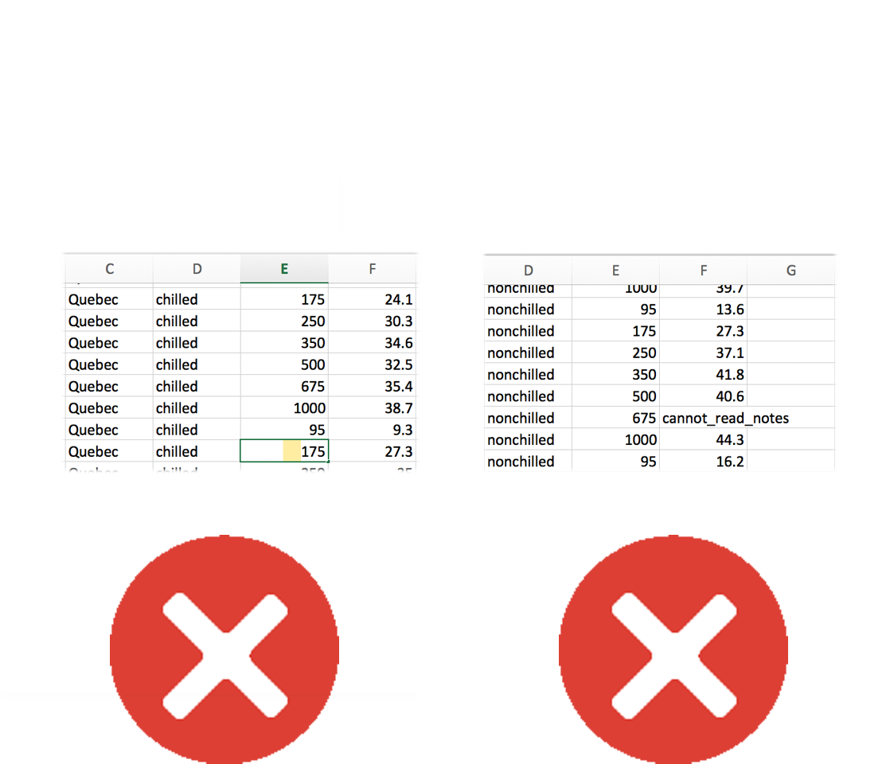

```{r setup, echo = F}
knitr::opts_chunk$set(
  comment = "#",
  collapse = TRUE,
  warning = FALSE,
  message = FALSE,
  fig.width=5, fig.height=5,
  fig.align = 'center'
)
```

```{r, echo =F}
options(repos=structure(c(CRAN="http://cran.r-project.org")))
```

```{r, include = FALSE}
if (!require(DiagrammeR)) install.packages("DiagrammeR")
library(DiagrammeR)
if (!require(widgetframe)) install.packages("widgetframe")
library(knitr)
library(tidyr)
library(dplyr)
library(magrittr)
```

## Learning Objectives

1. Creating an R project
2. Writing a script
3. Loading, exploring and saving data
4. Learn to manipulate data frames with tidyr, dplyr, maggritr

---
## RStudio projects

* What is this?
  - Within RStudio, Projects make it easy to separate and keep your work organized.  
  - All files, scripts, documentation related to a specific project are bound together

* Encourages reproducibility and easy sharing.

---
## Create a new project

Use the **Create project** command (available in the Projects menu and the global toolbar)

.center[
]

---
## Keep your files organized!

One project = one folder :)

.center[
]


---
## Preparing data for R

Dataset should be stored as comma-separated value files (.csv) in the working directory

* Can be created from almost all applications (Excel, LibreOffice, GoogleDocs)
* File -> Save as **.csv**…

.center[

]


---
## Choose filenames names wisely

.pull-left[
**Good!**
- rawDatasetAgo2017.csv
- co2_concentrations_QB.csv
- 01_figIntro.R]

.pull-right[
**Bad!**
- final.csv (*Uninformative!*)
- safnnejs.csv (*Random!*)
- 1-4.csv (*Avoid using only numbers!*)
- Dont.separate.names.with.dots.csv (*Because it may lead to reading file errors!*)]


---
## Choose variable names wisely

.pull-left[
**Good!**
  - Measurements
  - SpeciesNames
  - Site ]

.pull-right[
**Bad!**
 - a
 - 3
 - supercomplicatedverylongname]

---
## Things to consider with your data input


.pull-left[
* No text in numeric columns
* Do not include spaces!
* NA (not available) is allowed
* Blank entries will automatically be replaced with NA
* Name your variables informatively
* Look for typos]

.pull-right[
* Avoid numeric values for data that are not numeric
* Use CONSISTENT formats for dates, numbers, metrics, etc.
* No notes in .CSV files
* No additional headings
* No merged cells]

---
## Bad data examples:

.pull-left[
]

.pull-right[

]

---
## Horrible data examples:

Bad data preservation practices

.center[
]


---
## Preparing data in R

It is possible to do all your data preparation work within R

* Saves time for large datasets
* Keeps original data intact
* Keeps track of the manipulation and transformation you did
* Can switch between long- and wide-formats easily (more on this in future workshops)

* Useful tips on data preparation can be found here: https://www.zoology.ubc.ca/~schluter/R/data/

---
class: inverse, center, middle

# Writing a Script

---
## R Scripts

* What is this?
   - A text file that contains all of the commands that you will use

* Once written and saved, your script file allows you to make changes and re-run analyses with minimal effort!
  - Just highlight text and click "Run" or press Command + Enter (Apple) or Ctrl + Enter (Windows and Linux)


---
## Create an R script

.center[

]

---
## Create an R script


.center[

]


---
## Commands and comments
The `#` symbol in a script tells R to ignore anything remaining on this line of the script when running commands

```{r, eval = FALSE}
# This is a comment not a command
```


---
## Why should I use `#`?

* Annotating someone’s script is a good way to learn
* Remember what you did
* Tell collaborators what you did
* Good step towards reproducible science
* Be as detailed as possible


---
## Header

It is recommended that you start your script with a header using comments:

.center[

]


---
## Section Headings

You can make a section heading in R Studio four `#` signs

```{r, eval = FALSE}
# You can coment using this, but look below how to create section headers:

## Heading name ####
```

This allows you to move quickly between sections and hide sections

.center[

]


---
## Housekeeping

The first command at the top of all scripts may be: `rm(list = ls())`.
This command:

* Clears R memory
* Prevents errors related to the use of older data

---
## Clearing the workspace

```{r, eval = FALSE}
# Clear the R workspace
rm(list = ls())
?rm
?ls
```

---
## Housekeeping

Demo – Try to add some test data to R and then see how `rm(list = ls())` removes it


```{r, eval = TRUE, error = TRUE}
A<-"Test" # Put some data in workspace
A <- "Test" # Note that you can use spaces!
A = "Test" # <- or = can be used equally

#Note that it is best practice to use "<-" for assigment instead of "="
A
rm(list=ls())
A
```

---
## Remember

* R is ready for commands when you see the chevron `>` in the console. If you don't see it, press ESC
* R is case sensitive!


---
class: inverse, center, middle

# Loading, exploring and saving data

---
## Download today's data

You can download the data and the script for this workshop from the wiki:

.center[http://qcbs.ca/wiki/r/workshop2]

Save the files in the folder where your created your R project.

---
## Working Directory

Tells R where your scripts and data are. You need to set the right working directory to load a data file. Type `getwd()` in the console to see your working directory:

```{r, eval = FALSE}
getwd()
```

If this is not the directory you would like to work with, you can set your own using:

```{r, eval = FALSE}
setwd()
```

Within the parenthesis, you will write the *extension of the directory* you would like to work with. See the example below:

```{r, eval = FALSE}
setwd("C:/Users/Luigi/Documents") # We use slashes "/", and not backslashes "\"
```

---
## Display contents of the directory

You can display contents of the working directory using `dir()`:

```{r, eval = TRUE}
dir()
```

It helps to:

* Check that the file you plan to open is present in the folder that R is currently working in
* Check for correct spelling (e.g. "co2_good.csv" instead of "CO2_good.csv")

---
## Importing Data

Import data into R using `read.csv`:

```{r, eval = TRUE}
CO2 <- read.csv("co2_good.csv", header=TRUE)
```

Note that this will:
* Create a new object in R called `CO2`;
* The filename is written within quotation marks ('file' or "file");
* If you needed to fetch the filename from another directory that is not yours, you would have to write the full extension (e.g., `"C:/Users/Mario/Downloads/co2_good.csv"`)
* `header=TRUE` tells R that the first line of your dataset contains column names

---
## Importing Data

.alert[Recall] to find out what arguments the function requires, use help “?”
I
```{r, eval = FALSE}
?read.csv
```

.alert[Note] that if your operating system or .CSV editor (e.g. Excel) is in French, you may have to use `read.csv2`

```{r, eval = FALSE}
?read.csv2
```

---
## Importing Data

.center[

]

Notice that RStudio now provides information on the CO2 data in your **workspace**.

The **workspace** refers to all the objects that you create during an R session.


---
## Looking at Data

R Command  					| Action
----------------- | -------------
`CO2`					  		| look at the whole dataframe
`head(CO2)`		  		| look at the first few rows
`tail(CO2)`         | look at the last few rows
`names(CO2)`				| names of the columns in the dataframe
`attributes(CO2)`		| attributes of the dataframe
`dim(CO2)`          | dimensions of the dataframe
`ncol(CO2)`					| number of columns
`nrow(CO2)`					| number of rows


---
## Inspecting the data

```{r, eval = TRUE}
str(CO2)
```
This shows the structure of the dataframe.
Very useful to check data type (mode) of all columns to make sure R loaded data properly.

.small[Note: the CO2 dataset includes repeated measurements of CO2 uptake from 6 plants from Quebec and 6 plants from Mississippi at several levels of CO2 concentration. Half the plants of each type were chilled overnight before the experiment was conducted.]


---
## Inspecting the data

**Common problems:**

* Factors loaded as text (character) or vice versa;
* Factors includes too many (and unexpected) levels because of typos
* Data (integer or numeric) is loaded as character because of typos (*e.g.* a space or a "," instead of a "." to separate decimal numbers)

---
## Looking at Data

.pull-left[

.pull-left[
`data()`

`head()`
]
.pull-right[

`tail()`

`str()`
]
]

.pull-right[
.pull-left[
`names()`

`attributes()`
]
.pull-right[

`dim()`

`ncol()`

`nrow()`
]
]


Load the data with:

```{r, eval = FALSE}
CO2 <- read.csv("co2_good.csv", header = FALSE)
```

Check data types with `str()` again. What is wrong here?
.comment[Do not forget to re-load data with* `header = T` *afterwards]

---
## Reminder from Workshop 1: Accessing data

Imagine a data frame called `mydata`:

.center[

]

```{r, eval = FALSE}
mydata[1,] # Extracts the first row
mydata[2,3] # Extracts the content of row 2 / column 3
mydata[,1] # Extracts the first column
mydata[,1][2] # [...] can be also be used recursively
mydata$Variable1 # Also extracts the first column
```

---
## Renaming variables

Variables names can be changed within R.

```{r, eval = TRUE}
# First lets make a copy of the dataset to play with
CO2copy <- CO2
# names() gives you the names of the variables present in the data frame
names(CO2copy)

# Changing from English to French names (make sure you have the same levels!)
names(CO2copy) <- c("Plante","Categorie", "Traitement", "conc", "absortion")
names(CO2copy)
```

---
## Creating new variables

Variables and strings can be concatenated together.
The function `paste()` is very useful for concatenating.
See `?paste` and `?paste0`.


```{r, eval = TRUE}
# Let's create an unique id for our samples:
# Don't forget to use "" for strings
CO2copy$uniqueID <- paste0(CO2copy$Plante,
                           "_",CO2copy$Categorie,
                           "_", CO2copy$Traitement)

# observe the results
head(CO2copy$uniqueID)
```

---
## Creating new variables

Creating new variables works for numbers and mathematical operations as well!

```{r, eval = FALSE}
# Let's standardize our variable "absortion" to relative values
CO2copy$absortionRel <- CO2copy$absortion/max(CO2copy$absortion)  

# Observe the results
head(CO2copy$absortionRel)
```

---
## Subsetting data

There are many ways to subset a data frame

```{r, eval = FALSE}
# Let's keep working with our CO2copy data frame

# Select only "Plante" and "absortionRel" columns. (Don't forget the ","!)
CO2copy[,c("Plante", "absortionRel")]

# Subset data frame from rows from 1 to 50
CO2copy[1:50,]
```


---
## Subsetting data

```{r, eval = F}
# Select observations matching only the nonchilled Traitement.
CO2copy[CO2copy$Traitement == "nonchilled",]

# Select observations with absortion higher or equal to 20
CO2copy[CO2copy$absortion >= 20, ]  

# Select observations with absortion higher or equal to 20
CO2copy[CO2copy$Traitement  == "nonchilled" & CO2copy$absortion >= 20, ]

# We are done playing with the Dataset copy, lets erase it.
CO2copy <- NULL
```

Go [here](https://stat.ethz.ch/R-manual/R-devel/library/base/html/Logic.html) to check all the logical operators you can use

---
## Data exploration

A good way to start your data exploration is to look at some basic statistics of your dataset.

Use the `summary()` function to do that!

```{r, eval = FALSE}
summary(CO2)
```

This is also useful to spot some errors you might have missed!

---
## Data exploration

You can also use other functions to calculate basic statistics on parts of your data frame. Let's try the `mean()`, `sd()` and `hist()` functions:

```{r, eval = FALSE}
# Calculate the mean and the standard deviation of the CO2 concentration:
# Assign them to new variables
meanConc <- mean(CO2$conc)
sdConc <- sd(CO2$conc)
# print() prints any given value to the R console
print(paste("the mean of concentration is:", meanConc))
print(paste("the standard deviation of concentration is:", sdConc))
```

```{r, eval = FALSE}
# Let's plot a histogram to explore the distribution of "uptake"
hist(CO2$uptake)

# Increasing the number of bins to observe better the pattern
hist(CO2$uptake, breaks = 40)
```

---
## Data exploration

Use `apply()` to calculate the means of the last two columns of the data frame (*i.e.* the columns that contain continuous data).

```{r, eval = FALSE}
?apply # Let's see how apply works!
```

```{r}
apply(CO2[,4:5],
      MARGIN = 2,
      FUN = mean)
```

---
## Saving your Workspace


```{r, eval = F}
# Saving an R workspace file that stores all your objects
save.image(file="co2_project_Data.RData")


# Clear your memory
rm(list = ls())


# Reload your data
load("co2_project_Data.RData")
head(CO2) # Looking good!
```

```{r, echo=F}
head(CO2)
```

---
## Exporting data

R disposes of `write` functions that allow you to write objects directly to files in your computer. Let us use the `write.csv` function to save our CO2 data into a .CSV file:

```{r, eval = FALSE}
write.csv(CO2, file = "co2_new.csv")
```

Note that our arguments are both:

`CO2`  Object (name)

`"co2_new.csv"`  File to write (name)


---
## Challenge: Use your data 

* Try to load, explore, plot, and save your own data in R;*
* If it does not load properly, try to make the appropriate changes;
* When you are finished, try opening your exported data in Excel, Numbers, Notepad or TextEdit.

.comment[*If you don’t have your own data, work with your neighbour]
.comment[*Remember to clean your workspace]


---
## Fixing a broken data frame

Getting your data working properly can be tougher than you think!

Sometimes, one may find **compatibility issues**.

For example, sharing data from an Apple computer to Windows, or between computers set up in different continents can lead to incompatible files (e.g. different decimal separators).

Let's practice how to solve these common errors.

---
## Harder Challenge

Read the file `co2_broken.csv`

```{r, eval = TRUE}
CO2 <- read.csv("co2_broken.csv")
head(CO2)
```

---
## Harder Challenge 

* This is probably what the data you are using looks like;
* You can fix the data frame in R or other software;
* Please give it a try before looking at the script provided;
* Work with your neighbours and have FUN!.

```{r, eval = TRUE}
CO2[1:4,]
```


---
## Fixing co2_broken 

Some useful functions:

* `?read.csv` - look at some of the options for how to load a .csv
* `head()` - first few rows
* `str()` - structure of data
* `class()` - class of the object
* `unique()` - unique observations
* `levels()` - levels of a factor
* `which()` - ask a question to your data frame
* `droplevels()` - get rid of undesired levels after subsetting factors

.alert[HINT] There are 4 problems!

---
## Broken data

.alert[ERROR 1] The data appears to be lumped into one column

```{r, eval = TRUE}
head(CO2)

```

---
## Broken data

.alert[ERROR 1] - Solution

* Re-import the data, but specify the separation among entries
* The sep argument tells R what character separates the values on each line of the file
* Here, "TAB" was used instead of ","

```{r, eval = TRUE}
CO2 <- read.csv("co2_broken.csv",sep = "")
```

---
## Broken data

.alert[ERROR 2] The data does not start until the third line of the file, so you end up with notes on the file as the headings.

```{r, eval = TRUE}
head(CO2)
```


---
## Broken data

.alert[ERROR 2] - Solution

Skip two lines when loading the file using the "skip" argument:

```{r, eval = TRUE}
CO2 <- read.csv("co2_broken.csv", sep = "", skip = 2)
head(CO2)
```

---
## Broken data

.alert[ERROR 3]

`conc` and `uptake` variables are considered factors instead of numbers, because there are comments in the numeric columns

```{r, eval = TRUE}
str(CO2)
```

* Due to missing values entered as "cannot_read_notes" and "na"
* Recall that R only recognizes "NA" (capital)

---
## `?read.csv`


---
## Broken data

.alert[ERROR 3] - Solution

Tell R that all of NA, "na", and "cannot_read_notes" should be considered NA. Then because all other values in those columns are numbers, `conc` and `uptake` will be loaded as numeric/integer.


```{r, eval = TRUE}
CO2 <- read.csv("co2_broken.csv", sep = "", skip = 2,
                na.strings = c("NA","na","cannot_read_notes"))
str(CO2)
```

---
## Broken data

.alert[ERROR 4]

There are only 2 treatments (chilled and nonchilled) but there are spelling errors causing it to look like 4 different treatments.

```{r, eval = FALSE}
str(CO2)
```

```{r, eval = TRUE}
levels(CO2$Treatment)
unique(CO2$Treatment)
```

---
## Broken data

.alert[ERROR 4] - Solution


```{r, eval = TRUE}
# Identify all rows that contain "nnchilled" and replace with "nonchilled"
CO2$Treatment[CO2$Treatment=="nnchilled"] <- "nonchilled"

# Identify all rows that contain "chiled" and replace with "chilled"
CO2$Treatment[CO2$Treatment=="chiled"] <- "chilled"

# Drop unused levels from factor
CO2 <- droplevels(CO2)
str(CO2)
```

Fixed!

---
class: inverse, center, middle

# Learn to manipulate data with tidyr, dyplr, maggritr

---
## Using `tidyr` to reshape data frames

```{r, eval = F}
library(tidyr)
```

<div style="text-align:center">

</div>

---
## Data formats


.pull-left[
**Wide format**
```{r, echo=FALSE, eval = T}
# Let's create a new data frame
wide <- data.frame(Species = c("Oak", "Elm", "Ash"),
                   DBH = c(12, 20, 13),
                   Height = c(56, 85, 55))
wide
```
]

.pull-right[
**Long format**
```{r, echo=FALSE, eval = T}
long = gather(wide, Measurement, Value, DBH, Height)
long
```
]

---
## long vs wide format

.pull-left[
**Wide** data format has a separate column for each variable or each factor in your study]

.pull-right[
**Long** data format has a column for possible variables and a column for the values of those variables]

------------

Wide data frame can be used for some basic plotting in `ggplot2`, but more complex plots require long format (example to come)

`dplyr`, `lm()`, `glm()`, `gam()` all require long data format

---
## Tidying your data

Tidying allows you to manipulate the structure of your data while preserving all original information

`gather()` - convert from wide to long format

`spread()` - convert from long to wide format

.center[
]

---
## `tidyr` installation

```{r, eval=FALSE}
install.packages("tidyr")
library(tidyr)
```

---
## `gather` columns into rows

`gather(data, key, value, ...)`

<span style="font-size: 21px;">
  - `data` A data frame (e.g. `wide`)   
  - `key` name of the new column containing variable names (e.g. `Measurement`)  
  - `value` name of the new column containing variable values (e.g. `Value`)   
  - `...` name or numeric index of the columns we wish to gather (e.g. `DBH`, `Height`)
</span>

---
## `gather` columns into rows

```{r, echo = T}
wide <- data.frame(Species = c("Oak", "Elm", "Ash"),
                   DBH = c(12, 20, 13), Height = c(56, 85, 55))
wide
```

```{r}
long = gather(wide, Measurement, Value, DBH, Height)
long
```

---
## `spread` rows into columns

`spread(data, key, value)`

<span style="font-size: 21px;">
  - `data` A data frame (e.g. `long`)   
  - `key` Name of the column containing variable names (e.g. `Measurement`)  
  - `value` Name of the column containing variable values (e.g. `Value`)   
</span>

---
## `spread` rows into columns

```{r}
long
wide2 = spread(long, Measurement, Value)
wide2
```

---
## `separate` columns

`separate()` splits a columns by a character string separator

<div style="text-align:center">

</div>

`separate(data, col, into, sep)`

  - `data` A data frame (e.g. `long`)   
  - `col` Name of the column you wish to separate
  - `into` Names of new variables to create
  - `sep` Character which indicates where to separate  

---
## Using `separate()` example

Create a fictional dataset about fish and plankton
```{r}
set.seed(8)
messy <- data.frame(id = 1:4,
                    trt = sample(rep(c('control', 'farm'), each = 2)),
                    zooplankton.T1 = runif(4),
                    fish.T1 = runif(4),
                    zooplankton.T2 = runif(4),
                    fish.T2 = runif(4))
messy
```

---
## Using `separate()` example

First convert the messy data frame from wide to long format

```{r}
messy.long <- gather(messy, taxa, count, -id, -trt)
head(messy.long)
```

---
## Using `separate()` example

Then we want to split the 2 sampling time (T1 and T2).

```{r}
messy.long.sep <- separate(messy.long, taxa,
                           into = c("species", "time"), sep = "\\.")
head(messy.long.sep)
```

<span style="font-size: 18px;">
The argument `sep = "\\."` tells R to splits the character string around the period (.). We cannot type directly `"."` because it is a regular expression that matches any single character.
</span>

---
## Recap of `tidyr`

A package that reshapes the layout of data sets.

Converting from wide to long format using `gather()`

Converting from long format to wide format using `spread()`

Split and merge columns with `unite()` and `separate()`

[Data Wrangling with dplyr and tidyr Cheat Sheet](https://www.rstudio.com/wp-content/uploads/2015/02/data-wrangling-cheatsheet.pdf)


---
## Challenge with `tidyr` 

1. Using the airquality dataset, `gather` all the columns (except Month and Day) into rows.

2. Then `spread` the resulting data frame to return to the original data format.

```{r, eval = FALSE}
?airquality

data(airquality)
```

---
## Solution

1. Using the airquality dataset, `gather` all the columns (except Month and Day) into rows.
```{r}
air.long <- gather(airquality, variable, value, -Month, -Day)
head(air.long)
```
<span style="font-size: 18px;">
Note that the syntax used here indicates that we wish to gather ALL the columns exept *Month* and *Day*. It is equivalent to: `gather(airquality, value, Ozone, Solar.R, Temp, Wind)`
</span>


---
## Solution

2. Then `spread` the resulting data frame to return to the original data format.
```{r}
air.wide <- spread(air.long, variable, value)
head(air.wide)
```


---
## Data manipulation with `dplyr`

<div style="text-align:center">

</div>

---
## Intro to `dplyr`

- Package that contains a set of functions (or “verbs”) for data manipulation such as filtering rows, selecting specific columns, re-ordering rows, adding new columns and summarizing data;
- Easy and intuitive functions
- Fast and efficient
- Can interface with external databases and translate your R code into SQL queries

Some corresponding R base functions:
`split()`, `subset()`, `apply()`, `sapply()`, `lapply()`, `tapply()` and `aggregate()`

---
## Intro to `dplyr`

```{r, eval=F}
install.packages("dplyr")
library(dplyr)
```

---
## Basic functions in `dplyr`

These 4 core functions tackle the most common manipulations when working with data frames

  * `select()`: select columns from a data frame
  * `filter()`: filter rows according to defined criteria
  * `arrange()`: re-order data based on criteria (e.g. ascending, descending)
  * `mutate()`: create or transform values in a column

---
## `select` columns

<div style="text-align:center">
</img>
</div>

`select(data, ...)`

  * `...`  Can be column names or positions or complex expressions separated by commas

  `select(data, column1, column2)` select columns 1 and 2
  `select(data, c(2:4,6))` select columns 2 to 4 and 6
  `select(data, -column1)` select all columns except column 1
  `select(data, start_with(x.))` select all columns that start with "x."

---
## `select` columns

<div style="text-align:center">

</div>

---
## `select` columns

Example: suppose we are only interested in the variation of Ozone over time within the airquality dataset

```{r}
ozone <- select(airquality, Ozone, Month, Day)
head(ozone)
```

---
## `filter` rows

Extract a subset of rows that meet one or more specific conditions

`filter(dataframe, logical statement 1, logical statement 2, ...)`

<div style="text-align:center">


</div>

---
## `filter` rows

Example: we are interested in analyses that focus on the month of August during high temperature events

```{r}
august <- filter(airquality, Month == 8, Temp >= 90)
# same as: filter(airquality, Month == 8 & Temp >= 90)
head(august)
```

---
## Sort rows with `arrange`

Re-order rows by a particular column, by default in ascending order

Use `desc()` for descending order.

`arrange(data, variable1, desc(variable2), ...)`

---
## Sort rows with `arrange`

Example:
1. Let's use the following code to create a scrambled version of the airquality dataset

```{r}
air_mess <- sample_frac(airquality, 1)
head(air_mess)
```

---
## Sort rows with `arrange`

Example:
2. Now let's arrange the data frame back into chronological order, sorting by Month then Day

```{r}
air_chron <- arrange(air_mess, Month, Day)
head(air_chron)
```

Try :  `arrange(air_mess, Day, Month)` and see the difference.

---
## Create new columns using `mutate`

Compute and add new columns

`mutate(data, newVar1 = expression1, newVar2 = expression2, ...)`

<div style="text-align:center">

</div>

---
## Create new columns using `mutate`

Example: we want to convert the temperature variable form degrees Fahrenheit to degrees Celsius

```{r}
airquality_C <- mutate(airquality, Temp_C = (Temp-32)*(5/9))
head(airquality_C)
```

---
## `magrittr`

<div style="text-align:center">

</div>

Usually data manipulation require multiple steps, the magrittr package offers a pipe operator `%>%` which allows us to link multiple operations

---
## `magrittr`

```{r, eval=F}
install.packages("magrittr")
require(magrittr)
```

---
## `magrittr`

Suppose we want to analyse only the month of June, then convert the temperature variable to degrees Celsius. We can create the required data frame by combining 2 dplyr verbs we learned

```{r}
june_C <- mutate(filter(airquality, Month == 6),
                 Temp_C = (Temp-32)*(5/9))
```

As we add more operations, wrapping functions one inside the other becomes increasingly illegible. But, step by step would be redundant and write a lot of objects to the workspace.

---
## `magrittr`

Alternatively, we can use maggritr's pipe operator to link these successive operations

```{r}
june_C <- airquality %>%
    filter(Month == 6) %>%
    mutate(Temp_C = (Temp-32)*(5/9))
```

Advantages :

  * less redundant code
  * easy to read and write because functions are executed in order

---
## `dplyr::group_by` and `summarise`

The `dplyr` verbs become especially powerful when they are are combined using the pipe operator `%>%`.
The following `dplyr` functions allow us to split our data frame into groups on which we can perform operations individually

`group_by()` : group data frame by a factor for downstream operations (usually summarise)

`summarise()` : summarise values in a data frame or in groups within the data frame with aggregation functions (e.g. `min()`, `max()`, `mean()`, etc…)

---
## `dplyr` - Split-Apply-Combine

The `group_by` function is key to the Split-Apply-Combine strategy

<div style="text-align:center">

</div>

---
## `dplyr` - Split-Apply-Combine

<div style="text-align:center">

</div>

---
## `dplyr` - Split-Apply-Combine

Example: we are interested in the mean temperature and standard deviation within each month if the airquality dataset

```{r}
month_sum <- airquality %>%
      group_by(Month) %>%
      summarise(mean_temp = mean(Temp),
                sd_temp = sd(Temp))
month_sum
```

---
## Challenge with `dplyr`and `magrittr` 

Using the `ChickWeight` dataset, create a summary table which displays the difference in weight between the maximum and minimum weight of each chick in the study.

Employ `dplyr` verbs and the `%>%` operator.

---
## Solution

1. Use group_by() to divide the dataset by "Chick"
2. Use summarise() to calculate the weight gain within each group

```{r}
weight_diff <- ChickWeight %>%
      group_by(Chick) %>%
      summarise(weight_diff = max(weight) - min(weight))
head(weight_diff)
```

---
## Ninja challenge

Using the `ChickWeight` dataset, create a summary table which displays, for each diet, the average individual difference in weight between the end and the beginning of the study.

Employ `dplyr` verbs and the `%>%` operator.

(Hint: `first()` and `last()` may be useful here.)

---
## Ninja solution

```{r}
diet_summ <- ChickWeight %>%
      group_by(Diet, Chick) %>%
      summarise(weight_gain = last(weight) - first(weight)) %>%
      group_by(Diet) %>%
      summarise(mean_gain = mean(weight_gain))
diet_summ
```

---
## More on data manipulation

[Learn more on dplyr](http://r4ds.had.co.nz/transform.html)

[dplyr and tidyr cheatsheet](https://www.rstudio.com/wp-content/uploads/2015/02/data-wrangling-cheatsheet.pdf)


---
class: inverse, center, bottom

# Thank you for attending!


