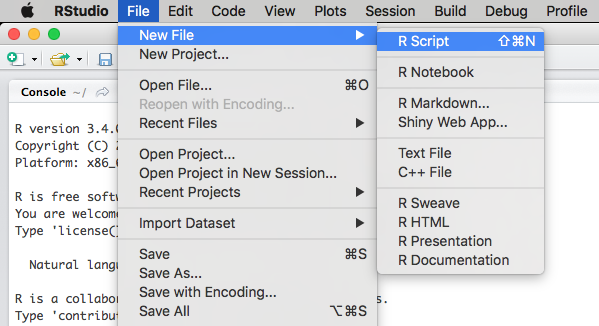
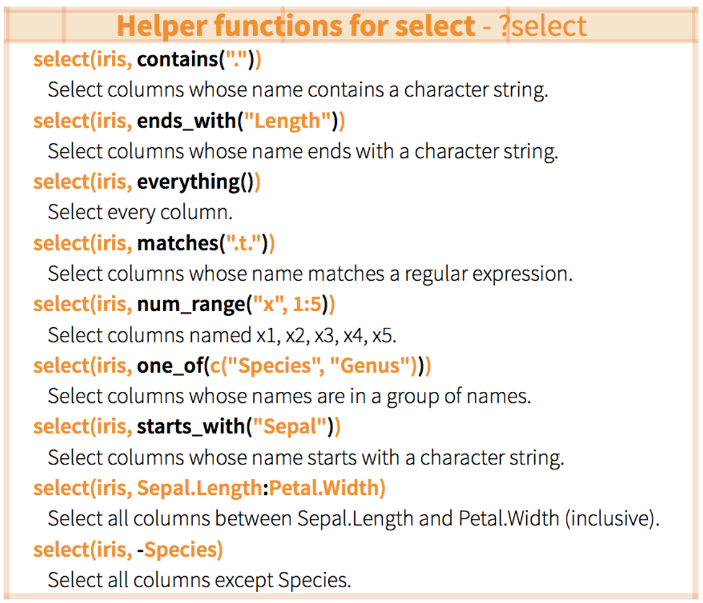
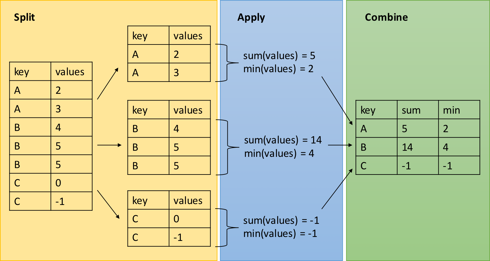

```{r setup, echo = F}
knitr::opts_chunk$set(
  comment = "#",
  collapse = TRUE,
  warning = FALSE,
  message = FALSE,
  fig.width=5, fig.height=5,
  fig.align = 'center'
)
```

```{r, echo =F}
options(repos=structure(c(CRAN="http://cran.r-project.org")))
```

```{r, include = FALSE}
if (!require(DiagrammeR)) install.packages("DiagrammeR")
library(DiagrammeR)
if (!require(widgetframe)) install.packages("widgetframe")
library(knitr)
library(tidyr)
library(dplyr)
library(magrittr)
```

## Objectifs d'apprentissage

1. Créer un projet RStudio
2. Ecrire un script dans R
3. Charger, explorer et enregistrer des données
4. Manipuler des jeux de données avec tidyr, dplyr, maggritr

---
## Les projets RStudio

* Qu'est-ce qu'un projet RStudio ?
  - Les projets RStudio permettent l'organisation de son travail et l'accès facile à tous les fichiers requis pour une analyse.
  - Tous les fichiers, scripts, et documentation utilisés pour une analyse sont reliés et regroupés ensemble dans un même projet.

* L'utilisation de projets RStudio facilite aussi la reproducibilité et le partage de données, de scripts, et de leur documentation.

---
## Créer un projet dans RStudio

Pour créer un projet dans RStudio, allez dans le menu Fichier puis sélectionnez "Nouveau projet".

.center[
]

---
## Organiser ses fichiers


Un projet = un dossier :)

.center[
]


---
## Préparer des données pour l'importation dans R

* Vous devriez enregistrer les fichiers à importer dans R en tant que fichiers "comma separated values" (.csv)
* Les fichiers .csv peuvent être créés par presque toutes les applications (Excel, GoogleDocs, LibreOffice, etc.)

.center[

]


---
## Bien nommer les fichiers

.pull-left[
**Non:**
- final.csv (*pas-informatif !*)
- safnnejs.csv (*C'est n'importe quoi!*)
- 1-4.csv  (*Eviter d'utiliser des chiffres!*)
- Ne.pas.separer.par.des.points.csv (*Peut causer des erreurs de lecture de fichier !*)
]

.pull-right[
**Oui:**
- rawDatasetAgo2017.csv
- co2_concentrations_QB.csv
- 01_figIntro.R
]


---
## Bien nommer les variables

* Utilisez des noms de variables courts et informatifs (i.e. "Temps_1" au lieu de "Temps de la première mesure")
* Les valeurs des colonnes doivent correspondre à l'usage prévu


.pull-left[
**Bien !**
  - Measurements
  - SpeciesNames
  - Site
]

.pull-right[
**Pas bien !**
 - a
 - 3
 - supernomunpeutroplong
]


---
## Conseils pour préparer les données


.pull-left[
* Pas de texte dans les colonnes de mode numérique
* Pas d'espace
* Identifiez les valeurs manquantes par NA ("not available")
* Faites attention aux erreurs typographiques!
]

.pull-right[
* Évitez les valeurs numériques pour les variables n'ayant pas un sens numérique (i.e. individu, réplicat, traitement)
* Utilisez un format uniforme pour les dates, les chiffres, etc.
* N'ajoutez pas de notes, d'entêtes supplémentaires, ou de cellules fusionnées!
* Une variable par colonne! ]

---
## Exemples de mauvaises habitudes:

<br>

.pull-left[

]

.pull-right[

]

---
## Exemples de très mauvaises présentations


.center[
]


---
## Préparer ses données dans R

Il est possible de faire toute la préparation des données dans R. Les avantages sont

* On économise du temps pour les grosses bases de données
* On préserve les données d'origine
* On peut basculer entre les modes "long" et "large" très facilement (plus de détails plus tard)
* Pour des informations complémentaires, consultez la page suivante :  https://www.zoology.ubc.ca/~schluter/R/data/

---
class: inverse, center, middle

# Écrire un script dans R

---
## Écrire un script dans R

* Un script R c'est
  * un fichier texte contenant toutes les commandes nécessaires pour réaliser un projet.
  * Une fois écrit et enregistré, votre script R vous permettra d'apporter des changements et de refaire des analyses avec un minimum d'effort.
  * Surlignez simplement une commande et appuyez sur "Run" ou sur 'command-enter' (Mac) ou 'ctrl-enter' (PC).


---
## Écrire un script dans R

.center[

]

---
## Écrire un script dans R


.center[

]


---
## Commandes & Commentaires

Utilisez le symbole `#` pour insérer des commentaires au sein d'un script. Ceci indique à R d'ignorer tout ce qui se trouve à la suite du symbole `#` lors de l'exécution de commandes.

```{r, eval = FALSE}
# Ceci est un commentaire pas une commande R!
```

Annoter son script est un bon moyen de :

  * se rappeler ce que vous avez fait
  * dire aux collaborateurs ce que vous avez fait
  * favoriser une science reproductible


---
## Entêtes de section

Il est recommandé d'ajouter des commentaires au début de vos scripts pour indiquer des infors importantes: nom du projet, auteur, date, version de R, etc.

.center[

]


---
## Entêtes de section

Vous pouvez utiliser quatre symboles `#` de suite pour créer un entête de section.

Par exemple :
```{r, eval = FALSE}
#### Chargement du fichier de données ####
```

Cela vous permet de passer rapidement d'une section à l'autre et de masquer des sections.

.center[

]


---
## Nettoyage

C'est une bonne habitude de maintenir son espace de travail propre en effaçant la mémoire de R à l'aide de `rm(list=ls())`.

```{r, eval = FALSE}
rm(list = ls()) # Efface ce qui se trouve dans l'espace de travail
?rm
?ls
```

Cette commande permet d'éviter d'utiliser un vieux jeu de données qui serait resté dans l'espace de travail.

---
## Nettoyage

On peut tester cette commande en ajoutant des objets dans l'espace de travail pour mieux comprendre comment `rm(list=ls())` fonctionne.


```{r, eval = TRUE, error = TRUE}
A <- "Test" # On crée un objet "A".
A
rm(list=ls())
A
```

---
## Petit rappel important

* R est prêt à exécuter une commande lorsque vous voyez le chevron `>` affiché dans la console. Si le chevron n'apparaît pas, c'est qu'une commande est incomplète. Appuyez sur 'ESC' pour sortir de cette commande.
* R est sensible à la casse, i.e. `A` est différent de `a`.

```{r, eval = TRUE, error = TRUE}
a <- 10
A <- 5
a
A
rm(list=ls())  # On nettoie l'espace de travail à nouveau !
```

---
class: inverse, center, middle

# Charger, explorer et enregistrer des données

---
## Télécharger les données

Vous pouvez télécharger les données et le script depuis :

http://qcbs.ca/wiki/r/workshop2

Enregistrez les fichiers dans le dossier où vous avez crée votre projet R.

---
## Répertoire de travail

Vous devez indiquer à R le répertoire où se trouvent les fichiers de données afin de les charger.

Pour voir quel répertoire R utilise :

```{r, eval = FALSE}
getwd()
```

Lorsque vous chargez un script, R définit le répertoire de travail comme étant le dossier qui contient le script.

Utilisez `setwd()` pour spécifier un nouveau chemin d'accès du répertoire ou cliquez sur session -> Définir le répertoire -> Choisir le répertoire.

---
## Afficher le contenu du répertoire de travail

La fonction `dir()` affiche le contenu du répertoire de travail.

```{r, eval = FALSE}
dir()
```

Vous pouvez vérifier:

* Si le fichier que vous voulez ouvrir se trouve dans le répertoire de travail
* L'orthographe du nom du fichier (e.g. 'monfichier.csv' au lieu de 'MonFichier.csv')


---
## Importer un jeu de données

Utilisez la fonction `read.csv()` pour importer des données provenant d'un fichier .csv dans R.

```{r, eval = TRUE}
CO2 <- read.csv("co2_good.csv", header=TRUE)
```

Cette commande spécifie que vous créez un objet nommé "CO2" en chargeant un fichier .csv nommé "co2_good.csv". Ce fichier doit se trouver dans votre répertoire de travail.

Il est aussi possible d'utiliser la fonction `file.choose()` pour charger un fichier de manière interactive (non recommandé).

```{r, eval = F}
CO2 <- read.csv(file.choose())
```

---
## Importer un jeu de données

Rappelez-vous que vous pouvez obtenir de l'aide pour une fonction avec `?`

```{r, eval = FALSE}
?read.csv
```

La page d'aide nous informe que l'argument `header = TRUE` permet de spécifier que la première ligne du fichier contient le nom des colonnes.

```{r, eval = TRUE}
CO2 <- read.csv("co2_good.csv", header = TRUE)
```

.alert[NOTE] Si vous utilisez un système d'exploitation en français ou un éditeur CSV, il est possible que vous deviez utiliser la fonction `read.csv2()` pour importer correctement un fichier.

---
##  Importer un jeu de données

.center[

]

Prenez note que RStudio montre maintenant le jeu de données CO2 dans votre espace de travail. L'espace de travail inclut tous les objets créés pendant la session R.


---
## Visualiser les données

Voici quelques fonctions utiles pour visualiser le jeu de données importé :

R code  					| action
----------------- | -------------
`CO2`					  		| Affiche le tableau de données complet dans la console
`head(CO2)`		  		| Affiche les premières lignes du tableau de données
`names(CO2)`				| Affiche le nom des colonnes du tableau de données
`attributes(CO2)`		| Affiche les attributs du tableau de données
`ncol(CO2)`         | Affiche le nombre de colonnes du tableau de données
`nrow(CO2)`					| Affiche le nomber de lignes
`summary(CO2)`			| Calcule quelques statistiques de base sur les variables
`str(CO2)`					| Affiche la structure du tableau de données


---
## Visualiser les données

```{r, eval = TRUE}
str(CO2)
```
La fonction `str()` est très utile pour identifier le type/mode de chaque colonne.

.small[Le jeu de données "CO2" contient des mesures répétées d'absorption de CO2 prises sur 6 plantes du Québec et 9 plantes du Mississippi à différentes concentrations de CO2 ambiant. La moitié des plantes de chaque région a subi un traitement de refroidissement la veille du début de l'expérience.]


---
## Visualiser les données

Problèmes fréquents lors de l'importation des données :

* Les facteurs apparaissent comme des chaînes de caractères (et vice versa)
* Les facteurs ont trop de niveaux à cause d'une erreur de frappe
* Les données numériques sont stockées sous forme de chaînes de caractères à cause d'une erreur de frappe


---
## Exercice

Chargez les données de nouveau en utilisant le script suivant :


```{r, eval = FALSE}
CO2 <- read.csv("co2_good.csv", header = FALSE)
```

Vérifiez la structure des données avec la fonction `str()`.

Quel est le problème ?

.comment[N'oubliez pas de recharger les données avec l'argument `header=TRUE` avant de continuer.]

---
## Rappel de l'atelier 1 : Accéder aux données

Pusieurs façons d'extraire les données avec les crochets. Considerons un jeu de données nommé mydata.

.center[

]

```{r, eval = FALSE}
mydata[1,] # Extrait la 1ère ligne
mydata[2,3] # Extrait la 2ème ligne / 3ème colonne
mydata[,1] # Extrait la 1ère colonne
mydata[,1][2] # [...] peut être utilisé récursivement
mydata$Variable1 # Extrait la colonne "Variable1"
```

---
## Renommer les variables

On peut renommer les variables (colonnes) dans R.

```{r, eval = T}
# Créer une copie du jeu de données qu'on pourra modifier
CO2copy <- CO2

# names() donne les noms des variables présentes dans le jeu de données
names(CO2copy)

# Changer des noms anglais pour des noms français
names(CO2copy) <- c("Plante","Categorie", "Traitement", "conc","absorption")
names(CO2copy)
```

---
## Créer des nouvelles variables

On peut facilement créer et produire des nouvelles variables. Par exemple, la fonction `paste()` permet la concaténation de chaînes de caractères et de variables. Consultez `?paste` et `?paste0`.

Créer un ID unique pour les échantillons avec la fonction `paste0()`

```{r, eval = T}
# N'oubliez pas d'utiliser "" pour les chaînes de caractères
CO2copy$uniqueID <- paste0(CO2copy$Plante,
                           "_", CO2copy$Categorie,
                           "_", CO2copy$Traitement)

# Observer les résultats
head(CO2copy$uniqueID)
```

---
## Créer des nouvelles variables

On peut aussi créer des nouvelles variables à partir de chiffres et d'opérations mathématiques!

```{r, eval = T}
# Standardizer la variable "absorption" en valeurs relatives
CO2copy$absorptionRel <- CO2copy$absorption/max(CO2copy$absorption)

# Observer les résultats
head(CO2copy$absorptionRel)
```

---
## Sous-ensemble d'un data frame

```{r, eval = FALSE}
## Extraire un sous-ensemble par un nom de variable
CO2copy[,c("Plante", "absorptionRel")]

## Extraire un sous-ensemble de rangées
CO2copy[1:50,]

## Extraire les observations du traitement "nonchilled".
CO2copy[CO2copy$Traitement == "nonchilled",]

## Extraire selon une condition numérique
CO2copy[CO2copy$absorption >= 20, ]

## Extraire selon plusieurs conditions numériques
CO2copy[CO2copy$Traitement  == "nonchilled" & CO2copy$absorption >= 20, ]

# Nous avons fini de modifier le data frame CO2copy, effaçons-le.
CO2copy <- NULL
```

Consultez [ici](https://stat.ethz.ch/R-manual/R-devel/library/base/html/Logic.html) pour voir les opérateurs logiques pouvant être utilisés pour extraire des sous-ensembles de données dans R.

---
## Explorer les données

Un bon moyen de commencer votre exploration des données consiste à regarder des statistiques de base sur votre jeu de données.

Utilisez la fonction `summary()`.

C'est également utile pour repérer certaines erreurs que vous auriez peut-être manquées!


```{r, eval = T}
summary(CO2)
```

---
## Explorer les données

Vous pouvez également utiliser d'autres fonctions pour calculer des statistiques de base pour des parties spécifiques de votre trame de données.

Essayons les fonctions `mean()`, `sd()`, `hist()`, `print()`

```{r, eval = T}
# Calculer la moyenne et l'écart type de la concentration,
# et l'assigner à de nouvelles variables
meanConc <- mean(CO2$conc)
sdConc <- sd(CO2$conc)

# print() imprime une valeur données dans la console R
print(paste("the mean of concentration is:", meanConc))

print(paste("the standard deviation of concentration is:", sdConc))
```

---
## Explorer les données

```{r, eval = T}
# Créons un histogramme pour explorer la distribution de "uptake"
hist(CO2$uptake, breaks = 40) # breaks permet de changer le nombre de classes
```


---
## Explorer les données

La fonction `apply()` est utilisée pour appliquer une fonction à plusieurs colonnes ou lignes en même temps.

```{r, eval = FALSE}
?apply
```

Utilisez `apply ()` pour calculer la moyenne des deux dernières colonnes du data frame (c'est-à-dire les colonnes contenant des données continues)

```{r}
apply(CO2[,4:5], MARGIN = 2, FUN = mean)
```

* `MARGIN = 1`  si la fonction est appliquée aux lignes
* `MARGIN = 2`  si la fonction est appliquée aux colonnes

---
## Enregistrer son espace de travail

```{r, eval = FALSE}
# Sauver l'espace de travail avec tous les objets
save.image(file="co2_project_Data.RData")

rm(list = ls()) # Nettoyer l'espace de travail

load("co2_project_Data.RData") # Charger tout ce qui se trouvait dans l'espace de travail
head(CO2) # cela fonctionne! :)
```

```{r, echo=F}
head(CO2)
```
---
## Exporter des données

Pour enregistrer dans le répertoire de travail des données que vous avez créées ou modifiées dans R, utilisez la fonction `write.csv()`.

```{r, eval = FALSE}
write.csv(CO2, file = "co2_new.csv")
```

`CO2`  Nom de l'objet dans R

`"co2_new.csv"`  Nom du nouveau fichier à enregistrer


---
## Défi  

#### Utilisez vos données

* Essayez de charger, explorer, et enregistrer vos propres données dans R*.
  * Est-ce que le chargement fonctionne?
* Si ce n'est pas le cas, essayez de corriger vos données dans Excel.
* Enregistrez vos données corrigées et ré-essayez de les ouvrir dans R.

.comment[* Si vous n'avez pas de données, travaillez avec vos voisins]

---
class: inverse, center, middle

# Réparer un jeu de données


---
## DÉFI 

#### Réparer un jeu de données "endommagé"

Les jeux de données peuvent être désordonnés et incompatibles entre certains systèmes (Mac, Windows) ou entre ordinateurs.

Pratiquons-nous à réparer certains problèmes communs.

Importez un jeu de données "endommagé" dans R et trouvez les problèmes.

```{r, eval = TRUE}
CO2 <- read.csv("co2_broken.csv")
```

---
## DÉFI 

```{r, eval = TRUE}
head(CO2) # C'est le bordel!
```

---
## DÉFI 


* Vos données ou des données téléchargées peuvent souvent ressembler à ça !
* Réparez le jeu de données dans R
* Faites un essai avant de regarder la solution
* Entraidez-vous entre voisins et amusez-vous :)

```{r, eval = TRUE}
CO2
```

---
## DÉFI 

Voici quelques fonctions qui peuvent vous aider :

* `read.csv()` - examinez les options permettant de charger un fichier .csv
* `head()` - montre les premières lignes
* `str()` - structure de données
* `class()` - classe de l'objet
* `unique()` - observations uniques
* `levels()` - niveaux d'un facteur
* `which()` - pose une question sur votre bloc de données
* `droplevels()` - supprime les niveaux indésirables après avoir déduit les facteurs

.alert[Indice] T Il y a quatre problèmes avec ce jeu de données!


---
## Jeu de données "endommagé"

.alert[ERREUR 1]

Les données sont contenues dans une seule colonne

```{r, eval = TRUE}
head(CO2)
```

---
## Jeu de données "endommagé"

.alert[ERREUR 1] - Solution 1

* Importez les données de nouveau, en spécifiant comment chaque valeur est séparée.
* L'argument `sep` indique à R quel type de caractère sépare les valeurs sur chaque ligne.
* Ici, une tabulation sépare les valeurs au lieu d'une virgule.

```{r, eval = TRUE}
CO2 <- read.csv("co2_broken.csv", sep = "")
```

---
## Jeu de données "endommagé"

.alert[ERREUR 2]

Les données ne commencent pas avant la 3ème ligne. Les entêtes de colonnes sont remplacés par des notes.

```{r, eval = TRUE}
head(CO2)
```

---
## Jeu de données "endommagé"
.alert[ERREUR 2] - Solution

Pour régler ce problème, vous devez indiquer à R de sauter les deux premières lignes avec l'argument "skip".

```{r, eval = TRUE}
CO2 <- read.csv("co2_broken.csv", sep = "", skip = 2)
head(CO2)
```

---
## Jeu de données "endommagé"

.alert[ERREUR 3]

Les variables `conc` et `uptake` sont considérées commes des facteurs au lieu de nombres, car il y a du texte dans ces colonnes.

```{r, eval = TRUE}
str(CO2)
unique(CO2$conc)
unique(CO2$uptake)
```


---
## `?read.csv`


---
## Jeu de données "endommagé"

.alert[ERREUR 3] - Solution

Indiquez à R que tous les éléments NA, "na" et "cannot_read_notes" doivent être considérés comme des NA. Ensuite, comme toutes les autres valeurs de ces colonnes sont des nombres, `conc` et` uptake` seront chargés sous forme numérique / entier.

```{r, eval = TRUE}
CO2 <- read.csv("co2_broken.csv", sep = "", skip = 2,
                na.strings = c("NA", "na", "cannot_read_notes"))
str(CO2)
```


---
## Jeu de données "endommagé"

.alert[ERREUR 4]

En réalité, il y a seulement 2 traitements (chilled & non chilled), mais des erreurs d'orthographe créent 2 autres niveaux de traitement.

```{r, eval = TRUE}
str(CO2)
levels(CO2$Treatment)
unique(CO2$Treatment)
```

---
## Jeu de données "endommagé"

.alert[ERREUR 4] - Solution


```{r, eval = FALSE}
# Identifier toutes les lignes contenant "nnchilled" et remplacer par "nonchilled"
CO2$Treatment[which(CO2$Treatment=="nnchilled")] <- "nonchilled"

# Faisons la même chose pour "chiled" :
CO2$Treatment[which(CO2$Treatment=="chiled")] <- "chilled"

# Enlever les niveaux de facteur non utilisés
levels(CO2$Treatment)
CO2 <- droplevels(CO2)
levels(CO2$Treatment)
```

---
class: inverse, center, middle

# Manipulation de données avec `tidyr`, `dplyr`, `magrittr`

---
## `tidyr` pour réorganiser ses données


.center[

]

---
## Format de données

.pull-left[
**Format large (wide)**

Un data frame en format large contient une colonne pour chaque variable ou facteur

```{r, echo=FALSE, eval = T}
large <- data.frame(Species = c("Chene", "Orme", "Frene"),
                   DHP = c(12, 20, 13),
                   Haut = c(56, 85, 55))
large
```
]

.pull-right[
**Format long**

Un data frame en format long contient une colonne par variable, où chaque ligne est une observation

```{r, echo=FALSE, eval = T}
long <- gather(large, dimension, cm, DHP, Haut)
long
```
]

`ggplot2` peut utiliser le format large pour des visualisations simples, mais des visualisations plus complexes requierent le format long.

`dplyr`, `lm()`, `glm()`, `gam()` nécessitent le format long.

---
## Manipuler vos données

Le paquet `tidyr` permet de manipuler la structure d'un data frame en préservant les informations d'origine

`gather()`  "rassembler" les données (large -> long)

`spread()`  "disperser" les données (long -> large)


.center[
]

---
## Installation du paquet `tidyr`

```{r, eval=FALSE}
install.packages("tidyr")
library(tidyr)
```

---
## Rassembler avec `gather()`

`gather(data, key, value, ...)`

  - `data`  le jeu de données (e.g. 'large')
  - `key`  le nom de la nouvelle colonne spécifiant la variable mesurée (e.g. `dimension`)
  - `value`  le nom de la nouvelle colonne spécifiant la mesure associée (e.g. `cm`)
  - `...`  les colonnes qu'on veut empiler dans le jeu de données (e.g. `DHP`, `Haut`)


---
## Rassembler avec `gather()`

```{r, echo = T}
large <- data.frame(Species = c("Chene", "Orme", "Frene"),
                   DHP = c(12, 20, 13),
                   Haut = c(56, 85, 55))
large
```

```{r}
long <- gather(large, dimension, cm, DHP, Haut)
long
```


---
## Disperser avec `spread()`

`spread(data, key, value)`

  - `data`  le jeu de données (e.g. `long`)
  - `key`  nom de la colonne contenant les noms des variables (e.g. `dimension`)
  - `value`  nom de la colonne contenant les mesures associées aux variables (e.g. `cm`)


---
## Disperser avec `spread()`

```{r}
large2 <- spread(long, dimension, cm)
large2
```

---
## `separate()` des colonnes


.center[

]


`separate(data, col, into, sep)`

  - `data`  Un data frame (e.g. `long`)
  - `col`  Nom de la colonne que nous voulons séparer
  - `into`  Nom des nouvelles colonnes crées par la séparation
  - `sep`  Caractère qui indique où séparer le contenu

---
## Utiliser `separate()`

Créons un jeu de données fictif sur les poissons et le zooplancton :

```{r}
set.seed(8)
degat <- data.frame(id = 1:4,
                    trt = sample(rep(c('control', 'culture'), each = 2)),
                    zooplancton.T1 = runif(4),
                    poisson.T1 = runif(4),
                    zooplancton.T2 = runif(4),
                    poisson.T2 = runif(4))
degat
```

---
## Utiliser `separate()`

On peut commencer par convertir ce jeu de données vers le format long.

```{r}
degat.long <- gather(degat, taxa, count, -id, -trt)
head(degat.long)
```

.alert[Petit rappel] ici, nous utilisons `-id` et `-trt`, qui est interprété par la fonction comme étant TOUTES les colonnes sauf `id` et `trt`.

---
## Utiliser `separate()`

Ensuite, on veut séparer les 2 temps d'échantillonnage (T1 et T2) dans la colonne "taxa" en utilisant le point comme caractère de séparation

```{r}
degat.long.sep <- separate(degat.long, taxa,
                           into = c("especes", "temps"), sep = "\\.")
head(degat.long.sep)
```

.comment[
L'argument `sep = " \\."` indique à R de scinder la chaîne de caractères autour du point (.). Nous ne pouvons pas écrire directement `sep = "."` car il s’agit d’une expression régulière qui correspond à n’importe quel caractère (un joker).
]


---
## Récapitulatif: `tidyr`

`tidyr` est un paquet qui réorganise la structure de jeux de données.


Convertir de format large en format long à l'aide de `gather()`

Convertir de format long en format large à l'aide de `spread()`

Séparer et regrouper des colonnes à l'aide de `separate()` et de son inverse `unite()`

[Voici un aide-mémoire (en anglais) pour faciliter la manipulation de jeux de données avec tidyr et dplyr](https://www.rstudio.com/wp-content/uploads/2015/02/data-wrangling-cheatsheet.pdf)


---
## DÉFI 

#### Utiliser `tidyr` pour convertir le format long en format large

1. Réorganisez le jeu de données `airquality` en format long (en rassemblant toutes les colonnes sauf "Month" et "Day").

2. Ensuite, convertissez-le en format large pour retrouver le format original de `airquality`

```{r, eval = FALSE}
?airquality

data(airquality)
```

---
## Solution

1. Réorganisez le jeu de données `airquality` en format long (en rassemblant toutes les colonnes sauf "Month" et "Day").
```{r}
air.long <- gather(airquality, variable, value, -Month, -Day)
head(air.long)
```

.comment[Notez que la syntaxe utilisée ici indique que nous souhaitons rassembler TOUTES les colonnes sauf *Month* et *Day*. Cela équivaut à: `rassembler (qualité de l'air, valeur, Ozone, Solar.R, température, vent)`]

---
## Solution

2. Ensuite, convertissez-le en format large pour retrouver le format original de `airquality`

```{r}
air.wide <- spread(air.long, variable, value)
head(air.wide)
```

---
## Manipulation avec `dplyr`

.center[
]


---
## Introduction à `dplyr`

La mission de `dplyr` est de simplifier nos tâches de manipulation.

- Package contenant un ensemble de fonctions (ou *verbes*) pour la manipulation de données, telles que le filtrage des lignes, la sélection de colonnes spécifiques, le réorganisation des lignes, l'ajout de nouvelles colonnes et la synthèse des données;
- Fonctions simples et intuitives;
- Rapide et efficace avec les grands jeux de données;
- Peut s’interfacer avec des bases de données externes et traduire votre code R en requêtes SQL


---
## Introduction à `dplyr`

Certaines fonctions de base dans R ressemblent à des fonctions dans `dplyr`: `split()`, `subset()`, `apply()`, `sapply()`, `lapply()`, `tapply()` et `aggregate()`


Commençons par installer et charger le paquet `dplyr`

```{r, eval=F}
install.packages("dplyr")
library(dplyr)
```

---
## Fonctions de bases de `dplyr`

Voici les 4 *verbes* principaux qui permettent d'exécuter les manipulations les plus communes:

  * `select()`: sélectionne des colonnes dans un jeu de données
  * `filter()`: filtre des rangées suivant les critères spécifiés
  * `arrange()`: trie les données d'une colonne en ordre croissant ou décroissant
  * `mutate()`: crée une nouvelle colonne de données (ou transforme une colonne existante)


---
## `select()` - Sélection de colonnes

.center[]


`select(data, ...)`

  * `data` : le jeu de données
  * `...` : noms ou positions de colonnes, ou expressions complexes (séparés par des virgules pour désigner les colonnes que l'on veut sélectionner

```{r, eval=F}
select(données, colonne1, colonne2) # sélectionne colonne1 et colonne2
select(données, c(2:4,6) # sélectionne les colonnes 2 à 4, plus la 6ème colonne
select(données, -colonne1) # sélectionne toutes les colonnes sauf la 1ère
select(données, start_with(x.)) # sélectionne les colonnes ayant un nom qui commence par "x."
```

---
## `select()` - Sélection de colonnes

.center[]


---
## `select()` - Sélection de colonnes

Par exemple, si on s'intéresse à la variation de la variable Ozone avec le temps.

```{r}
ozone <- select(airquality, Ozone, Month, Day)
head(ozone)
```

---
## `filter()` - sélection de lignes

Pour extraire un sous-ensemble de rangées selon une condition, on peut utiliser la fonction `filter()` avec la syntaxe suivante:

`filter(dataframe, propostion logique 1, propostion logique 2, ...)`

<br>

.center[]

.center[]


---
## `filter()` - sélection de lignes

Par exemple, si on s'intéresse aux périodes de canicules du mois d'août dans le jeu de données `airquality`

```{r}
aout <- filter(airquality, Month == 8, Temp >= 90)
# ou filter(airquality, Month == 8 & Temp >= 90)
head(aout)
```

---
## `arrange()` - Ordonner des lignes

Réordonne les lignes selon une ou plusieurs colonnes, par défaut en ordre croissant

`arrange(données, variable1, variable2, ...)`

On peut également réordonner les lignes en ordre décroissant en utilisant la fonction `desc()` à l'intérieur de la fonction `arrange()`

`arrange(data, variable1, desc(variable2), ...)`

---
## `arrange()` - Ordonner des lignes

1. Commençons par créer une version désordonnée de `airquality`:

```{r}
air_degat <- sample_frac(airquality, 1)
head(air_degat)
```

---
## `arrange()` - Ordonner des lignes

2. Maintenant, on réarrange le data frame en ordre chronologique, soit en ordre croissant selon `Month` et ensuite selon `Day`

```{r}
air_chron <- arrange(air_degat, Month, Day)
head(air_chron)
```

Essayez `arrange(air_mess, Day, Month)` et voyez la différence.


---
## `mutate()` - Créer de nouvelles colonnes

On peut utiliser la fonction `mutate()` pour créer et transformer des variables.

`mutate(data, newVar1 = expression1, newVar2 = expression2, ...)`

.center[ 
]


---
## `mutate()` - Créer de nouvelles colonnes

Par exemple, on veut transformer la variable température `Temp` de degrés Fahrenheit vers degrés Celsius

```{r}
airquality_C <- mutate(airquality, Temp_C = (Temp-32)*(5/9))
head(airquality_C)
```

---
## `magrittr`

.center[
]


---
## `magrittr`

Habituellement, la manipulation de données nécessite plusieurs étapes, le package `magrittr` propose l'opérateur `%>%` (*pipe operator*) qui nous permet de lier plusieurs opérations.

Commençons par installer et charger le paquet :

```{r, eval=F}
install.packages("magrittr")
library(magrittr)
```

---
## `magrittr`

Supposons qu'on veut créer un sous-ensemble de airquality pour le mois de juin, et ensuite convertir la variable de la température en degrés Celsius. On peut créer ce data frame en combinant 2 *verbes* de dplyr

```{r}
juin_C <- mutate(filter(airquality, Month == 6),
                 Temp_C = (Temp-32)*(5/9))
```

.comment[Plus on ajoute des opérations, plus ce code deviendra illisible. Mais, le faire étape par étape serait redondant et écrirait de nombreux objets dans l'espace de travail.]

---
## `magrittr`

 Au lieu d'envelopper tous les fonctions, on peut écrire les opérations en ordre d'exécutions et les relier à l'aide du *pipe* %>% :

```{r}
juin_C <- airquality %>%
    filter(Month == 6) %>%
    mutate(Temp_C = (Temp-32)*(5/9))
```

Avantages :

  * le code est moins redondant
  * le code est facile à lire et à écrire parce que les fonctions sont executées dans l'ordre

---
## `dplyr::group_by` et `dplyr::summarise`

Les verbes `dplyr` que nous avons appris dans cet atelier deviennent particulièrement puissants quand ils sont reliés par le "pipe" (%>%).

Les fonctions `dplyr` suivantes nous permettent de séparer nos jeu de données en groupes distincts sur lesquels on peut exécuter des opérations individuelles, comme des fonctions d'aggrégation et de sommaire:

`group_by()`  regrouper le jeu de données par un facteur pour les opérations en aval (comme `summarise`)

`summarise()`  créer un sommaire de variables au sein de groupes distincts dans un jeu de données en utilisant des fonctions d'aggrégation (e.g. `min()`, `max()`, `mean()`)

---
## `dplyr` - Séparer-Appliquer-Combiner

La fonction `group_by` est la base de la stratégie  Séparer-Appliquer-Combiner

.center[

]

---
## `dplyr` - Séparer-Appliquer-Combiner

.center[

]


---
## `dplyr` - Séparer-Appliquer-Combiner

Utilisons ces deux fonctions pour générer un sommaire du jeu de données `airquality` qui montre la température moyenne et l'écart type pour chaque mois:

```{r}
mois_moy <- airquality %>%
      group_by(Month) %>%
      summarise(mean_temp = mean(Temp),
                sd_temp = sd(Temp))
mois_moy
```

---
## DÉFI - `dplyr` et `magrittr` 

En utilisant le jeu de données `ChickWeight`, créez un tableau sommaire dans lequel on retrouve la différence de masse entre le maximum et le minimum de la masse enregistré pour chaque poussin dans l'étude.

Utilisez les verbes dplyr et le "pipe" `%>%`.

```{r eval = 2}
?ChickWeight
data(ChickWeight)
```

---
## Solution

1. Utisez `group_by()` pour grouper le jeu de données `ChickWeight`
2. Utisez `summarise()` pour calculer la gain de poids par groupe

```{r}
mass_diff <- ChickWeight %>%
      group_by(Chick) %>%
      summarise(mass_diff = max(weight) - min(weight))
mass_diff
```

---
## NINJA DÉFI - `dplyr` et `magrittr` 

<br>

- En utilisant le jeu de données `ChickWeight`, créez un tableau sommaire qui indique pour chaque `diet`, la moyenne de la différence de masse entre la fin et le début de l'étude pour chaque poussin.

- Utilisez les verbes `dplyr` et la "pipe" `%>%`.

<br>

.comment[Indice] les fonctions `first()` et `last()` pourraient s'avérer utiles

---
## Solution ninja

```{r}
diet_mass <- ChickWeight %>%
      group_by(Diet, Chick) %>%
      summarise(gain_masse = last(weight) - first(weight)) %>%
      summarise(gain_moyen = mean(gain_masse))
diet_mass
```

---
## Ressources supplémentaires

[Pour en savoir plus sur dplyr](http://r4ds.had.co.nz/transform.html)

[dplyr et tidyr anti-sèche](https://www.rstudio.com/wp-content/uploads/2015/02/data-wrangling-cheatsheet.pdf)


---
class: inverse, center, bottom

# Merci pour votre participation! :)


