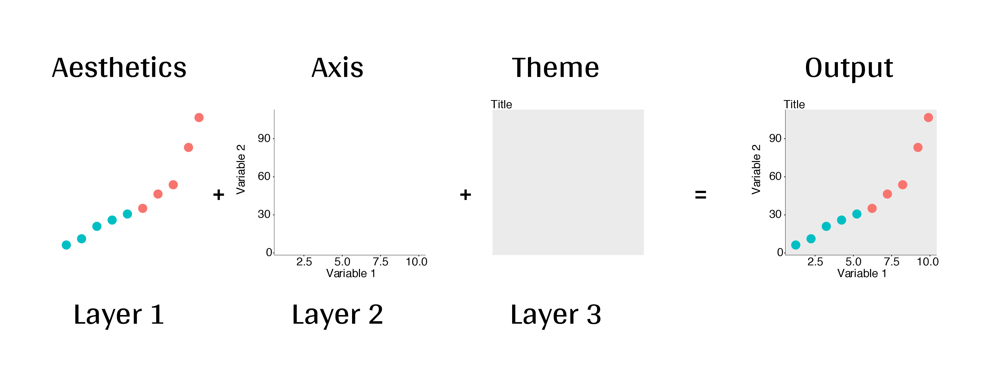
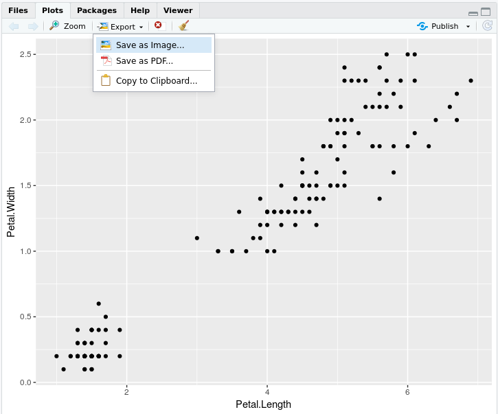
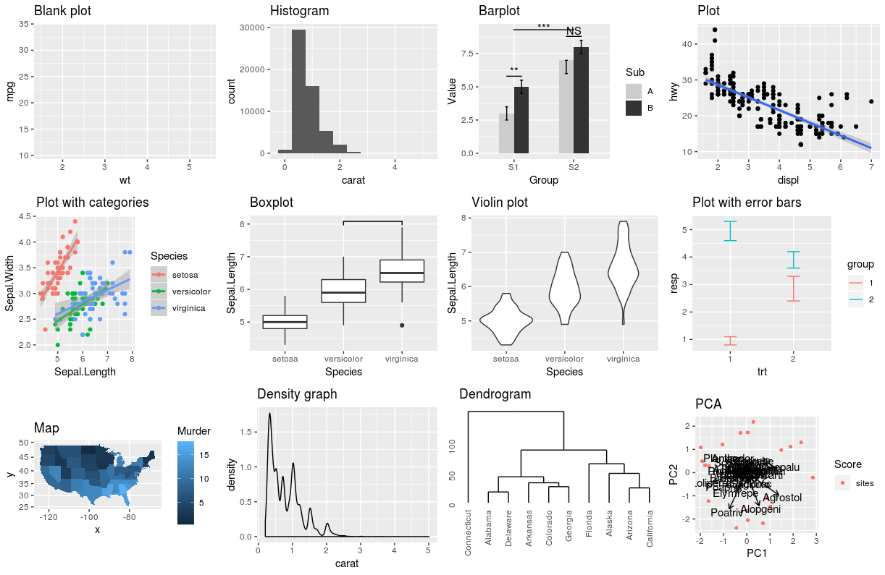
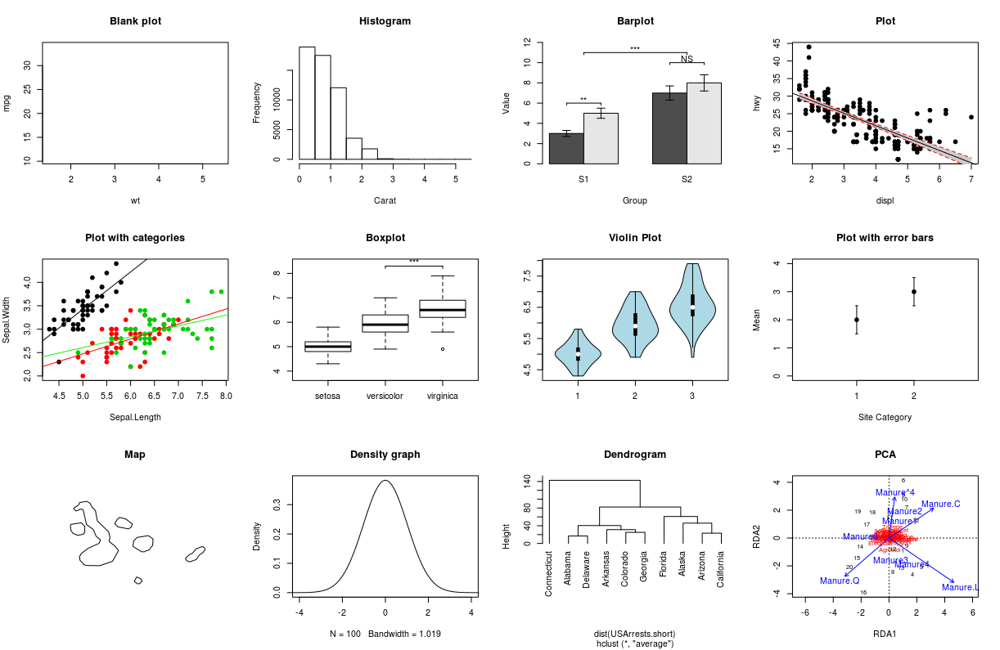
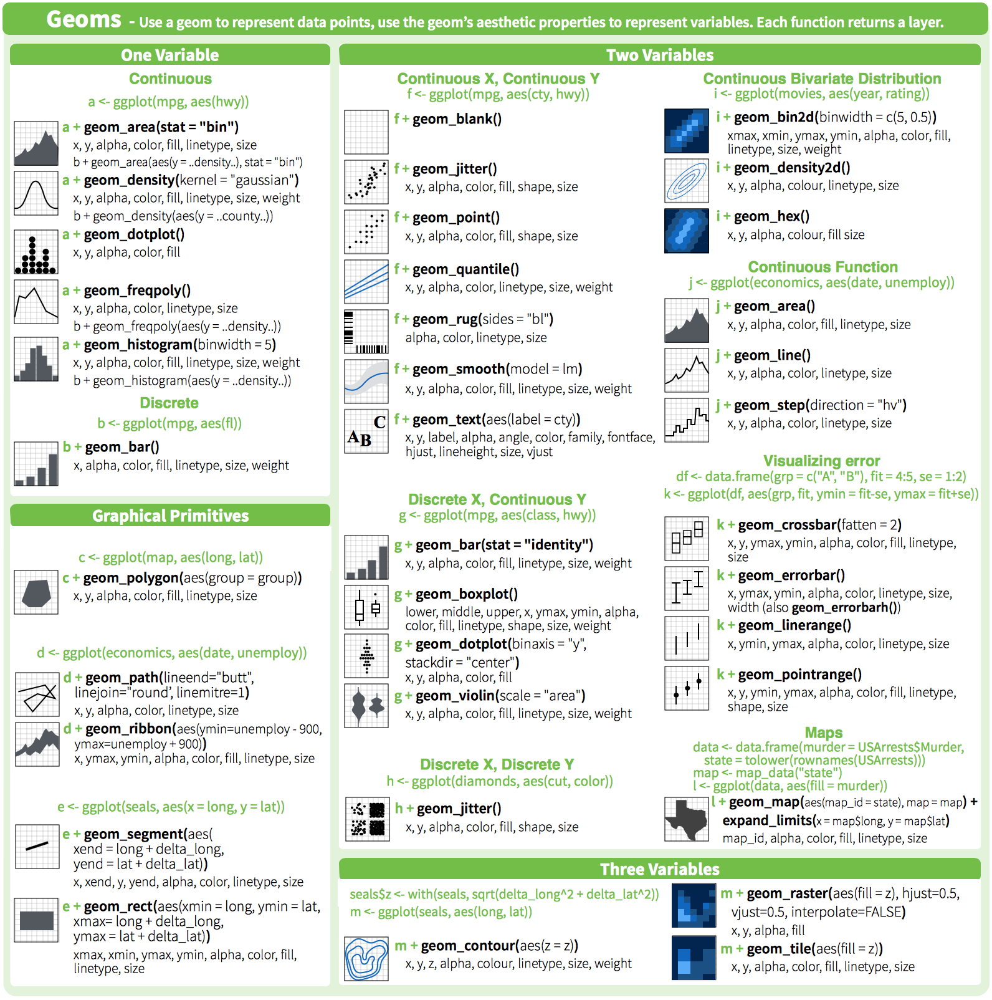
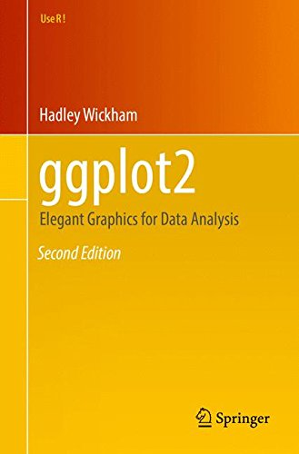
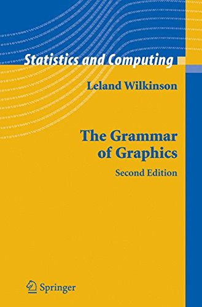

```{r setup, echo = F}
knitr::opts_chunk$set(
  comment = "#",
  collapse = TRUE,
  warning = FALSE,
  message = FALSE,
  fig.width=5, fig.height=5,
  fig.align = 'center'
)
```

```{r, echo = F}
options(repos=structure(c(CRAN="http://cran.r-project.org")))
```

```{r, include = FALSE}
source(file="./Scripts_and_data/multiplot.R")

if(!require(ggplot2)) install.packages("ggplot2")
if(!require(ggplot2)) library(ggplot2)

if(!require(knitr)) install.packages("knitr")
if(!require(knitr)) library(knitr)

if(!require(tidyr)) install.packages("tidyr")
if(!require(tidyr)) library(tidyr)

if(!require(dplyr)) install.packages("dplyr")
if(!require(dplyr)) library(dplyr)

if(!require(magrittr)) install.packages("magrittr")
if(!require(magrittr)) library(magrittr)

if(!require(grid)) install.packages("grid")
if(!require(grid)) library(grid)

if(!require(gridExtra)) install.packages("gridExtra")
if(!require(gridExtra)) require(gridExtra)

if(!require(RColorBrewer)) install.packages("RColorBrewer")
if(!require(RColorBrewer)) library(RColorBrewer)

if(!require(kableExtra)) install.packages("kableExtra")
if(!require(kableExtra)) library(kableExtra)

if(!require(gridBase)) install.packages("gridBase")
if(!require(gridBase))library(gridBase)

if(!require(vegan)) install.packages("vegan")
if(!require(vegan)) library(vegan)

if(!require(vioplot)) install.packages("vioplot")
if(!require(vioplot)) library(vioplot)

if(!require(ggpubr)) install.packages("ggpubr")
if(!require(ggpubr)) library(ggpubr)

if(!require(ggsignif)) install.packages("ggsignif")
if(!require(ggsignif)) library(ggsignif)

# if(!require(ggvegan)) install.packages("ggvegan")
# if(!require(ggvegan)) library(ggvegan)

if(!require(ggdendro)) install.packages("ggdendro")
if(!require(ggdendro)) library(ggdendro)

if(!require(rworldmap)) install.packages("rworldmap")
if(!require(rworldmap)) library(rworldmap)

if(!require(maps)) install.packages("maps")
if(!require(maps)) library(maps)

if(!require(mapproj)) install.packages("mapproj")
if(!require(mapproj)) library(mapproj)
```

## Introduction

- To follow along:

Code and .HTML available at http://qcbs.ca/wiki/r/workshop3

- Recommendation:
      * create your own new script
      * refer to provided code only if needed
      * avoid copy pasting or running the code directly from script

- ggplot2 is also hosted on Github: https://github.com/hadley/ggplot2

---
## Outline
1. Introduction
2. ggplot mechanics
3. Importance of data structure
4. Basic plot
5. Aesthetic
6. Geom
  * point, line, Histogram, box plot
  * Error bar, sgnificant value & linear regression
7. Fine tunning
  * Color
  * Theme
8. Miscellaneous

---
## Introduction : Why use R for plotting?
<div style="text-align:center">

</div>

---
## Introduction : Why use R for plotting?
<div style="text-align:center">

</div>

---
## Introduction : Why use R for plotting?
Beautiful and flexible graphics!

```{r, echo=FALSE, fig.width=7}
source(file="./Scripts_and_data/multiExamplePlot.R")
```
---
## Introduction

- Have you created plots?
      * What kind of plot?
      * Which software?

- Have you plotted in R?
      * `base` R, `lattice`?
      * `ggplot2`?

---
class: inverse, center, middle

# ggplot2

---
## ggplot2

The `ggplot2` package lets you make beautiful and customizable plots of your data. It implements the grammar of graphics, an easy to use system for building plots.

<div style="text-align:center">

</div>

---
## Introduction

Required packages
```{r, eval = FALSE}
install.packages("ggplot2")
library(ggplot2)
```

---
## Grammar of Graphics (GG)

A graphic is made of different layers:
  * aesthetics (`aes`)
  * transformation
  * geometries (`geoms`)
  * axis (coordinate system)
  * scales



---
```{r, , fig.height=3.5, fig.width=5}
ggplot(data = iris,             # Data
       aes(x = Sepal.Length,    # Your X-value
           y = Sepal.Width,     # Your Y-value
           col = Species)) +    # Aesthetics
  geom_point() +                # Geometry
  geom_smooth(method = "lm") +  # Linear regression
  ggtitle("My fabulous graph")+ # Title
  theme(plot.title= element_text(color="red",         #|
                                 size=14,             #| Theme
                                 face="bold.italic")) #|
```

---
## Importance in data structure

```{r}
head(iris[,c("Sepal.Length","Sepal.Width","Species")], n = 5)
```

`ggplot(data = iris, aes(`**x = Sepal.Length**`,` **y = Sepal.Width**`, `**col = Species**`))`

---
## A simple Example with iris database

.small[

.pull-left[

**Inheritance from ggplot**
```{r, eval=FALSE}
ggplot(data = iris,             # Data
      aes(x = Sepal.Length,    # Your X-value
          y = Sepal.Width)) +  # Your Y-value
 geom_point()                  # Geometry

```

**Storing ggplot in object**
```{r, eval=FALSE}

p <- ggplot(data = iris,
                   aes(x = Sepal.Length,
                       y = Sepal.Width))
q <- p + geom_point()
q   # Print your final plot

```
]

.pull-right[

**No inheritance from ggplot**
```{r, eval=FALSE}
ggplot() +
 geom_point(data = iris,
            aes(x = Sepal.Length,
                y = Sepal.Width))
```

**Adding layer from ggplot object**
```{r, eval=FALSE}
s <- ggplot()
s <- s +
 geom_point(data = iris,
            aes(x = Sepal.Length,
                y = Sepal.Width))
s
```
]

]

---
## GGplot dynamics: base layer

```{r, fig.height=4, fig.width=5}
ggplot() +
scale_x_continuous() +
scale_y_continuous()
```

---
## GGplot dynamics: Data layer

```{r, fig.height=4, fig.width=5}
ggplot(data = iris, aes(x = Sepal.Length, y = Sepal.Width)) +
  xlab("x = Sepal Lenght") +
  ylab("y = Sepal Width")
```

---
## GGplot dynamics: Gemoetric Layer

```{r, fig.height=4, fig.width=5}
ggplot(data = iris, aes(x = Sepal.Length, y = Sepal.Width)) +
  xlab("x = Sepal Lenght") + ylab("y = Sepal Width") +
  geom_point()
```

---
## Challenge #1 

  * Draw your 1rst (gg)plot:


 data | geom | x value | y value
:-------------:|:-------------:|:-------------:|:-------------:
iris|geom_point|Petal length|Petal width

---
## Solution Challenge 1# 

```{r, fig.height=4}
ggplot(data = iris, aes(x = Petal.Length, y = Petal.Width)) +
  geom_point()
```

---
## Saving plots in RStudio

<div style="text-align:center">

</div>

---
## Saving plots in code

`ggsave()` will write directly to your working directory all in one line of code and you can specify the name of the file and the dimensions of the plot:

.small[
```{r, eval=FALSE}
my1rstPlot <- ggplot(data = iris, aes(x = Petal.Length, y = Petal.Width)) + geom_point()
ggsave("my1rstPlot.pdf",
       my1rstPlot,
       height = 8.5,
       width = 11,
       units = "in")
```
]

.comment[Note that vector format (e.g., pdf, svg) are often preferable choice compared to raster format (jpeg, png, ...)]

.comment[Other methods to save image `?pdf` `?jpeg`]

---
## Aesthetic

Different aesthetic are available to help you distinguish different class, group & structure within your data:

```{r echo=FALSE, fig.width=8}
source(file="./Scripts_and_data/4plot_aesthetic.R")
```

---
## Example of aesthetic: color

.small[
.pull-left[
```{r, fig.width=6, fig.height=5.4}
#Without Color
ggplot(data = iris, aes(x = Sepal.Length,
                        y = Sepal.Width)) +
  geom_point()
```
]
.pull-right[
```{r, fig.width=6, fig.height=6}
ggplot(data = iris, aes(x = Sepal.Length,
                        y = Sepal.Width,
                        color = Species)) +
geom_point() + theme(legend.position = 'bottom')
```
]
]

---
## Challenge #2 

Produce a colourful plot from built in data such as the `Iris`, `CO2` or the `msleep` dataset

<br>

Data|x value|y value| Aesthetic
:-------------:|:-------------:|:-------------:|:-------------:
iris|Petal.Length|Petal.Width|Species
CO2|conc|uptake|Treatment & Type
msleep|log10(bodywt)|awake| vore & conservation

---
## Solution to challenge #2 

Example using `iris` database

```{r, fig.height=3.5, fig.width=6}
data(iris)
iris.plot <- ggplot(data = iris,
  aes(x = Petal.Length, y = Petal.Width, color = Species)) +
  geom_point()
iris.plot
```

---
## Solution to challenge #2 

Example using `CO2` database

```{r, fig.height=3.5, fig.width=6}
data(CO2)
CO2.plot <- ggplot(data = CO2,
    aes(x = conc, y = uptake, colour = Treatment)) +
    geom_point()
CO2.plot
```


---
## Solution to challenge #2 

Example using `msleep` database

```{r, fig.height=3.5, fig.width=6}
data(msleep)
msleep.plot <- ggplot(data = msleep,
    aes(x = log10(bodywt), y = awake, colour = vore, shape= conservation)) +
    geom_point()
msleep.plot
```

---
## Facet: `Iris`

```{r, fig.height=4, fig.width=7}
ggplot(data = iris, aes(x = Sepal.Length, y = Sepal.Width,
                        color = Species)) +
  geom_point() +
  facet_grid(~Species, scales = "free")
```

---
## Facet: `CO2`

```{r, echo=F, fig.width=7, fig.height=6}
CO2.plot.nofacet <- ggplot(data = CO2, aes(x = conc, y = uptake, colour = Treatment)) +
    geom_point() +
    xlab("CO2 Concentration (mL/L)") +
    ylab("CO2 Uptake (umol/m^2 sec)") +
    ggtitle("Without Facet")
CO2.plot.facet <- CO2.plot + facet_grid(~ Type) + ggtitle("Facet")
multiplot(CO2.plot.nofacet, CO2.plot.facet)
```

---
## Fine tuning - colours

Colour: Manual_colour

.small[
```{r, eval=FALSE, fig.align="center", fig.width=6, fig.height=4}
iris.plot <- ggplot(data = iris, aes(x = Sepal.Length, y = Sepal.Width, color = Species)) +
            geom_point()
iris.plot + scale_colour_manual(values = c("setosa" = "red",
                                           "versicolor" = "darkgreen",
                                           "virginica"="blue"))
```
]
.pull-left[
**Classic**
```{r, echo=FALSE, fig.align="center", fig.width=6, fig.height=4}
iris.plot <- ggplot(data = iris,
                    aes(x = Sepal.Length,
                        y = Sepal.Width,
                        color = Species)) +
            geom_point()
iris.plot
```
]
.pull-right[
**Manual**
```{r, echo=FALSE, fig.align="center", fig.width=6, fig.height=4}
iris.plot +
scale_colour_manual(values = c("setosa" = "red",
                               "versicolor" = "darkgreen",
                               "virginica"="blue"))
```
]

---
## Fine tuning - gradient colours for quantitative variable

*quantitavie variable: `Petal.Length`*

```{r, echo=TRUE, eval=FALSE}
iris.plot.petal <- ggplot(data=iris, aes(..., color = Petal.Length))
```

.pull-left[
```{r, echo=FALSE, fig.align="center", fig.width=6, fig.height=4}
iris.plot.petal <- ggplot(data = iris,
                    aes(x = Sepal.Length,
                        y = Sepal.Width,
                        color = Petal.Length)) +
            geom_point()
iris.plot.petal
```
]
.pull-right[
```{r, echo=FALSE, fig.align="center", fig.width=6, fig.height=4}
iris.plot.petal <- ggplot(data = iris,
                    aes(x = Sepal.Length,
                        y = Sepal.Width,
                        color = Petal.Length)) +
            geom_point()
iris.plot.petal + scale_color_gradient(low="blue", high="red")
```
]

---
## Fine tuning - colours

Coulours theme

```{r, eval=FALSE}
install.packages("RColorBrewer")
require(RColorBrewer)
```

<div style="text-align:center">

</div>

---
## Fine tuning - colours

Coulours theme: RColorBrewer
```{r, eval=FALSE}
iris.plot + scale_color_brewer(palette = "Dark2")
```

.pull-left[
**Classic**
```{r, echo=FALSE, fig.align="center", fig.width=6, fig.height=4}
iris.plot
```
]
.pull-right[
**Dark2**
```{r, echo=FALSE, fig.align="center", fig.width=6, fig.height=4}
iris.plot + scale_color_brewer(palette = "Dark2")
```
]

---
## Fine tuning - colours

Blind color friendly: presentation purpose

```{r, eval=FALSE}
cbbPalette <- c("#000000", "#E69F00", "#56B4E9", "#009E73",
                "#F0E442", "#0072B2", "#D55E00", "#CC79A7")
iris.plot + scale_color_manual(values=cbbPalette)
```

.pull-left[
**Classic**
```{r, echo=FALSE, fig.align="center", fig.width=6, fig.height=4}
iris.plot
```
]
.pull-right[
**Blind color friendly**
```{r, echo=FALSE, fig.align="center", fig.width=6, fig.height=4}
cbbPalette <- c("#000000", "#E69F00", "#56B4E9", "#009E73",
                "#F0E442", "#0072B2", "#D55E00", "#CC79A7")
iris.plot + scale_color_manual(values=cbbPalette)
```
]

---
## Fine tuning - colours

black & white: grey scale for publication purpose

```{r, eval=FALSE}
iris.plot + scale_color_grey()
```

.pull-left[
**Defaut**
```{r, echo=FALSE, fig.align="center", fig.width=6, fig.height=4}
iris.plot
```
]
.pull-right[
**Grey scale**
```{r, echo=FALSE, fig.align="center", fig.width=6, fig.height=4}
iris.plot + scale_color_grey()
```
]

---
## Fine tuning - theme

Theme: classic for publication purpose

```{r, eval=FALSE}
iris.plot + scale_color_grey() + theme_classic()
```

.pull-left[
**Defaut**
```{r, echo=FALSE, fig.align="center", fig.width=6, fig.height=4}
iris.plot+ scale_color_grey()
```
]
.pull-right[
**Classic**
```{r, echo=FALSE, fig.align="center", fig.width=6, fig.height=4}
iris.plot + scale_color_grey() + theme_classic()
```
]

```{r,echo=F}
#--- Only way I could find to comment a slide (<!-- did not work)
## Challenge #3 
#
#  * Voici un graphique issu d'une publication
#    .alert[mettre le graphique de la publication]
#  * Voici ce même graphique obtenu avec un code par défaut de ggplot2
#    .alert[mettre le code et le graphique de base + penser à mettre *facilement* à disposition le jeux de données lié]
#  * Votre challenge sera d'utiliser les fonctions présentées précédemment afin de recréer le graphique d'Origine
#    .alert[mettre des pistes des différentes fonctions à utiliser: theme, color, ... ?]
```

---
## Challenge #3 

Explore a new `geom()` and other plot elements with your own data or built in data

```r
data(msleep)
data(OrchardSprays)
```

---
## Solution challenge #3 

```{r, fig.height=4}
box.plot <- ggplot(data = OrchardSprays,
                  aes(x = treatment, y = decrease)) +
                  geom_boxplot()
box.plot
```

---
## Geom: GGplot

<div style="text-align:center">

</div>

---
## Base plot

<div style="text-align:center">

</div>

---
## Blank plot

.small[
.pull-left[
*GGplot2*
```{r}
ggplot(mtcars, aes(wt, mpg)) +
       geom_blank()
```
]

.pull-right[
*Base Plot*
```{r}
plot(mpg~wt, data = mtcars, type = "n")
```
]]

---
## Histogram

.small[
.pull-left[
*GGplot2*
```{r}
qplot(rnorm(100)) +
      geom_histogram()
```
]

.pull-right[
*Base Plot*
```{r}
hist(rnorm(100))
```
]]

---
## Barplot: value significance

.small[
.pull-left[
*GGplot2*
```{r}
qplot(rnorm(100)) +
      geom_histogram()
```
]

.pull-right[
*Base Plot*
```{r}
counts <- table(mtcars$gear)
barplot(counts, main="Car Distribution",
  	    xlab="Number of Gears", border=NA)

```
]]

---
## Plot: linear reagression

---
## Plot with categories

---
## Boxplot with significant value only

---
## Violoin Plot

---
## Plot with errors bars

---
## Map

---
## Density Graph

---
## Dendogram

---
## Ordination: PCA

---
## Geom_point & Geom_line

.alert[put ggplot vs base plot]

```{r}
CO2.plot.facet.baline <- CO2.plot.facet + geom_line()
CO2.plot.facet.line <- CO2.plot.facet + geom_line(aes(group=Plant))
multiplot(CO2.plot.facet.baline, CO2.plot.facet.line)
```

---
class: inverse, center, middle

# Miscellaneous

---
## Miscellaneous
  * .alert[Put other Crazy R visualisation]
  * .alert[A time for a tour on r-graph-gallery.com]
  * .alert[Itroduce Dynamics representative]
  * .alert[May be let the choice to the current speaker to show its own tricks and/or own data visu]

---
# Miscellaneous : `qplot()` vs `ggplot()`

```{r, eval = FALSE, message=FALSE, warning=FALSE}
qplot(data = iris,
      x = Sepal.Length,
      xlab = "Sepal Length (mm)",
      y = Sepal.Width,
      ylab = "Sepal Width (mm)",
      main = "Sepal dimensions")

ggplot(data = iris, aes(x = Sepal.Length, y = Sepal.Width)) +
  geom_point() +
  xlab("Sepal Length (mm)") +
  ylab("Sepal Width (mm)") +
  ggtitle("Sepal dimensions")
```
---
## Available elements

[Data Visualization with ggplot2 Cheat Sheet](https://www.rstudio.com/wp-content/uploads/2015/03/ggplot2-cheatsheet.pdf)

<div style="text-align:center">

</div>

---
## Additional resources

`help(package = ggplot)`

http://ggplot2.tidyverse.org/reference/

<div>
  
  
</div>

---
class: inverse, center, bottom

# Merci d'avoir participé!


