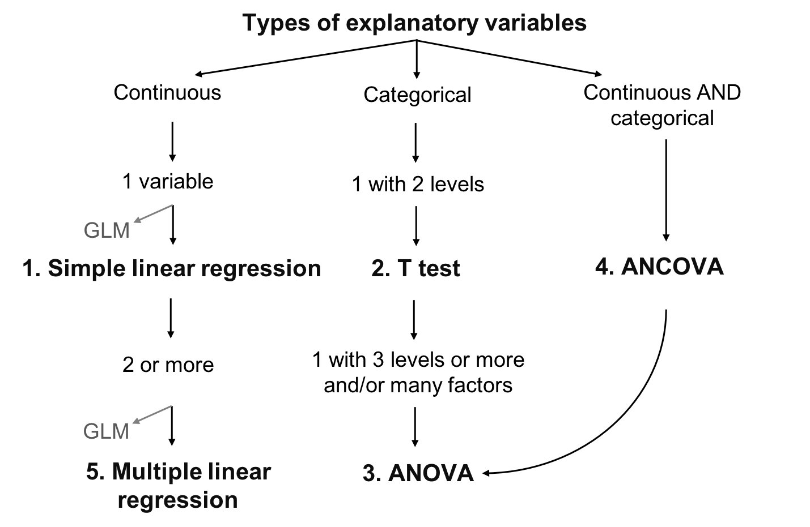
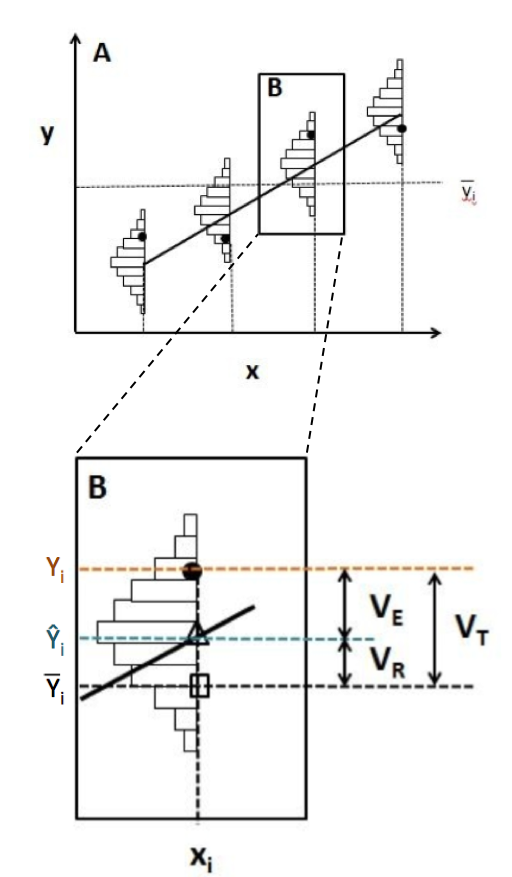
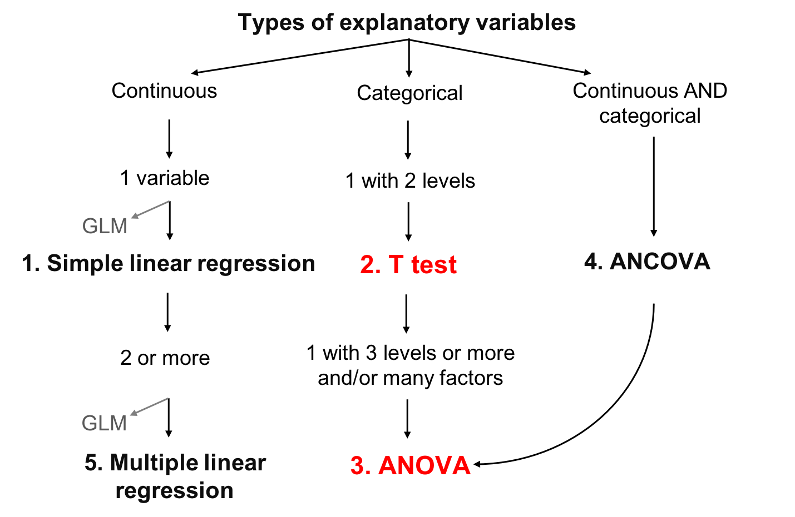
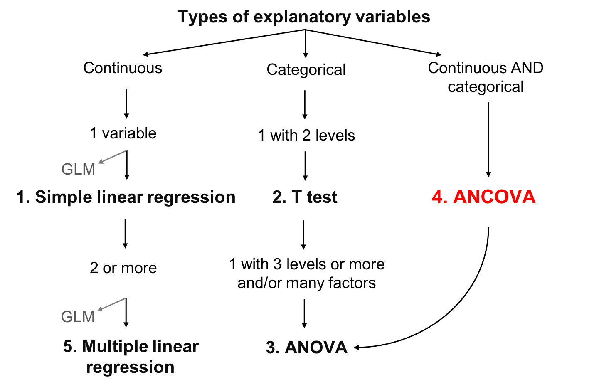
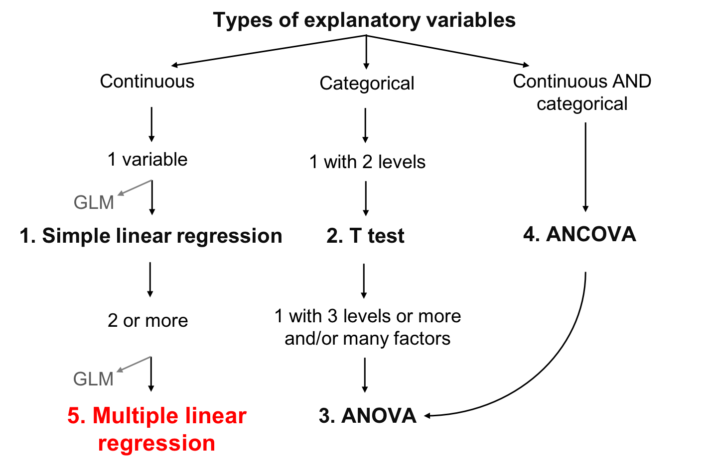

```{r setup, echo = F}
knitr::opts_chunk$set(
  comment = "#",
  collapse = TRUE,
  #cache = TRUE,
  warning = FALSE,
  message = FALSE,
  fig.width=6, fig.height=6,
  fig.align = 'center'
)
```

```{r, echo =F}
options(repos=structure(c(CRAN="http://cran.r-project.org")))
```

```{r, include = FALSE}
if (!require(dplyr)) install.packages("dplyr")
library(dplyr)

if (!require(kableExtra)) install.packages("kableExtra")
library(kableExtra)

if (!require(vegan)) install.packages("vegan")
library(vegan)

if (!require(e1071)) install.packages("e1071")
library(e1071)

if (!require(MASS)) install.packages("MASS")
library(MASS)

if (!require(car)) install.packages("car")
library(car)
```

---
class: inverse, center, middle

# Important concepts

## mean and variation

---

## Mean

Mean is a measure of the average value of a population (*x*):

$$\bar{x} = \frac{1}{N} \sum_{i=1}^{n} x_{i}$$

---
## Variation

- Variation is the spread around the mean
  - Mean deviation
  - Variance
  - Standard deviation
  - Coefficient of deviation

**What is deviation?**

$$D_{i} = |x_{i} - \bar{x}|$$

---
## Variation

**Deviation**:

$$D_{i} = |x_{i} - \bar{x}|$$
--
**Mean deviation**:

$$D = \frac{1}{N} \sum_{i=1}^{n} |x_{i} - \bar{x}|$$
--

Instead of absolute values, we can also square the value, giving the **variation**:

$$V = \frac{1}{N} \sum_{i=1}^{n} {(x_{i} - \bar{x})}^2$$

---
## Variation

But by squaring each value, our variables are no longer in meaningful units

So we just root square the **variation** ( $V$ ), giving the **standard variation**:

$$\sigma = \sqrt{V}$$
--

The relative standard deviation, expressed in percentage, is the **coefficient of variation**:

$$cv = \frac{\sigma}{\bar{x}}$$

---
class: inverse, center, middle

# Linear models

---
## What are linear models

Linear relationship between response ( $Y$ ) and explanatory ( $X$ ) variable, using the concepts of **mean** and **variation**

- $Y$ : variable you want to explain (only one response variable)
- $X$ : explain your response variable (one or more explanatory variables)
- $Y$ : must be continuous
- $X$ : continuous or categorical
- $\epsilon$ : what is not explained by the explanatory variable(s)  residuals or error

---
## Defining linear models

Putting everything together:

$$Y_{i} = \beta_{0} + \beta_{1} x_{i1} + \cdots + \beta_{p} x_{ip} + \epsilon_{i}$$

- $Y_i$ is the response variable
- $β_0$ is the intercept of the regression line
- $β_1$ is the coefficient of variation for the first explanatory variable
- $β_p$ is the coefficient of variation for the *nth* explanatory variable
- $x_i1$ is the first explanatory variable
- $x_ip$ is the *nth* explanatory variable
- $ε_i$ are the residuals of the model

---
## The goal of linear models

- The goal is to find the **best estimation** of the parameters (the $\beta$ variables) and then assess the goodness of fit of the model

- Several methods to calculate the intercept and coefficients of linear models
  - the appropriate choice depends on the kind of explanatory variables considered and their number

.center[.large[The general concept behind these methods is that the residuals are minimized]]

---
## Learning objectives

.center[

]

---
## Linear model assumptions

1. The residuals are independent
2. The residuals are normally distributed
3. The residuals have a mean of 0
4. The residuals are homoskedastic (they have constant variance)

.alert[These assumptions concern the residuals, not the response or explanatory variables]

.small[.comment[In the following sections, we do not always explicitly restate the above assumptions for every model because these assumption are implicit in all linear models]]
---
## Work follow

.center[

]

- Plot the data
- Create a model
- Test the model assumptions
- Adjust the model if assumptions are violated
- Interpret the model results

---
class: inverse, center, middle

# Simple linear regression

---
## Simple linear regression

- Type of linear model which contains a single, continuous explanatory variable

$$Y_i = \beta_0 + \beta_1 x_i + \epsilon_i$$

- Estimates the **intercept** ( $\beta_0$ ) and a **coefficient of correlation** ( $\beta_1$ )

- Ordinary least squares methods
  - Most used method and corresponds to the default function in R

---
## Least squares methods

.pull-left[
.center[]
]

.pull-right[
**Assumptions**

- $Y_i$ : Observed value (measured) at $X_i$
- $\widehat{Y}_i$ : Predicted value at $X_i$
- $\bar{Y}$ : Mean value of all $Y_i$
- $V_E$ : Residual variance (error)
- $V_R$ : Variance explained by the regression
- $V_T$ : Total variance
- $R^2 = \frac{V_R}{V_T}$
]

---
## Running a regression in R

.small[
**Step 1**. Run your linear model

**Step 2**. Verify assumptions
]

.pull-left[.center[]] .pull-right[.center[]]

.pull-left[.center[*Assumptions are met?*]

.small[**Step 3**. Estimate regression parameters, test significance, plot your model
]]

.pull-right[.center[*Assumptions are not met?*]

.small[*Can you transform your variables (and does it make sense to do so)?*]

.pull-left[.center[]] .pull-right[.center[]]

.small[
.pull-left[
Yes: Go back to Step 1 with transformed variables
]

.pull-right[
No: Try GLM that might better suit your data
]]]

---
## Running a regression in R

**Step 1**. Run your linear model

In R, the function `lm()` is used to fit a linear model

```{r, eval = FALSE}
lm1 <- lm(Y~X)
```

- `lm1` : New object containing the linear model we created
- `Y` : Response variable
- `X` : Explanatory variable

---
## Running a regression in R

Download the <span style="color:blue"> *birdsdiet* </span> dataset:

```{r, eval=TRUE, echo=FALSE}
bird <- read.csv("Scripts_and_data/birdsdiet.csv")
```

```{r, eval = FALSE}
bird <- read.csv("birdsdiet.csv")
```

Visualize the data using the structure `str()` command:

```{r}
str(bird)
```

---
## Running a regression in R

Response variable: **Bird abundance**   num: continuous

Explanatory variable: **Bird mass**     num: continuous

```{r}
str(bird)
```

We first want to test if bird maximum abundance is a function of bird mass

```{r eval=TRUE}
lm1 <- lm(MaxAbund ~ Mass, data = bird)
```

---
## Running a regression in R

**Step 2**. Verify assumptions using diagnostic plots

```{r, eval=FALSE}
opar <- par(mfrow=c(2,2))
plot(lm1)
```

- `par( )`: sets the graphical parameters, for example, the `mfrow` argument sets the number of rows in the frame
- `plot( )`: is a generic function to plot graphics in R

The output will provide the four built-in diagnostic plots of the `lm()` function

---
## Diagnostic plot # 1 - Residuals vs Fitted

Example of independence (what we want!)

- Should show a scatter across and no pattern

```{r, echo = FALSE, fig.height=4.2, fig.width=5.5}
  set.seed(1234564)
  x <- rnorm(100,10,10)
  y <- 2*x+0 + rnorm(100)
  lm <- lm(y~x)
  plot(lm, which = 1)
```

---
## Diagnostic plot # 1 - Residuals vs Fitted

```{r, echo=FALSE, fig.height=4, fig.width=8.5, warning=FALSE}
par(mfrow=c(1,2))
set.seed(1234564)
x = rnorm(100,10,10)
y = (x)^2 + rnorm(length(x),0,30)
lm=lm(y~scale(x))
plot(lm,which = 1, main = "Nonlinear", col.main="red")

x = abs(rnorm(100,10,10))
y = (x) + rnorm(length(x), 0, x)
lm=lm(y~scale(x))
plot(lm,which = 1, main = "Heteroscedastic", col.main="red")
```

- Solution: Transform your data or try another distribution than linear (Gaussian) (i.e., a generalized linear model (GLM): Poisson, binomial, negative binomial, etc.)

---
## Diagnostic plot # 2 - Scale Location

- Should show a scatter across and no pattern

```{r, echo=FALSE, fig.height=3.8, fig.width=8, warning=FALSE}
par(mfrow=c(1,2))
set.seed(1234564)
x <- 1:100
y <- x + rnorm(100,sd=5)
lm=lm(y~x)
plot(lm,which = 3)

set.seed(2)
x = abs(rnorm(100,10,10))
y = (x) + rnorm(length(x), 0, x)
lm=lm(y~scale(x))
plot(lm,which = 3)
```
.pull-left[.center[]] .pull-right[.center[]]

.pull-left[.center[No pattern in the residuals]] .pull-right[.center[Strong pattern in the residuals]]

---
## Diagnostic plot # 3 - Normal QQ

- Compares the distribution (quantiles) of the residuals of the current model to those of a normal distribution
- If points lie linearly on the 1:1 line, data follow a normal distribution

```{r, echo=FALSE, fig.height=3, fig.width=8, warning=FALSE}
par(mfrow=c(1,2), mar = c(4, 4, 1.5, 3))
set.seed(1234564)
x <- 1:100
y <- x + rnorm(100,sd=5)
lm=lm(y~x)
plot(lm, which = 2)

set.seed(2)
x = abs(rnorm(100,10,10))
y = (x) + rnorm(length(x), 0, x)
lm=lm(y~scale(x))
plot(lm, which = 2)
```

.pull-left[.center[]] .pull-right[.center[]]

.pull-left[.center[Good!]] .pull-right[.center[Not that good...]]

---
## Diagnostic plot # 4 - Residuals vs Leverage

- Looks for influential values
- **Leverage points**: observations at extreme/ outlying values of the explanatory variable. Because they lack neighboring observations, the regression model passes close to leverage points. **They may OR may not have a high influence on the regression.**
- High leverage points with high influence can be identified with a **Cook's distance greater than 0.5**

---
## Leverage vs influence

```{r, echo=FALSE, fig.height=6, fig.width=5, warning=FALSE}
par(mfrow=c(3, 1), mar = c(4, 15, 1, 3), cex = 0.75)
set.seed(1234564)
x <- 1:20
y <- rnorm(x, x, 2)
lm0 <- lm(y ~ x)
# plot 1
plot(x, y, ylim = c(-4, 22)); abline(lm0, col = 2); points(11, -3, pch = 15)
# add 20, 10 point to the new lm
xx <- c(x, 11); yy <- c(y, -3)
abline(lm(yy ~ xx), col = 2, lty = 3)
text(-18, 10, srt=0, adj = 0, labels = '* No leverage \n* Low influence', xpd = TRUE, cex = 1.5)
# plot 2
plot(x, y, ylim = c(-4, 32), xlim = c(0, 31)); abline(lm0, col = 2); points(30, 30, pch = 15)
# add 20, 10 point to the new lm
xx <- c(x, 30); yy <- c(y, 30)
abline(lm(yy ~ xx), col = 2, lty = 3)
text(-31, 15, srt=0, adj = 0, labels = '* High leverage \n* No influence', xpd = TRUE, cex = 1.5)

# plot 3
plot(x, y, ylim = c(-4, 32), xlim = c(0, 31)); abline(lm0, col = 2); points(30, 15, pch = 15)
# add 20, 10 point to the new lm
xx <- c(x, 30); yy <- c(y, 15)
abline(lm(yy ~ xx), col = 2, lty = 3)
text(-31, 15, srt=0, adj = 0, labels = '* High leverage \n* High influence', xpd = TRUE, cex = 1.5)
```

---
## Leverage vs influence

```{r, echo=FALSE, fig.height=3.5, fig.width=9, warning=FALSE}
par(mfrow=c(1,2), mar = c(4, 4, 1.5, 3))
set.seed(1234564)
x <- 1:100
y <- x + rnorm(100,sd=5)
lm=lm(y~x)
plot(lm, which = 5)

set.seed(1234564)
x = abs(rnorm(100,10,10))
y = (x) + rnorm(length(x), 0, x)
lm=lm(y~scale(x))
plot(lm, which = 5)
```

.pull-left[.center[]] .pull-right[.center[]]

.pull-left[.center[No influential values]]
.pull-right[.center[High leverage point and reasonable influence]]

<br />
<br />
<br />

.comment[Point 29 has high leverage but its influence is acceptable (inside the 0.5 Cook's distance limits)]

---
## Leverage vs influence

High leverage point and high influence

<br />

.pull-left[
```{r, echo=FALSE, fig.height=3.5, fig.width=4, warning=FALSE}
par(mar = c(4, 4, 1, 0))
set.seed(1234564)
x = abs(rnorm(100,10,10))
y = (x) + rnorm(length(x), 0, x)
y[29] <- 100
lm=lm(y~scale(x))
plot(lm, which = 5)
```
]
.pull-right[
- Point 29 is outside the 0.5 limit of Cook's distance
- These points have too much influence on the regression
]

.alert[You should never remove outliers if you don't have good reasons to do so (ex: error of measurement)]

---
## **Step 2**. Verify assumptions of `lm1`

```{r, fig.height=4.9, fig.width=5.5}
par(mfrow=c(2,2), mar = c(4,4,2,1.1), oma =c(0,0,0,0))
plot(lm1)
```

---
## Assumptions not met - what is wrong?

Plot Y ~ X with corresponding best-fit regression line, and a histogram of Y and X to explore their distributions

```{r, fig.height=2.7, fig.width=9, echo = -1}
par(mfrow=c(1,3), mar = c(4,4,3,1), cex = 0.8)
plot(bird$MaxAbund ~ bird$Mass)
abline(lm1) # adds the best-fit line
hist(bird$MaxAbund) # hist() produces a histogram of the variable
hist(bird$Mass)
```

---
## Assumptions not met - what is wrong?

Can also use the **`Shapiro-Wilk`** and the `Skewness` tests to see if variables follow a normal distribuon:

```{r}
shapiro.test(bird$MaxAbund)
shapiro.test(bird$Mass)
```
.comment[In both cases, distributions are significantly different from normal]

---
## Assumptions not met - what is wrong?

Can also use the `Shapiro-Wilk` and the **`Skewness`** tests to see if variables follow a normal distribuon:

```{r}
skewness(bird$MaxAbund)
skewness(bird$Mass)
```
.comment[The positive skewness values also indicate that the distributions are left skewed]

---
## Transform the data

- Lets try normalizing data with a `log10()` transformation
- Add the log-transformed variables to our data frame

```{r}
bird$logMaxAbund <- log10(bird$MaxAbund)
bird$logMass <- log10(bird$Mass)
```

**Step 1**: Re-run the analysis with log-transformed variables

```{r}
lm2 <- lm(logMaxAbund ~ logMass, data = bird)
```

---
## **Step 2**: Verify assumptions of model `lm2`

```{r, fig.height=4.4, fig.width=5.9}
par(mfrow=c(2,2), mar=c(3,4,1.15,1.2))
plot(lm2)
```

.comment[.center[Much improved!]]

---
## **Step 2**: Verify assumptions of model `lm2`

```{r, echo=-1, fig.height=3.4, fig.width=9}
par(mfrow=c(1,3), mar=c(4,4,1.15,1.2))
plot(logMaxAbund ~ logMass, data=bird)
abline(lm2)
hist(log10(bird$MaxAbund))
hist(log10(bird$Mass))
```

---
## **Step 3**: Estimate parameters and test significance

The function `summary()` is used to obtain parameter estimates, significance, etc.

.small[
```{r}
summary(lm2)
```
]

---
## **Step 3**: Estimate parameters and test significance

We can also call out specific parameters of the model, for example:

```{r}
lm2$coef
summary(lm2)$coefficients
summary(lm2)$r.squared
```

---
## Group discussion

- Can you write down the equation of the regression line for your model `lm2`?
- Are the parameters significant?
- What proportion of variance is explained by model `lm2`?

.small[
```{r}
summary(lm2)
```
]

---
## Group discussion

Can we improve the model if we only use terrestrial birds?

.comment[You could exclude objects using `=!`]

```{r}
lm3 <- lm(logMaxAbund~logMass, data=bird, subset=!bird$Aquatic)
# removes aquatic birds (= TRUE)
# or equivalently
lm3 <- lm(logMaxAbund~logMass, data=bird, subset=bird$Aquatic == 0)
```

```{r eval=FALSE}
# Examine the diagnostic plots
par(mfrow=c(2,2))
plot(lm3)
summary(lm3)

# Compare both models
par(mfrow=c(1,2))
plot(logMaxAbund~logMass, data=bird)
plot(logMaxAbund~logMass, data=bird, subset=!bird$Aquatic)
```

---
## Plot

`R2-adj` changed from $0.05$ to $0.25$ when we dropped aquatic birds:

```{r, fig.height=3.5, fig.width=7}
par(mfrow=c(1,2), mar = c(4, 4, 3, 1))
plot(logMaxAbund~logMass, data=bird, main = 'All birds')
abline(lm2, col = 'red')
plot(logMaxAbund~logMass, data=bird, subset=!bird$Aquatic, main = 'Terrestrial birds')
abline(lm3, col = 'red')
```

---
## Challenge 1 

- Examine the relationship between `log(MaxAbund)` and `log(Mass)` for passerine birds
- Save the model object as `lm4`

.comment[HINT: Passerine is also coded 0 and 1 (look at `str(bird)`)]

- Compare the variance explained by `lm2`, `lm3` and `lm4`

---
## Challenge 1 - Solution 

<br>
```{r}
# Run the model
lm4 <- lm(logMaxAbund ~ logMass, data=bird, subset=bird$Passerine == 1)
summary(lm4)
```

---
## Challenge 1 - Solution 

```{r, echo=-3,fig.height=4.8, fig.width=6.5}
# diagnostic plots
par(mfrow=c(2,2), mar = c(4,4,2,1.1), oma =c(0,0,0,0))
plot(lm4)
```

---
## Challenge 1 - Solution 

Compare variance explained by `lm2`, `lm3` and `lm4`

```{r}
# Recall: we want adj.r.squared
summary(lm2)$adj.r.squared
summary(lm3)$adj.r.squared
summary(lm4)$adj.r.squared
```

.comment[The best model among the three models is `lm3` *(only terrestrial birds)*]

---
## Learning objectives

.center[

]

---
class: inverse, center, middle

# ANOVA

## T-test, One-way ANOVA, Two-way ANOVA

---
## ANOVA

Continuous response variable

**Categorical explanatory variables**

- Two or more levels (groups)

.large[.center[ANOVA tests whether the means of the response variable differs between the levels]]

Sum of squares: within-treatment variance *vs* between-treatment variance

If between-treatment variance $>$ within-treatment variance:
  - The treatments affect the explanatory variable more than the random error
  - The explanatory variable is likely to be significantly influenced by the treatments

---
## Types of ANOVA

1. One-way ANOVA
  - One factor with 2 or more levels
  - If there are 2 levels a **t-test** can be used alternatively

2. Two-way ANOVA
  - 2 factors or more
  - Each factor can have multiple levels
  - The interactions between each factor must be tested

3. Repeated measures?
  - ANOVA can be used for repeated measures, but we won't cover this today
  - Linear Mixed-effect Models can also be used for this kind of data (you'll see it on Workshop 6)

---
class: inverse, center, middle

# T-test

---
## T-test

- **Response variable**  Continuous
- **Explanatory variable**  Categorical with **2 levels**

**Assumptions**
- Data follow a normal distribution
- Equality of variance between groups (Homoscedasticity)

.comment[robustness of this test increases with sample size and is higher when groups have equal sizes]

---
## Running a T-test in R

Use the function `t.test()`

```r
t.test(Y~X2, data= data, alternative = "two.sided")
```

  - `Y`: response variable
  - `X2`: factor (2 levels)
  - `data`: name of dataframe
  - `alternative` hypothesis: `"two.sided"` (default), `"less"`, or `"greater"`

The t-test is still a linear model and a specific case of ANOVA with one factor with 2 levels

Thus the function `lm()` can also be used

```r
lm.t <-lm(Y~X2, data = data)
anova(lm.t)
```

---
## Running a T-test in R

.large[Are aquatic birds heavier than non-aquatic birds?]

- Response variable: `Bird mass`  num: Continuous
- Explanatory variable: `Aquatic`  2 levels: 1 or 0 (yes or no)

---
## Running a T-test in R

First, lets visualize the data using the function `boxplot()`

```{r eval=TRUE,fig.height=4.8, fig.width=6.5}
boxplot(logMass ~ Aquatic,
        data = bird, names = c("Non-Aquatic", "Aquatic"))
```

---
## Running a T-test in R

Next, test the assumption of equality of variance using `var.test()`

```{r}
var.test(logMass ~ Aquatic, data = bird)
```

.comment[The ratio of variances is not statistically different from 1, therefore variances are equal]

.comment[We may now proceed with the t-test!]

---
## Running a T-test in R

```{r}
ttest1 <- t.test(logMass ~ Aquatic, var.equal = TRUE, data = bird)

# Or use lm()
ttest.lm1 <- lm(logMass ~ Aquatic, data=bird)
```

.comment[Indicates that homogeneity of variance was respected (as we just tested)]

You can verify that `t.test()` and `lm()` provide the same model:

```{r}
ttest1$statistic^2
anova(ttest.lm1)$F
# answer: F=60.3845 in both cases
```

.comment[When the assumption of equal variance is met $t^2$ follows an F distribution]

---
## Running a T-test in R

If $p<0.01$ (or $0.05$ ), the null hypothesis of no difference between the two groups (*H0*) can be rejected, with a risk of $0.01$ (or $0.05$ ) that we made a mistake in this conclusion

```{r}
ttest1
```

.small[.comment[There exists a difference in mass between the aquatic and terrestrial birds - `p-value`]]

.small[.comment[Look at the mean of the two groups]]

---
## Violation of Assumptions

- If variances between groups are not equal, can use corrections like the Welch correction (DEFAULT in R!)
- If assumptions cannot be respected, the **non-parametric** equivalent of t-test is the Mann-Whitney test
- If two groups **are not independent** (e.g. measurements on the same individual at 2 different years), you should use a paired t-test

---
## Group discussion

.large[Are aquatic birds heavier than terrestrial birds?]

```{r}
# Unilateral t-test
uni.ttest1 <- t.test(logMass ~ Aquatic,
                     var.equal = TRUE,
                     data = bird,
                     alternative = "less")
```

.comment[What did you conclude?]

---
## Group discussion

```{r}
uni.ttest1
```

.small[
Yes, aquatic birds are heavier than terrestrial birds: p-value = `r format(uni.ttest1$p.value, scientific=FALSE)`
]

---
class: inverse, center, middle

# ANOVA

---
## Analysis of Variance (ANOVA)

Generalization of the t-test to $>2$ groups and/or $≥2$ factor levels

Subsets variation in the response variable into additive effects of one or several factors and the interactions between them

<br>
$$Y = \underbrace{\mu}_{\Large{\text{The average outcome}\atop\text{over all individuals}}} + \overbrace{\tau_{i}}^{\Large{\text{The average outcome over}\atop\text{all individuals in group i}}} + \underbrace{\epsilon}_{\text{Residuals}}$$

---
## Review: ANOVA

Assumptions
- Normality of residuals
- Equality of variance between groups

Complementary test
- When ANOVA detects a significant difference between groups, it does not tell you which group differs from which other group
- A commonly used post-hoc test to answer this question is the **Tukey's test**

---
## Running an ANOVA in R

##### Is abundance a function of diet?
- Response variable: **MaxAbund**   num: continuous
- Explanatory variable: **Diet**  factor with 5 levels

```{r}
str(bird)
```

---
## Visualize data

First, visualize the data using `boxplot()` (alphabetically by default)

```{r, fig.height=4.2, fig.width=7,echo=-1}
par(mar = c(4, 4, 0.5, 1))
boxplot(logMaxAbund ~ Diet,
        data = bird, ylab = expression("log"[10]*"(Maximum Abundance)"), xlab = 'Diet')
```

---
## Visualize data

We can reorder factor levels according to group medians using the `tapply()` and `sort()` functions

```{r, fig.height=3.5, fig.width=7, echo=-1}
par(mar=c(4,4,.1,1))
med <- sort(tapply(bird$logMaxAbund, bird$Diet, median))
boxplot(logMaxAbund ~ factor(Diet, levels = names(med)), data = bird,
        ylab = expression("log"[10]*"(Maximum Abundance)"), xlab = 'Diet')
```

---
## Visualize data

Another way to graphically view the effect sizes is to use `plot.design()`

```{r, fig.height=3.5, fig.width=7, echo=-1}
par(mar=c(4,4,.4,1))
plot.design(logMaxAbund ~ Diet, data=bird, ylab = expression("log"[10]*"(Maximum Abundance)"))
```

.comment[Levels of a particular factor along a vertical line, and the overall value of the response in a horizontal line]

---
## Running a one-way ANOVA in R

Can use the function `lm()` to run an ANOVA
```{r}
anov1 <- lm(logMaxAbund ~ Diet,
            data = bird)
```

Or use a specific function called `aov()`
```{r}
aov1 <- aov(logMaxAbund ~ Diet,
            data = bird)
```

.comment[Try it and compare the outputs!]

---
## Running a one-way ANOVA in R

Compare outputs
```{r}
anova(anov1)
```
```{r}
summary(aov1)
```

---
## Did we violate the model assumptions?

**Bartlett test**: equality of variance among groups

.small[
```{r}
bartlett.test(logMaxAbund ~ Diet,
              data = bird)
```
]

**Shapiro-Wilk test**:  Normality of residuals

.small[
```{r}
shapiro.test(resid(anov1))
```
]

.comment[Both tests are non-significant; variances assumed to be equal and residuals assumed to be normally distributed]

---
## What if the assumptions were not met?

**Transform the data**: might normalize the residuals and homogenize the variances, and convert a multiplicative effect into an additive one
```{r eval=FALSE}
data$logY <- log10(data$Y)
```
* see Workshop 1 for rules on data transformation
* re-run your data with the transformed variables and verify the assumptions once again

**Kruskal-Wallis Test**: non-parametric equivalent to ANOVA if you cannot *(or do not wish to)* transform the data
```{r eval=FALSE}
kruskal.test(Y~X, data)
```

---
## Output of our ANOVA model

Factor levels in alphabetical order and all levels are compared to the reference level (`Insect`)

.small[
```{r}
summary(anov1)
```
]

---
## Output of our ANOVA model

On the other hand, if `lm()` is used

.pull-left2[
.small[
```{r}
summary.lm(aov1)
```
]]

.pull-right2[
.comment[Significant difference between Diet groups, but we don't know which ones!]
]

---
## A posteriori test

If ANOVA detects a significant effect, a post-hoc test is required to determine which treatment(s) differ from the others. This can be done with the `TukeyHSD()` function

.pull-left2[
.small[
```{r}
TukeyHSD(aov(anov1), ordered = TRUE)
```
]
]
.pull-right2[
<br><br>
.comment[Only "Vertebrate" and "PlantInsect" differ]
]

---
## Graphical representation

The ANOVA results can be graphically illustrated using the `barplot()` function

.small[
```{r, fig.height=3, fig.width=7,echo=-1}
par(mar=c(3,3,0.5,0.5))
sd <- tapply(bird$logMaxAbund, list(bird$Diet), sd)
means <- tapply(bird$logMaxAbund, list(bird$Diet), mean)
n <- length(bird$logMaxAbund)
se <- 1.96*sd/sqrt(n)
bp <- barplot(means, ylim = c(0, max(bird$logMaxAbund) - 0.5))
epsilon = 0.1
segments(bp, means - se, bp, means + se, lwd=2) # vertical bars
segments(bp - epsilon, means - se, bp + epsilon, means - se, lwd = 2) # horizontal bars
segments(bp - epsilon, means + se, bp + epsilon, means + se, lwd = 2) # horizontal bars
```
]

---
class: inverse, center, middle

# Two-way ANOVA

---
## Two-way ANOVA

More than one factor

- One factor anova:

 `aov <- lm(Y ~ X, data)`

- Two or more factors anova:

 `aov <- lm(Y ~ X * Z * ..., data)`

.comment[The "*" symbol indicates that the main effects as well as their interaction will be included in the model]

.comment[If use the "+" symbol, the main effects, but not their interaction are included]

`aov <- lm(Y ~ X + Z + ..., data)`


---
## Two-way ANOVA

Example of a non-significant interaction

.small[
```r
aov <- lm(Y ~ X * Z, data)
summary(aov)
# Analysis of Variance Table
#
# Response: Y
# Df Sum Sq Mean Sq F value Pr(>F)
# X 4 5.1059 1.27647 3.0378 0.02669 *
# Z 1 0.3183 0.31834 0.7576 0.38870
# X:Z 3 2.8250 0.94167 2.2410 0.10689
# Residuals 45 18.9087 0.42019
# ---
# Signif. codes: 0 ‘***’ 0.001 ‘**’ 0.01 ‘*’ 0.05 ‘.’ 0.1 ‘ ’ 1
```
]

According to law of **parsimony**, select model that explain the most variance with the least model parameters possible
- Thus, remove the interaction term if non-signficant and re-evaluate

```r
aov <- lm(Y ~ X + Z, data)
```

---
## Challenge 2 

Evaluate how `log(MaxAbund)` varies with Diet and Aquatic

- .comment[Hint: Test the factors Diet, Aquatic and their interaction in a two-way ANOVA model
e.g. `lm(Y ~ A*B)`]

- .comment[where A is your first factor, B is your second and ` * ` is the command for interaction in R]

---
## Challenge 2 - Solution 

.small[
```{r}
anov2 <- lm(logMaxAbund ~ Diet*Aquatic, data = bird)
summary(anov2)
```
]

---
## Challenge 2 - Solution 

.small[
```{r}
anov2 <- lm(logMaxAbund ~ Diet*Aquatic, data = bird)
anova(anov2)
```
]

.comment[In this case, the only significant term of the model is the diet factor]

---
## Learning objectives

.center[

]

---
class: inverse, center, middle

# ANCOVA

---
## Analysis of Covariance (ANCOVA)

- Combination of ANOVA and linear regression
- Explanatory variables are a mix of continuous variable(s) (covariates) and categorial variable(s) (factors)

$$Y = \mu + \text{Main Effects of Factors} + \\
            \text{Interactions between factors} + \\
            \text{Main effects of covariates} + \\
            \text{Interactions between covariates and factors} + \epsilon$$

---
## Review: ANCOVA

In addition to the assumptions of linear models, **ANCOVA** models must have:

- The same value range for all covariates
- Variables that are fixed
- No interaction between categorical and continuous variables

<br>

.small[
.comment[A **fixed** variable is one that you are specifically interested in (bird mass) whereas a **random** variable is noise that you want to control for (i.e. site a bird was sampled in)]]

.small[.comment[*More in workshop 6 with linear-mixed effects models*]]

---
## Types of ANCOVA

You can have any number of factors and/or covariates, but as their number increases, the interpretation of results gets more complex

<br>

Frequently used ANCOVA

1. **One covariate and one factor**
2. One covariate and two factors
3. Two covariates and one factor

.small[.comment[We will only see the first case today, but the two others are pretty similar!]]

---
## ANCOVA with 1 covariate and 1 factor

Different possible goals of this analysis:

1. Effect of factor and covariate on the response variable
2. Effect of factor on the response variable after removing effect of covariate
3. Effect of covariate on response variable while controlling for the effect of factor

<br>

.center[.alert[You can only meet these goals if you have no interaction between your factor and covariate!]]

---
## ANCOVA with 1 covariate and 1 factor

<br>

```{r,echo=FALSE,fig.height=3, fig.width=10}
## functions
f1 <- function(x, a, b) {
  return(x*a+b)
}
# conf for plot
col = rgb(118, 143, 175, maxColorValue = 255)
x <- 1:20
par(mfrow = c(1, 3), mar = c(1, 1, 6.5, 4))

# plot 1
plot(x, f1(x, a=1.1,b=2), ylim = c(0, 60), type = 'l', lwd = 2.5, xaxt = "n", yaxt = "n", xlab = "", ylab = "", bty='l', col = col)
lines(f1(x, a=1.1,b=17), lwd = 2.5, col = col)
lines(f1(x, a=0.6,b=22), lwd = 2.5, col = col)
lines(f1(x, a=1.1,b=40), lwd = 2.5, col = col)
mtext('One level of the factor\n has a different slope', side = 3, line = 2, cex = 1.5)
# plot 2
plot(x, f1(x, a=.5,b=2), ylim = c(0, 60), type = 'l', lwd = 2.5, xaxt = "n", yaxt = "n", xlab = "", ylab = "", bty='l', col = col)
lines(f1(x, a=1.1,b=17), lwd = 2.5, col = col)
lines(f1(x, a=1.1,b=22), lwd = 2.5, col = col)
lines(f1(x, a=0.01,b=40), lwd = 2.5, col = col)
mtext('Many levels have\n different slopes', side = 3, line = 2, cex = 1.5)
# plot 3
plot(x, f1(x, a=1.1,b=2), ylim = c(0, 60), type = 'l', lwd = 2.5, xaxt = "n", yaxt = "n", xlab = "", ylab = "", bty='l', col = col)
lines(f1(x, a=1.1,b=17), lwd = 2.5, col = col)
lines(f1(x, a=1.1,b=22), lwd = 2.5, col = col)
lines(f1(x, a=1.1,b=40), lwd = 2.5, col = col)
mtext('No interaction', side = 3, line = 2, cex = 1.5)
```

.pull-left2[.center[.pull-left[] .pull-right[]]] .pull-right2[.center[]]

.center[.pull-left2[If the interaction is significant, you will have a scenario that looks like these]]

.pull-right2[If your covariate and factor are significant, outputs will look like this]

---
## Compare ANCOVA - Adjusted means

To compare the mean values of each factor, conditional on the effect of the other

The `effect()` function uses the output of the ANCOVA model to estimate the means of each factor level, corrected by the effect of the covariate

.small[
```{r eval=FALSE, warning=FALSE}
ancova.exemple <- lm(Y ~ X*Z, data=data) # X = quantitative; Z = categorical
library(effects)
adj.means.ex <- effect('Z', ancova.exemple)
plot(adj.means.ex)
```
]

```{r,echo=FALSE,fig.height=3, fig.width=5}
# plot to simulate effects::effect() plot
a = 40; b =20; sd = 8
par(mar=c(4,4,.5,1))
plot(c(a, b), ylim = c(10, 50), xlim = c(0.9, 2.1), xlab = 'factor Z', ylab = 'Y', xaxt = 'n')
lines(c(a, b), col = 4, pch = 1.5)
segments(c(1, 2), c(a-sd, b-sd), c(1,2), c(a+sd, b+sd), lwd = 1.5, col = 'orange')
segments(c(1, 2) - .04, c(a, b) + sd, c(1, 2) + .04, c(a, b) + sd, lwd = 1.5, col = 'orange')
segments(c(1, 2) - .04, c(a, b) - sd, c(1, 2) + .04, c(a, b) - sd, lwd = 1.5, col = 'orange')
points(c(1, 2), c(a, b), pch = 16, col = 4)
axis(1, at = c(1, 2), labels = FALSE) # add ticks
mtext(c('Level 1', 'Level 2'), 1, at = 1:2, line = 0.5) # add labels to ticks
```

---
## ANCOVA with 1 covariate and 1 factor

- If only your factor is significant, remove the covariate -> you will have a simple **ANOVA**
- If only your covariate is significant, remove your factor -> you will have a **simple linear regression**
- If the interaction btw your covariate and factor (*) is significant, you should explore which levels of the factor have different slopes from the others

.alert[Verify assumptions!]

- Very similar to what we have done so far!

---
## Running an ANCOVA in R

##### Is `Max Abund` a function of Diet and Mass?

Response variable: **MaxAbund**  num : quantitative continuous

Explanatory variables:
  - **Diet**  factor with 5 levels
  - **Mass**  numeric continuous

```{r}
str(bird)
```

---
## Challenge 3 

1- Run an ANCOVA to test the effect of Diet and Mass (as well as their interaction) on Maximum abundance
```{r eval=FALSE}
ancova.exemple <- lm(Y~X*Z, data=data)
summary(ancova.exemple)
```

2- Test whether the interaction is signifiant
```{r eval=FALSE}
ancova.exemple2 <- lm(Y~X+Z, data=data)
summary(ancova.exemple2)
```

---
## Challenge 3 - Solution 

<br>

```{r}
ancov1 <- lm(logMaxAbund ~ logMass*Diet,
             data = bird)
anova(ancov1)
```

.comment[Interaction between `logMass` and `Diet` is non-significant]

---
## Challenge 3 - Solution 

Remove the interaction term and re-evaluate the model (with only the main effects of `Diet` and `logMass`)

```{r}
ancov2 <- lm(logMaxAbund ~ logMass + Diet,
             data = bird)
anova(ancov2)
```

---
## Learning objectives

.center[

]

---
class: inverse, center, middle

# Multiple linear regression

---
## Multiple linear regression
- **Explanatory variable**  2 or more continuous variables
- **Response variable**  1 continuous variable

Generalization of simple linear regression

.center[
$$Y_i = \alpha + \beta_1x_{1i}+\beta_2x_{2i}+\beta_3x_{3i}+...+\beta_kx_{ki} + \epsilon$$
]

Assumptions (.small[*In addition to the usual assumptions of linear models*])
- Linear relationship between each explanatory variable and response variable
- Explanatory variables are orthogonal (NO collinearity)

If collinearity
1. Keep only one of the collinear variables
2. Try multidimensional analysis (workshop 9)
3. Try a pseudo-orthogonal analysis

---
##  Multiple linear regression in R

Using the `Dickcissel` datast to test effect of climate (`clTma`), productivity (`NDVI`) and grassland cover (`grass`) on bird abundance (`abund`)

.small[
```{r, eval=TRUE}
Dickcissel = read.csv("Scripts_and_data/dickcissel.csv")
str(Dickcissel)
```
]

---
## Verify assumptions!

Collinearity:
- Verify collinearity of all explanatory variables and variables of interest

.small[
.pull-left[
```{r, fig.height=6, fig.width=7}
# select variables
var <- c('clTma', 'NDVI', 'grass', 'abund')
plot(Dickcissel[, var])
```
]]

.pull-right[
<br>
.small[.comment[
If you see a pattern between any two variables, they may be collinear!

They are likely to explain the same variability of the response variable and the effect of one variable will be masked by the other
]]]

---
## Multiple linear regression in R

Run the multiple linear regression in R with `abund` as a function of `clTma + NDVI + grass`

```{r,eval=FALSE}
lm.mult <- lm(abund ~ clTma + NDVI + grass, data = Dickcissel)
summary(lm.mult)
```

Verify diagnostic plots, as you did for the simple linear regression

```{r,eval=FALSE,echo=-2}
par(mfrow = c(2, 2))
par(mfrow=c(2,2), mar = c(3.9,4,1.2,1.1), oma =c(0,0,0,0))
plot(lm.mult)
```

---
## Multiple linear regression in R

Run the multiple linear regression in R with `abund` as a function of `clTma + NDVI + grass`

.small[
```{r}
lm.mult <- lm(abund ~ clTma + NDVI + grass, data = Dickcissel)
summary(lm.mult)
```
]

---
## Multiple linear regression in R

Verify diagnostic plots, as you did for the simple linear regression

```{r, fig.height=4.4, fig.width=6,echo=-2}
par(mfrow = c(2, 2))
par(mfrow=c(2,2), mar = c(3.9,4,1.2,1.1), oma =c(0,0,0,0))
plot(lm.mult)
```

---
## Find the best-fit model

Recall the principle of parsimony: Most variance explained using the least number of terms possible  remove the weakest variable

.pull-left2[
.small[
```{r}
summary(lm.mult)
```
]]
.pull-right2[
.small[.comment[
<br>
All 3 variables are significant;

Model explains ~11% of the dickcissel variance (R²-adj = 0.11)
]]]

---
## Find the best-fit model

However, the response variable `abund` is not linearly related to the explanatory variables

```{r, fig.height=3, fig.width=9,echo=-1}
par(mfrow=c(1,3), mar=c(4, 4, 0.5, 0.5), cex = 1)
plot(abund ~ clTma, data = Dickcissel)
plot(abund ~ NDVI,  data = Dickcissel)
plot(abund ~ grass, data = Dickcissel)
```

.comment[See **Advanced section** on **polynomial regression** for solution!]

---
class: inverse, center, middle

# Optional section

## *if time permits*

---
## Optional section

1. Stepwise regression
2. Interpreting contrasts
3. Unbalanced ANOVA
4. Polynomial regression
5. Variance partitioning

---
class: inverse, center, middle

# Stepwise regression

---
## Stepwise regression

Run a model with everything in except the "Present/ absence" variable

Use `step()` to iteratively select the best model;
  - i.e. model with lowest Akaike's Information Criterion (AIC)

.small[
```{r,eval=FALSE}
lm.full <- lm(abund ~ . - Present,
              data = Dickcissel)
lm.step <- step(lm.full)
```
]
```{r,include=FALSE}
lm.full <- lm(abund ~ . - Present,
              data = Dickcissel)
lm.step <- step(lm.full)
```

---
## Stepwise regression

.pull-left[
.tiny[
```{r eval=TRUE}
summary(lm.full)
```
]]

.pull-right[

Variables selected by the `step()` function
.tiny[
```{r}
summary(lm.step)
```
]]

.small[.comment[The model now accounts for 31.44% of the Dickcissel abundance variability]]

---
class: inverse, center, middle

# Interpreting contrasts

---
## Interpreting contrasts

DEFAULT: contrast compares each level of a factor to baseline level

The intercept is the baseline group and corresponds to the mean of the first (alphabetically) Diet level (`Insect`)

Add Intercept + coefficient estimates of each Diet level

```{r}
tapply(bird$logMaxAbund, bird$Diet, mean)
coef(anov1)
coef(anov1)[1] + coef(anov1)[2] # InsectVert
coef(anov1)[1] + coef(anov1)[3] # Plant
```

.comment[What did you notice?]

---
## Interpreting contrasts

We may want to relevel the baseline:

1. Compare the Plant diet to all other diet levels

```{r,eval=FALSE}
bird$Diet2 <- relevel(bird$Diet, ref="Plant")
anov2 <- lm(logMaxAbund ~ Diet2, data = bird)
summary(anov2)
anova(anov2)
```

2. Reorder multiple levels according to median

```{r,eval=FALSE}
bird$Diet2 <- factor(bird$Diet, levels=names(med))
anov2 <- lm(logMaxAbund ~ Diet2,
            data = bird)
summary(anov2)
anova(anov2)
```

.comment[Did you see change in the significance of each Diet level?]

---
## Interpreting contrasts

.comment[NOTE: the DEFAULT contrast `contr.treatment` is NOT orthogonal]

To be orthogonal:
  - Coefficients must sum to 0
  - Any two contrast columns must sum to 0

```{r}
sum(contrasts(bird$Diet)[,1])
sum(contrasts(bird$Diet)[,1]*contrasts(bird$Diet)[,2])
```

---
## Interpreting contrasts

Change the contrast to make levels orthogonal (e.g. Helmert contrast will contrast the second level with the first, the third with the average of the first two, and so on)

.small[
```{r}
options(contrasts=c("contr.helmert", "contr.poly"))
sum(contrasts(bird$Diet)[,1])
sum(contrasts(bird$Diet)[,1]*contrasts(bird$Diet)[,2])
```
]
.tiny[
```{r}
anov3 <- lm(logMaxAbund ~ Diet, data = bird)
summary(anov3)
```
]

---
class: inverse, center, middle

# Unbalanced ANOVA

---
## Unbalanced ANOVA

The `birdsdiet` data is actually unbalanced (number of `Aquatic` and `non-Aquatic` is not equal)

```{r}
table(bird$Aquatic)
```

Which means the order of the covariates changes the values of Sums of Squares

```{r}
unb.anov1 <- lm(logMaxAbund ~ Aquatic + Diet, data = bird)
unb.anov2 <- lm(logMaxAbund ~ Diet + Aquatic, data = bird)
```

---
## Unbalanced ANOVA

```{r}
anova(unb.anov1)
```

```{r}
anova(unb.anov2)
```

---
## Unbalanced ANOVA

Now try type III ANOVA using the `Anova()` function

.pull-left[
.small[
```{r}
car::Anova(unb.anov1, type = "III")
```
]]
.pull-right[
.small[
```{r}
car::Anova(unb.anov2, type = "III")
```
]]

.comment[What have you noticed when using `Anova()`?]ff

---
class: inverse, center, middle

# Polynomial regression

---
## Polynomial regression

As we noticed in the section on **multiple linear regression**, `MaxAbund` was non-linearly related to some variables

To test for non-linear relationships, polynomial models of different degrees are compared.

- A polynomial model looks like this:

.center[$$\underbrace{2x^4}+\underbrace{3x}-\underbrace{2}$$]

.comment[this polynomial has 3 terms]

---
## Polynomial regression

For a polynomial with one variable (x), the *degree* is the largest exponent of that variable

<br>
.center[*this makes the degree 4*]
$$2x^\overbrace{4} + 3x - 2$$

---
## Polynomial regression

When you know a degree, you can also give it a name

```{r echo=FALSE, warning=FALSE}

poly.reg=data.frame(Degree = 0:5,
                    Name = c("Constant","Linear","Quadratic",
                             "Cubic","Quartic","Quintic"),
                    Example = c("\\(3\\)",
                                "\\(x+9\\)",
                                "\\(x^2-x+4\\)",
                                "\\(x^3-x^2+5\\)",
                                "\\(6x^4-x^3+x-2\\)",
                                "\\(x^5-3x^3+x^2+8\\)"))
knitr::kable(poly.reg, format = "html", escape=FALSE)
```

---
## Polynomial regression

Using the `Dickcissel` dataset, test the non-linear relationship between max abundance and temperature by comparing three sets of nested polynomial models (of degrees 0, 1, and 3):

```{r,echo=-c(4:6)}
lm.linear <- lm(abund ~ clDD, data = Dickcissel)
lm.quad   <- lm(abund ~ clDD + I(clDD^2), data = Dickcissel)
lm.cubic  <- lm(abund ~ clDD + I(clDD^2) + I(clDD^3), data = Dickcissel)
summ_lm.linear <- capture.output(summary(lm.linear))[c(9:12, 17, 18)]
summ_lm.quad <- capture.output(summary(lm.quad))[c(9:13, 18, 19)]
summ_lm.cubic <- capture.output(summary(lm.cubic))[c(9:14, 17, 18)]
```

---
## Polynomial regression

- Compare the polynomial models and determine which nested model we should keep
- Run a summary of this model, report the regression formula, p-values and $R^2$-adj

---
## Polynomial regression

Compare the polynomial models; .comment[which nested model we should keep?]

Run a summary of this model, report the regression formula, p-values and $R^2$-adj

.tiny[
```{r}
print(summ_lm.linear)
```
```{r}
print(summ_lm.quad)
```
```{r}
print(summ_lm.cubic)
```
]

---
class: inverse, center, middle

# Variance Partitioning

---
## Variance Partitioning

Some of the selected explanatory variables in the **multiple linear regression** section were highly correlated

Collinearity between explanatory variables can be assessed using the variance inflation factor `vif()` function of package `car`
  - Variable with `VIF > 5` are considered collinearity

```{r warning=FALSE,message=FALSE}
mod <- lm(clDD ~ clFD + clTmi + clTma + clP + grass, data = Dickcissel)
car::vif(mod)
```

---
## Variance Partitioning

Use `varpart()` to partition the variance in max abundance with all land cover variables in one set and all climate variables in the other set (leaving out NDVI)

.pull-left2[
.tiny[
```{r warning=FALSE,message=FALSE}
library(vegan)
part.lm = varpart(Dickcissel$abund, Dickcissel[ ,c("clDD","clFD","clTmi","clTma","clP")],
                  Dickcissel[ ,c("broadleaf","conif","grass","crop", "urban","wetland")])
part.lm
```
]]
.pull-right2[
<br><br>
.small[.comment[**Note**: Collinear variables do not have to be removed prior to partitioning]]
]

---
## Variance Partitioning

.pull-left[
```{r,fig.height=4,echo=-1}
par(mar=rep(0.5,4))
showvarparts(2)
```
.small[
```{r,eval=FALSE}
?showvarparts
# With two explanatory tables, the fractions
# explained uniquely by each of the two tables
# are ‘[a]’ and ‘[c]’, and their joint effect
# is ‘[b]’ following Borcard et al. (1992).
```
]]

.pull-right[
```{r,fig.height=5,echo=-1}
par(mar=rep(0.5,4))
plot(part.lm,
     digits = 2,
     bg = rgb(48,225,210,80,
              maxColorValue=225),
     col = "turquoise4")
```
]

.small[.comment[Proportion of variance explained by climate alone is 28.5% (given by X1|X2), by land cover alone is ~0% (X2|X1), and by both combined is 2.4%]]

---
## Variance Partitioning

Test significance of each fraction

- Climate set
```{r,eval=FALSE}
out.1 = rda(Dickcissel$abund,
            Dickcissel[ ,c("clDD", "clFD","clTmi","clTma","clP")],
            Dickcissel[ ,c("broadleaf","conif","grass","crop", "urban","wetland")])
```

- Land cover set
```{r,eval=FALSE}
out.2 = rda(Dickcissel$abund,
            Dickcissel[ ,c("broadleaf","conif","grass","crop", "urban", "wetland")],
            Dickcissel[ ,c("clDD","clFD","clTmi", "clTma","clP")])

```

```{r,include=FALSE}
out.1 = rda(Dickcissel$abund,
            Dickcissel[ ,c("clDD", "clFD","clTmi","clTma","clP")],
            Dickcissel[ ,c("broadleaf","conif","grass","crop", "urban","wetland")])
out.2 = rda(Dickcissel$abund,
            Dickcissel[ ,c("broadleaf","conif","grass","crop", "urban", "wetland")],
            Dickcissel[ ,c("clDD","clFD","clTmi", "clTma","clP")])
```

---
## Variance Partitioning

.pull-left[
.small[
```{r}
# Climate set
anova(out.1, step = 1000, perm.max = 1000)
```
]]

.pull-right[
.small[
```{r}
# Land cover set
anova(out.2, step = 1000, perm.max = 1000)
```
]]

.comment[Conclusion: the land cover fraction is non-significant once climate data is accounted for]

---
class: inverse, center, bottom

# Thank you for attending!


