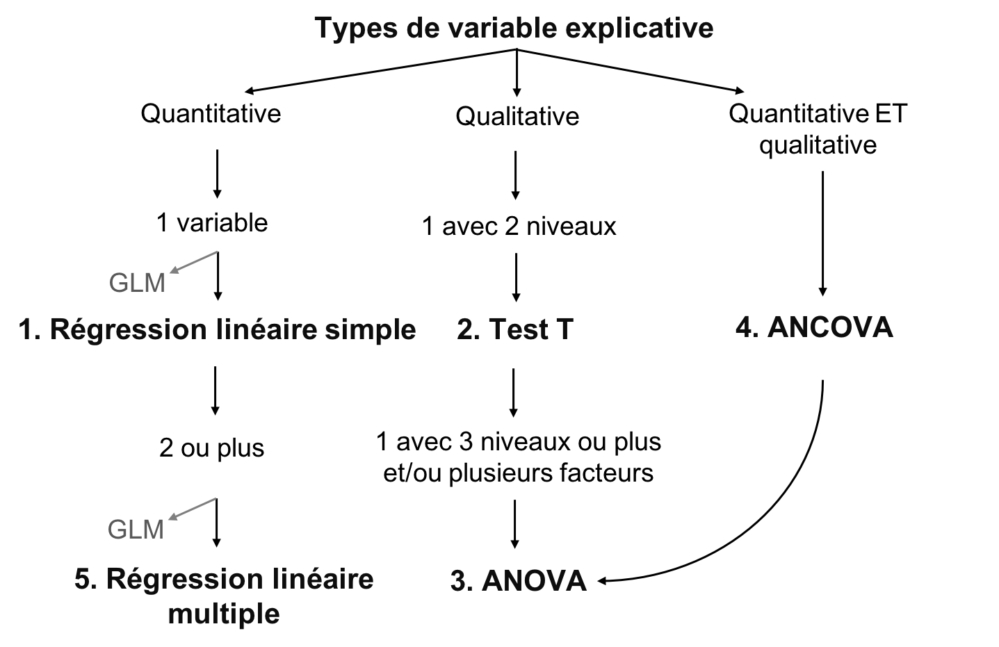
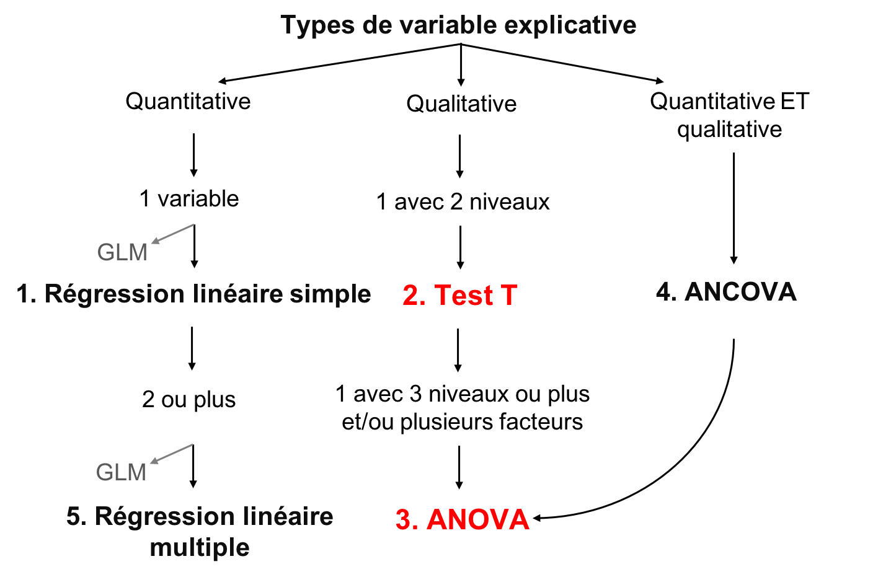
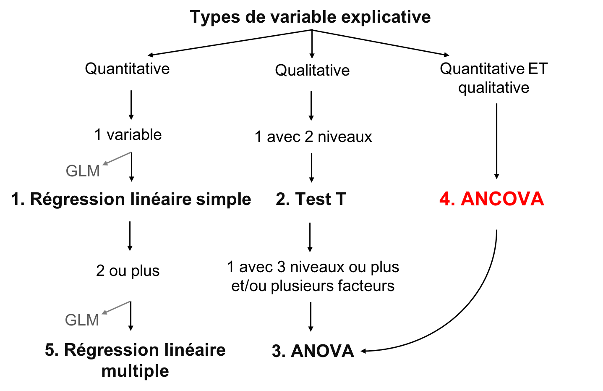
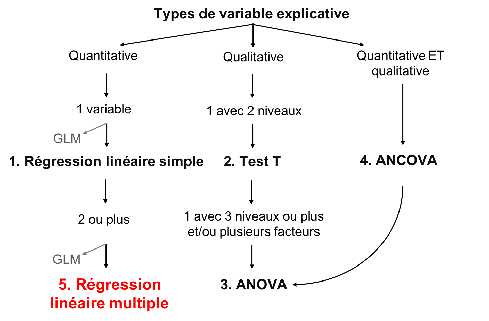

```{r setup, echo = F}
knitr::opts_chunk$set(
  comment = "#",
  collapse = TRUE,
  cache = TRUE,
  warning = FALSE,
  message = FALSE,
  fig.width=6, fig.height=6,
  fig.align = 'center'
)
```

```{r, echo =F}
options(repos=structure(c(CRAN="http://cran.r-project.org")))
```

```{r, include = FALSE}
if (!require(dplyr)) install.packages("dplyr")
library(dplyr)

if (!require(kableExtra)) install.packages("kableExtra")
library(kableExtra)

if (!require(vegan)) install.packages("vegan")
library(vegan)

if (!require(e1071)) install.packages("e1071")
library(e1071)

if (!require(MASS)) install.packages("MASS")
library(MASS)

if (!require(car)) install.packages("car")
library(car)
```

---
class: inverse, center, middle

# Concepts importants

## Définir la moyenne et la variation

---

## Moyenne

La moyenne est une mesure de la valeur moyenne d'une population (*x*):

$$\bar{x} = \frac{1}{N} \sum_{i=1}^{n} x_{i}$$

---
## Variation

- La variation est la dispersion des observations autour de la moyenne
  - Écart moyen
  - Variance
  - Écart type
  - Coefficient de variation

**Mais qu'est-ce que c'est l'écart ?**

$$D_{i} = |x_{i} - \bar{x}|$$

---
## Variation

**L'écart**:

$$D_{i} = |x_{i} - \bar{x}|$$
--
**L'écart moyen**:

$$D = \frac{1}{N} \sum_{i=1}^{n} |x_{i} - \bar{x}|$$
--

Au lieu de valeurs absolues, nous pouvons également mettre la valeur au carré, donnant la **variance**:

$$V = \frac{1}{N} \sum_{i=1}^{n} {(x_{i} - \bar{x})}^2$$

---
## Variation

Mais en mettant chaque valeur au carré, ces variables ne sont plus en unités significatives

On fait donc la racine carrée de la **variance** ( $V$ ), donnant l'**écart type**:

$$\sigma = \sqrt{V}$$
--

L'écart type relatif, en pourcentage, est le **coefficient de variation**:

$$cv = \frac{\sigma}{\bar{x}}$$

---
class: inverse, center, middle

# Les modèles linéaires

---
## Les modèles linéaires

Relation linéaire entre une variable réponse ( $Y$ ) et une/des explicative ( $X$ ), en utilisant les concepts de **moyenne** et **variance**

- $Y$ : variable que vous voulez expliquer (une seule variable réponse)
- $X$ : variable pour expliquer variable réponse (une ou plusieurs variables explicatives)
- $Y$ : doit être quantitative
- $X$ : quantitative ou qualitative
- $\epsilon$ : ce qui n'est pas expliqué par la ou les variables explicatives  résidus ou erreur

---
## Définir des modèles linéaires

Rassembler tous ensemble :

$$Y_{i} = \beta_{0} + \beta_{1} x_{i1} + \cdots + \beta_{p} x_{ip} + \epsilon_{i}$$

- $Y_i$ est la variable réponse
- $β_0$ est l'ordonnée à l'origine de la droite de régression
- $β_1$est le coefficient de variation de la $1^{ère}$ variable explicative
- $β_p$ est le coefficient de variation de la $p^{ème}$ variable explicative
- $x_{i1}$ est la variable explicative quantitative pour la $1^{ère}$ observation
- $x_ip$ est la variable explicative quantitative pour la $p^{ème}$ observation
- $ε_i$ sont les résidus du modèle (i.e. la variance inexpliquée)

---
## Le but des modèles linéaires

- Le but d'un modèle linéaire est de trouver la meilleure estimation des paramètres (les variables $\beta$), puis d'évaluer la qualité de l'ajustement du modèle

- Plusieurs méthodes ont été développées pour calculer l'intercept et les coefficient de modèles linéaires
  -  Le choix approprié dépend du type de variables explicatives considérées et de leur nombre

.center[.large[Le concept général de ces méthodes consiste à minimiser les résidus]]

---
## Objectif d'enseignement

.center[

]

---
## Conditions de base du modèle linéaire

1. Les résidus sont indépendants
2. Les résidus suivent une distribution normale
3. Les résidus ont une moyenne de 0
4. Les résidus sont homoscédastiques (i.e. leur variance est constante)

.alert[Ces 4 conditions concernent les résidus, et non les variables réponses ou explicatives]

.small[.comment[Dans les sections suivantes, nous ne répétons pas les conditions ci-dessus pour chaque modèle parce que ces conditions de base s'appliquent à tous les modèles linéaires]]

---
## Flux de travail

.center[

]

- Visualiser les données
- Créer un modèle
- Tester les 4 conditions de base du modèle
- Ajuster le modèle si les conditions de base ne sont pas respectées
- Interpréter les résultats du modèle

---
class: inverse, center, middle

# Régression linéaire simple

---
## Régression linéaire simple

- Type de modèle linéaire qui contient seulement une variable explicative continue

$$Y_i = \beta_0 + \beta_1 x_i + \epsilon_i$$

- Estimation de l'**ordonnée à l'origine** ( $\beta_0$ ) et un **coefficient de corrélation** ( $\beta_1$ )

- Méthode des moindres carrés
  - méthode la plus couramment utilisée (défaut sur R)

---
## Méthode des moindres carrés

.pull-left[
.center[]
]

.pull-right[
**Suppositions**

- $Y_i$ : valeur observé (mesurée) pour $X_i$
- $\widehat{Y}_i$ : valeur prédite pour $X_i$
- $\bar{Y}$ : moyenne de tout les $Y_i$
- $V_E$ : résidus (erreur)
- $V_R$ : variance expliqué par la régression
- $V_T$ : variance totale
- $R^2 = \frac{V_R}{V_T}$
]

---
## Effectuer un modèle linéaire

.small[
**Étape 1**. Exécuter votre modèle linéaire

**Étape 2**. Vérifier les suppositions
]

.pull-left[.center[]] .pull-right[.center[]]

.pull-left[.center[*Suppositions sont satisfaites ?*]

.small[**Étape 3**. Estimer les paramètres de régression, test de signification, tracer votre modèle
]]

.pull-right[.center[*Suppositions non satisfaites ?*]

.small[*Pouvez-vous transformer vos variables (est-ce justifié) ?*]

.pull-left[.center[]] .pull-right[.center[]]

.small[
.pull-left[
Oui: retourner à l'étape 1 avec des variables transformées
]

.pull-right[
Non: essayer GLM qui pourrait mieux convenir aux données
]]]

---
## Exécution du modèle linéaire dans R

**Étape 1**. créer votre modèle linéaire

Dans R, la fonction `lm()` est utilisée pour ajuster un modèle linéaire

```{r, eval = FALSE}
lm1 <- lm(Y~X)
```

- `lm1` : Nouvel objet contenant le modèle linéaire
- `Y` : Variable réponse
- `X` : Variable indépendante

---
## Exécution du modèle linéaire dans R

Télécharger les donées <span style="color:blue"> *birdsdiet* </span>:

```{r, eval=TRUE, echo=FALSE}
bird <- read.csv("Scripts_and_data/birdsdiet.csv")
```

```{r, eval = FALSE}
bird <- read.csv("birdsdiet.csv")
```

Visualisez le tableau de la structure des données en utilisant la fonction `str()` :

```{r}
str(bird)
```

---
## Exécution du modèle linéaire dans R

Variable réponse : **abondance d'oiseaux**   num : quantitative

Variable explicative : **masse**     num : quantitative

```{r}
str(bird)
```

Nous voulons d'abord vérifier si l'abondance maximale des oiseaux (`maxAbund`) est une fonction de la masse des oiseaux (`Mass`)

```{r eval=TRUE}
lm1 <- lm(MaxAbund ~ Mass, data = bird)
```

---
## Exécution du modèle linéaire dans R

**Étape 2**. Vérifier les suppositions avec les graphiques diagnostics

```{r, eval=FALSE}
opar <- par(mfrow=c(2,2))
plot(lm1)
```

- `par( )`: définit les paramètres du graphique, par exemple, l'argument `mfrow` spécifie le nombre de rangées et colonnes
- `plot( )`: est la fonction pour faire le graphique

La sortie comprend les quatre graphiques diagnostics de la fonction `lm()`

---
## Graph. #1 - Résidus vs valeurs prédites

Exemple d'indépendance .comment[(ce que nous recherchons !)]

- Devrait montrer une dispersion de points sans patron

```{r, echo = FALSE, fig.height=4.2, fig.width=5.5}
  set.seed(1234564)
  x <- abs(rnorm(100,10,10))
  y <- 2*x+0 + rnorm(100)
  lm <- lm(y~x)
  plot(lm, which = 1)
```

---
## Graph. #1 - Résidus vs valeurs prédites

Example de non-indépendance .comment[(ce que nous ne voulons pas !)]
```{r, echo=FALSE, fig.height=4, fig.width=8.5, warning=FALSE}
par(mfrow=c(1,2))
set.seed(1234564)
x = abs(rnorm(100,10,10))
y = (x)^2 + rnorm(length(x),0,30)
lm=lm(y~scale(x))
plot(lm,which = 1, main = "Non-linéaire", col.main="red")

x = abs(rnorm(100,10,10))
y = (x) + rnorm(length(x), 0, x)
lm=lm(y~scale(x))
plot(lm,which = 1, main = "Hétéroscédastique", col.main="red")
```


- Solution: Transformer vos données ou essayer une distribution autre que linéaire (gaussienne); modèle linéaire généralisé (GLM) (ex: Poisson, binomial, binomial négatif, etc.)

---
## Graph. #2 - échelle localité

Devrait montrer une dispersion de points sans patron

```{r, echo=FALSE, fig.height=3.8, fig.width=8, warning=FALSE}
par(mfrow=c(1,2))
set.seed(1234564)
x <- 1:100
y <- x + rnorm(100,sd=5)
lm=lm(y~x)
plot(lm,which = 3)

set.seed(2)
x = abs(rnorm(100,10,10))
y = (x) + rnorm(length(x), 0, x)
lm=lm(y~scale(x))
plot(lm,which = 3)
```
.pull-left[.center[]] .pull-right[.center[]]

.pull-left[.center[Aucun patron dans les résidus]] .pull-right[.center[Forte tendance dans les résidus]]

---
## Graph. # 3 - Normal QQ

- Compare la distribution (quantiles) des résidus aux quantiles d'une distribution normale
- Si les points se situent de façon linéaire sur la ligne 1: 1, les résidus suivent une distribution normale

```{r, echo=FALSE, fig.height=3, fig.width=8, warning=FALSE}
par(mfrow=c(1,2), mar = c(4, 4, 1.5, 3))
set.seed(1234564)
x <- 1:100
y <- x + rnorm(100,sd=5)
lm=lm(y~x)
plot(lm, which = 2)

set.seed(2)
x = abs(rnorm(100,10,10))
y = (x) + 0 + rnorm(length(x), 0, x)
lm=lm(y~scale(x))
plot(lm, which = 2)
```

.pull-left[.center[]] .pull-right[.center[]]

.pull-left[.center[C'est bien !]] .pull-right[.center[Pas très bien...]]

---
## Graph. # 4 - Résidus vs effet de levier

- Recherche les valeurs influentes
- **Points de levier** : observations extrêmes ou périphériques de la variable explicative. Parce qu'ils n'ont pas d'observations voisines, la ligne de régression passe près de ces points. **Ils peuvent (ou pas) avoir une grande influence sur la régression**
- Les points de levier avec une forte influence peuvent être identifiés avec une **distance de Cook supérieure à 0,5**

---
## Effet levier vs influence

```{r, echo=FALSE, fig.height=6, fig.width=5, warning=FALSE}
par(mfrow=c(3, 1), mar = c(4, 15, 1, 3), cex = 0.75)
set.seed(1234564)
x <- 1:20
y <- rnorm(x, x, 2)
lm0 <- lm(y ~ x)
# plot 1
plot(x, y, ylim = c(-4, 22)); abline(lm0, col = 2); points(11, -3, pch = 15)
# add 20, 10 point to the new lm
xx <- c(x, 11); yy <- c(y, -3)
abline(lm(yy ~ xx), col = 2, lty = 3)
text(-20, 10, srt=0, adj = 0, labels = "* Pas d'effet de levier \n* Faible influence
", xpd = TRUE, cex = 1.5)
# plot 2
plot(x, y, ylim = c(-4, 32), xlim = c(0, 31)); abline(lm0, col = 2); points(30, 30, pch = 15)
# add 20, 10 point to the new lm
xx <- c(x, 30); yy <- c(y, 30)
abline(lm(yy ~ xx), col = 2, lty = 3)
text(-33, 15, srt=0, adj = 0, labels = "* Effet de levier \n* Pas d'influence", xpd = TRUE, cex = 1.5)

# plot 3
plot(x, y, ylim = c(-4, 32), xlim = c(0, 31)); abline(lm0, col = 2); points(30, 15, pch = 15)
# add 20, 10 point to the new lm
xx <- c(x, 30); yy <- c(y, 15)
abline(lm(yy ~ xx), col = 2, lty = 3)
text(-33, 15, srt=0, adj = 0, labels = '* Effet de levier \n* Influence élevée', xpd = TRUE, cex = 1.5)
```

---
## Effet levier vs influence

```{r, echo=FALSE, fig.height=3.5, fig.width=9, warning=FALSE}
par(mfrow=c(1,2), mar = c(4, 4, 1.5, 3))
set.seed(1234564)
x <- 1:100
y <- x + rnorm(100,sd=5)
lm=lm(y~x)
plot(lm, which = 5)

set.seed(1234564)
x = abs(rnorm(100,10,10))
y = (x) + 0 + rnorm(length(x), 0, x)
lm=lm(y~scale(x))
plot(lm, which = 5)
```

.pull-left[.center[]] .pull-right[.center[]]

.pull-left[.center[Aucune valeur influente]]
.pull-right[.center[Effet de levier élevé et influence raisonnable]]

<br />
<br />
<br />

.comment[Ici, le point 29 a un effet de levier élevé, mais son influence est acceptable (à l'intérieur des limites de la distance Cook de 0,5)]

---
## Effet levier vs influence

Effet de levier et influence élevée

<br />

.pull-left[
```{r, echo=FALSE, fig.height=3.5, fig.width=4, warning=FALSE}
par(mar = c(4, 4, 1, 0))
set.seed(1234564)
x = abs(rnorm(100,10,10))
y = (x) + 0 + rnorm(length(x), 0, x)
y[29] <- 100
lm=lm(y~scale(x))
plot(lm, which = 5)
```
]
.pull-right[
- Points en dehors de la limite de 0,5 de la distance Cook
- Ces points ont trop d'influence sur la régression
]

.alert[Vous ne devriez jamais supprimer les valeurs aberrantes si vous n'avez pas de bonnes raisons de le faire (ex: erreur de mesure)]

---
## **Étape 2**. Vérifier les suppositions de `lm1`

```{r, fig.height=4.9, fig.width=5.5}
par(mfrow=c(2,2), mar = c(4,4,2,1.1), oma =c(0,0,0,0))
plot(lm1)
```

---
## Suppositions non-respectées - quelle est la cause?

Traçons le graphique Y ~ X avec la droite de régression et les histogrammes de Y et X pour explorer leurs distributions

.small[
```{r, fig.height=2.7, fig.width=9, echo = -1}
par(mfrow=c(1,3), mar = c(4,4,3,1), cex = 0.8)
plot(bird$MaxAbund ~ bird$Mass)
abline(lm1) # adds the best-fit line
hist(bird$MaxAbund) # hist() produces a histogram of the variable
hist(bird$Mass)
```
]

---
## Suppositions non-respectées - quelle est la cause?

Vérifions la normalité des données à l'aide d'un test de `Shapiro-Wilk` et d'un test d'asymétrie (**`skewness`**) :

```{r}
shapiro.test(bird$MaxAbund)
shapiro.test(bird$Mass)
```
.comment[Dans les deux cas, les distributions ne sont pas normales
]

---
## Suppositions non-respectées - quelle est la cause?

Vérifions la normalité des données à l'aide d'un test de `Shapiro-Wilk` et d'un test d'asymétrie (**`skewness`**) :

```{r}
skewness(bird$MaxAbund)
skewness(bird$Mass)
```
.comment[La valeur positive indique que la distribution des données est décalée vers la gauche]

---
## Transformer les données

- Normalisons les données en appliquant une transformation `log10()`
- Ajoutons ces variables transformées à notre base de données

```{r}
bird$logMaxAbund <- log10(bird$MaxAbund)
bird$logMass <- log10(bird$Mass)
```

**Étape 1**: Exécuter une régression linéaire sur les données transformées

```{r}
lm2 <- lm(logMaxAbund ~ logMass, data = bird)
```

---
## **Étape 2**: Vérifier les suppositions de `lm2`

```{r, fig.height=4.4, fig.width=5.9}
par(mfrow=c(2,2), mar=c(3,4,1.15,1.2))
plot(lm2)
```

.comment[.center[Beaucoup mieux !]]

---
## **Étape 2**: Vérifier les suppositions de `lm2`

```{r, echo=-1, fig.height=3.4, fig.width=9}
par(mfrow=c(1,3), mar=c(4,4,1.15,1.2))
plot(logMaxAbund ~ logMass, data=bird)
abline(lm2)
hist(log10(bird$MaxAbund))
hist(log10(bird$Mass))
```

---
## **Étape 3**: Estimer les paramètres et leur seuil de signification

La fonction `summary()` est utilisée pour obtenir les paramètres, leur importance, etc

.small[
```{r}
summary(lm2)
```
]

---
## **Étape 3**: Estimer les paramètres et leur seuil de signification

Nous pouvons aussi extraire les paramètres du modèle, par exemple :

```{r}
lm2$coef
summary(lm2)$coefficients
summary(lm2)$r.squared
```

---
## Discussion de groupe

- Pouvez-vous écrire l'équation de la droite de régression pour votre modèle `lm2`
- Les paramètres sont-ils importants ?
- Quelle proportion de la variance est expliquée par le modèle `lm2` ?

.small[
```{r}
summary(lm2)
```
]

---
## Discussion de groupe

Pouvons-nous améliorer le modèle si nous analysons que les oiseaux terrestres?

.comment[Vous pouvez exclure des objets en utilisant `=!`]

```{r}
lm3 <- lm(logMaxAbund~logMass, data=bird, subset=!bird$Aquatic)
# removes aquatic birds (= TRUE)
# or equivalently
lm3 <- lm(logMaxAbund~logMass, data=bird, subset=bird$Aquatic == 0)
```

```{r eval=FALSE}
# Examine the diagnostic plots
par(mfrow=c(2,2))
plot(lm3)
summary(lm3)

# Compare both models
par(mfrow=c(1,2))
plot(logMaxAbund~logMass, data=bird)
plot(logMaxAbund~logMass, data=bird, subset=!bird$Aquatic)
```

---
## Plot

`R2-adj` a changé de 0,05 à 0,25 quand nous avons exclu les oiseaux aquatiques :

```{r, fig.height=3.5, fig.width=7}
par(mfrow=c(1,2), mar = c(4, 4, 3, 1))
plot(logMaxAbund~logMass, data=bird, main = 'Tous les oiseaux')
abline(lm2, col = 'red')
plot(logMaxAbund~logMass, data=bird, subset=!bird$Aquatic, main = 'Oiseaux terrestres')
abline(lm3, col = 'red')
```

---
## Défi 1 

- Examiner la relation entre `log(MaxAbund)` et `log(Mass)` chez les passereaux ("passerine birds")
- Sauvegarder l'objet du modèle sous `lm4`

.comment[INDICE: comme les espèces aquatiques, les passereaux sont codées 0/1, ce qui peut être vérifié à partir de la structure de la base de données]

- Comparer la variance expliquée par `lm2`, `lm3` and `lm4`

---
## Défi 1 - Solution 

<br>
```{r}
# Run the model
lm4 <- lm(logMaxAbund ~ logMass, data=bird, subset=bird$Passerine == 1)
summary(lm4)
```

---
## Défi 1 - Solution 

```{r, echo=-3,fig.height=4.8, fig.width=6.5}
# diagnostic plots
par(mfrow=c(2,2), mar = c(4,4,2,1.1), oma =c(0,0,0,0))
plot(lm4)
```

---
## Défi 1 - Solution 

Comparer la variance expliquée par `lm2`, `lm3` and `lm4`

```{r}
# Recall: we want adj.r.squared
summary(lm2)$adj.r.squared
summary(lm3)$adj.r.squared
summary(lm4)$adj.r.squared
```

.comment[Le meilleur modèle parmi les trois est `lm3` *(seulement les oiseaux terrestres)*]

---
## Objectif d'enseignement

.center[

]

---
class: inverse, center, middle

# ANOVA

## Test-t
## ANOVA à un critère de classification
## ANOVA à deux critères de classification

---
## ANOVA

Variable réponse continue

**Variables explicatives catégoriques**

- Deux niveaux ou plus (groupes)

.large[.center[Compare la variation intra-groupe et inter-groupe afin de déterminer si les moyennes des groupes diffèrent]]

Somme des carrés : variance intra-traitement *vs* variance inter-traitement

Si variance inter traitements $>$ variance intra traitements:
  - la variable explicative a un effet plus important que l'erreur aléatoire
  - variable explicative est donc susceptible d'influencer significativement la variable réponse

---
## Types d'ANOVA

1. ANOVA à un critère de classification
  - Une variable explicative catégorique avec au moins 2 niveaux
  - S'il y a 2 niveaux, un **test t** peut être utilisé alternativement

2. ANOVA à deux critères de classification
  - Deux variables explicatives catégoriques ou plus
  - Chaque facteur peut avoir plusieurs niveaux
  - Les interactions entre chaque variable explicative catégorique doivent être testées

3. Mesures répétées ?
  - L'ANOVA peut être utilisée pour des mesures répétées, mais ce sujet n'est pas abordé dans cet atelier
  - Modèle linéaire mixte peut également être utilisé pour ce type de données (voir l'atelier 6)

---
class: inverse, center, middle

# Test T

---
## Test T

- **Variable réponse**  quantitative
- **Variable explicative**  qualitative avec **2 niveaux**

**Suppositions**
- Les résidus suivent une distribution normale
- Les variances des groupes sont homogènes

.comment[Le test est plus robuste lorsque la taille de l'échantillon est plus élevée et lorsque les groupes ont des tailles égales]

---
## Exécuter un test T dans R

Vous pouvez utiliser la fonction `t.test()`

```r
t.test(Y~X2, data= data, alternative = "two.sided")
```

  - `Y`: variable réponse
  - `X2`: facteur (2 niveaux)
  - `data`: nom du jeu de donées
  - hypothèse `alternative` : `"two.sided"` (par défaut), `"less"`, ou `"greater"`

Le test de t est un modèle linéaire et un cas spécifique de l'ANOVA avec un facteur à 2 niveaux

Vous pouvez donc aussi utiliser la fonction `lm()`

```r
lm.t <-lm(Y~X2, data = data)
anova(lm.t)
```

---
## Exécuter un test T dans R

.large[Les oiseaux aquatiques sont-ils plus lourds que les oiseaux terrestres ?]

- Variable réponse : `Bird mass`  num: continue
- Variable explicative : `Aquatic`  2 niveaux : 1 ou 0 (oui ou non)

---
## Exécuter un test T dans R

Premièrement, visualiser les données à l'aide de la fonction `boxplot()`

```{r eval=TRUE,fig.height=4.8, fig.width=6.5}
boxplot(logMass ~ Aquatic,
        data = bird, names = c("Non aquatique", "Aquatique"))
```

---
## Exécuter un test T dans R

Testons l'homogénéité des variances avec la fonction `var.test()`

```{r}
var.test(logMass ~ Aquatic, data = bird)
```

.comment[Le rapport des variances n'est pas statistiquement différent de 1, celles-ci peuvent donc être considérées comme égales]

.comment[Nous pouvons maintenant procéder au test t !]

---
## Exécuter un test T dans R

```{r}
ttest1 <- t.test(logMass ~ Aquatic, var.equal = TRUE, data = bird)

# Or use lm()
ttest.lm1 <- lm(logMass ~ Aquatic, data=bird)
```

.comment[Spécifie que l'homogénéité des variances est respectée]

Vérifiez que `t.test()` et `lm()` donnent le même modèle :

```{r}
ttest1$statistic^2
anova(ttest.lm1)$F
# réponse : F=60.3845 dans les deux cas
```

.comment[Lorsque la supposition d'égalité de variance est confirmée, t^2 = F]

---
## Exécuter un test T dans R

Si $p<0,01$ (ou $0,05$ ), l'hypothèse de l'absence de différence entre les moyenne des 2 groupe (*H0*) peut être rejetée, avec un risque de $0,01$ (ou $0,05$ ) de se tromper

```{r}
ttest1
```

.small[.comment[Il existe une différence entre la masse des oiseaux aquatiques et terrestres - `p-value`]]

.small[.comment[Regardez les moyennes des 2 groupes]]

---
## Non respect des suppositions

- **Correction de Welch** : lorsque les écarts entre les groupes ne sont pas égaux (par défaut dans R !)
- **Test de Mann-Whitney** : l'équivalent **non paramétrique** du test de t lorsque les suppositions ne sont pas respectées
- **Test de t apparié** : lorsque les deux groupes ne sont **pas indépendants** (par exemple, des mesures sur la même personne récoltées lors de 2 années différentes)

---
## Discussion de groupe

.large[Les oiseaux aquatiques sont-ils plus lourds que les oiseaux terrestres ?]

```{r}
# Unilateral t-test
uni.ttest1 <- t.test(logMass ~ Aquatic,
                     var.equal = TRUE,
                     data = bird,
                     alternative = "less")
```

.comment[Qu'avez-vous conclu ?]

---
## Discussion de groupe

```{r}
uni.ttest1
```

.small[
Oui, les oiseaux aquatiques sont plus lourds que les oiseaux terrestres :

p-value = `r format(uni.ttest1$p.value, scientific=FALSE)`
]

---
class: inverse, center, middle

# ANOVA

---
## Analyse de Variance (ANOVA)

Généralisation du test t à $>2$ groupes, et/ou ≥ $2$ facteurs explicatifs

Décomposition de la variance observée de la variable réponse en effets additifs d'un ou de plusieurs facteurs et de leurs interactions

<br>
$$Y = \underbrace{\mu}_{\Large{\text{moyenne globale de la variable réponse}\atop\text{sur tous les individus}}} + \overbrace{\tau_{i}}^{\Large{\text{Le résultat moyen sur}\atop\text{tous les individus du groupe i}}} + \underbrace{\epsilon}_{\text{Résidus}}$$

---
## Rappel : ANOVA

Suppositions
- Normalité des résidus
- L'égalité de la variance inter-groupes

Test complémentaire
- Lorsque l'ANOVA détecte une différence significative entre les groupes, l'analyse n'indique pas quel(s) groupe(s) diffère(nt) de(s) l'autre(s)
- Un test couramment utilisé a posteriori pour répondre à cette question est le **Test de Tukey**

---
## Exécuter une ANOVA dans R

##### Est-ce que l'abondance maximale dépend du régime alimentaire ?
- Variable réponse : **MaxAbund**   num: quantitative
- Variable explicative : **Diet**  facteur avec 5 niveaux

```{r}
str(bird)
```

---
## Visualiser les données

Visualisons tout d'abord les données avec la fonction `boxplot()`

```{r, fig.height=4.2, fig.width=7,echo=-1}
par(mar = c(4, 4, 0.5, 1))
boxplot(logMaxAbund ~ Diet, data = bird,
  ylab = expression("log"[10]*"(Abondance maximale)"), xlab = 'Régime alimentaire')
```

---
## Visualiser les données

Nous pouvons changer l'ordre des niveaux afin qu'il suivent l'ordre croissant de leurs médianes respectives en utilisant les fonctions `tapply()` et `sort()`

```{r, fig.height=3.5, fig.width=7, echo=-1}
par(mar=c(4,4,.1,1))
med <- sort(tapply(bird$logMaxAbund, bird$Diet, median))
boxplot(logMaxAbund ~ factor(Diet, levels = names(med)), data = bird,
        ylab = expression("log"[10]*"(Abondance maximale)"), xlab = 'Régime alimentaire')
```

---
## Visualiser les données


Une autre façon de visualiser graphiquement les tailles d’effet est d’utiliser la fonction `plot.design()`

.small[
```{r, fig.height=3, fig.width=6, echo=-1}
par(mar=c(4,4,.4,1))
plot.design(logMaxAbund ~ Diet, data=bird,
  ylab = expression("log"[10]*"(Abondance maximale)"))
```
]

.comment[Les niveaux d'un facteur le long d'une ligne verticale, et la valeur globale de la réponse dans une ligne horizontale]

---
## Exécuter une ANOVA à un critère de classification dans R

Il est de nouveau possible d'utiliser la fonction `lm()`

```{r}
anov1 <- lm(logMaxAbund ~ Diet,
            data = bird)
```

Il y a aussi une fontion spécifique pour l'analyse de la variance dans R `aov()`

```{r}
aov1 <- aov(logMaxAbund ~ Diet,
            data = bird)
```

.comment[Essayez-les et comparez les sorties !]

---
## Exécuter une ANOVA à un critère de classification dans R

Comparer les sorties

.small[
```{r}
anova(anov1)
```
```{r}
summary(aov1)
```
]

---
## Vérifier les suppositions

**Test de Bartlett**: égalité de la variance entre les groupes

.small[
```{r}
bartlett.test(logMaxAbund ~ Diet,
              data = bird)
```
]

**Test de Shapiro-Wilk**:  normalité des résidus

.small[
```{r}
shapiro.test(resid(anov1))
```
]

.comment[Les deux tests sont non-significatifs; les résidus du modèle peuvent être considérés normaux et les variances homogènes]

---
## Et si les suppositons ne sont pas respectées...

**Transformer vos données** : pourrait égaliser les variances et normaliser les résidus, et peut convertir un effet multiplicatif en un effet additif

```{r eval=FALSE}
data$logY <- log10(data$Y)
```
* Voir le wiki de l'atelier 1 pour les règles de transformation de données
* ré-exécuter votre modèle avec la variable transformée et vérifier à nouveau les hypothèses

**Test de Kruskal-Wallis**: équivalent non paramétrique de l'ANOVA si vous ne pouvez pas
(*ou ne voulez pas*)

```{r eval=FALSE}
kruskal.test(Y~X, data)
```

---
## Sorties de notre modèle ANOVA

Triage en ordre alphabétique des niveaux et comparaison au niveau de référence (`Insect`)

.small[
```{r}
summary(anov1)
```
]

---
## Sorties de notre modèle ANOVA

D'autre part, si nous utilisons `lm()`

.pull-left2[
.small[
```{r}
summary.lm(aov1)
```
]]

.pull-right2[
<br><br>
.comment[Différence significative entre les groupes, mais nous ne savons pas lesquels !]]

---
## Test a posteriori

Lorsque l'ANOVA détecte un effet significatif de la variable explicative, un test post-hoc avec la fonction `TkeyHSD()`, doit être effectué pour déterminer quel(s) tratement(s) diffère(nt)

.pull-left2[
.small[
```{r}
TukeyHSD(aov(anov1), ordered = TRUE)
```
]]

.pull-right2[
<br><br>
.comment[Seuls `Vertebrate` et `PlantInsect` diffèrent]
]

---
## Représentation graphique

Représentation graphique de l'ANOVA à l'aide de la fonction `barplot()`

.small[
```{r, fig.height=3, fig.width=7,echo=-1}
par(mar=c(3,3,0.5,0.5))
sd <- tapply(bird$logMaxAbund, bird$Diet, sd)
means <- tapply(bird$logMaxAbund, bird$Diet, mean)
n <- length(bird$logMaxAbund)
se <- 1.96*sd/sqrt(n)
bp <- barplot(means, ylim = c(0, max(bird$logMaxAbund) - 0.5))
epsilon = 0.1
segments(bp, means - se, bp, means + se, lwd=2) # barres verticales
segments(bp - epsilon, means - se, bp + epsilon, means - se, lwd = 2) # barres horizontales
segments(bp - epsilon, means + se, bp + epsilon, means + se, lwd = 2) # barres horizontales
```
]

---
class: inverse, center, middle

# ANOVA à deux critères de classification

---
## ANOVA à deux critères de classification

Plus d'un facteur

- ANOVA avec un facteur:

 `aov <- lm(Y ~ X, data)`

- ANOVA avec deux ou plus facteurs:

 `aov <- lm(Y ~ X * Z * ..., data)`

.comment[lorsque vous utilisez le symbole "*" avec `lm()`, le modèle inclut les effets de chaque facteur séparément, ainsi que leur interaction]

.comment[lorsque vous utilisez le symbole "+" avec `lm()`, le modèle inclut les effets de
chaque facteur séparément (pas d'interaction)]

`aov <- lm(Y ~ X + Z + ..., data)`

---
## ANOVA à deux critères de classification

Exemple d'interaction non significative

.small[
```r
aov <- lm(Y ~ X * Z, data)
summary(aov)
# Analysis of Variance Table
#
# Response: Y
# Df Sum Sq Mean Sq F value Pr(>F)
# X 4 5.1059 1.27647 3.0378 0.02669 *
# Z 1 0.3183 0.31834 0.7576 0.38870
# X:Z 3 2.8250 0.94167 2.2410 0.10689
# Residuals 45 18.9087 0.42019
# ---
# Signif. codes: 0 ‘***’ 0.001 ‘**’ 0.01 ‘*’ 0.05 ‘.’ 0.1 ‘ ’ 1
```

Selon le principe de **parcimonie**, vous voulez que votre modèle explique le plus possible de la variance observée dans les données, avec le moins de termes possible
- Enlever le terme d'interaction s'il n'est pas significatif, et ré-exécuter le modèle

```r
aov <- lm(Y ~ X + Z, data)
```
]

---
## Défi 2 

Testez si l'abondance maximale `log(MaxAbund)` varie à la fois en fonction du régime alimentaire (`Diet`) et de l'habitat (`Aquatic`)

- .comment[INDICE: Examinez les facteurs Diet, Aquatic et leur interaction avec une ANOVA à deux critères de classificatioN e.g. `lm(Y ~ A*B)`]

- .comment[où A est le premier facteur, B le deuxième et "*" décrit l'interaction]

---
## Défi 2 - Solution 

.tiny[
```{r}
anov2 <- lm(logMaxAbund ~ Diet*Aquatic, data = bird)
summary(anov2)
```
]

---
## Défi 2 - Solution 

.small[
```{r}
anov2 <- lm(logMaxAbund ~ Diet*Aquatic, data = bird)
anova(anov2)
```
]

.comment[Le seul terme significatif du modèle est le facteur régime alimentaire]

---
## Objectif d'enseignement

.center[

]

---
class: inverse, center, middle

# ANCOVA

---
## Analyse de covariance (ANCOVA)

- Combinaison de l'ANOVA et de la régression linéaire
- Les variables explicatives sont un mélange de variables quantitatives (covariable) et qualitatives (facteurs)

$$Y = \mu + \text{Effets principaux des facteurs} + \\
            \text{Interactions entre facteurs} + \\
            \text{Effets principaux des covariables} + \\
            \text{Interactions entre covariables et facteurs} + \epsilon$$

---
## Rappel : ANCOVA

En plus des suppositions des modèles linéaires, les modèles **ANCOVA** doivent respecter :

- Les covariables ont toutes la **même étendue de valeurs**
- Les variables sont **fixes**
- Les variables catégoriques et continues sont **indépendantes**

<br>

.small[
.comment[Un variable **fixe** est une variable d'intérêt pour une étude (e.g. la masse des oiseaux). En comparaison, une variable aléatoire représente surtout une source de bruit qu'on veut contrôler (i.e. le site où les oiseaux ont été échantillonnés)]]

.small[.comment[*Voir l'atelier 6 sur les modèles linéaires mixtes*]]

---
## Types d'ANCOVA

Vous pouvez avoir n'importe quel nombre de facteurs et / ou variables, mais lorsque leur nombre augmente, l'interprétation des résultats devient de plus en plus complexe

<br>

ANCOVA fréquemment utilisées

1. **Une covariable et un facteur**
2. Une covariable et deux facteurs
3. Deux covariables et un facteur

.small[.comment[Nous ne considérerons que le premier cas aujourd'hui, mais les deux autres sont similaires]]

---
## ANCOVA avec 1 covariable et 1 facteur

Objectifs de l'analyse :

1. Déterminer l'effet du facteur et de la covariable sur ​​la variable réponse
2. Déterminer l'effet du facteur sur la variable réponse après avoir enlevé l'effet de la covariable
3. Déterminer l'effet de la covariable sur la variable réponse en contrôlant l'effet du facteur

<br>

.center[.alert[Si vous avez une interaction significative entre votre facteur et votre covariable, vous ne pouvez pas atteindre ces objectifs !]]

---
## ANCOVA avec 1 covariable et 1 facteur

<br>

```{r,echo=FALSE,fig.height=3, fig.width=10}
## functions
f1 <- function(x, a, b) {
  return(x*a+b)
}
# conf for plot
col = rgb(118, 143, 175, maxColorValue = 255)
x <- 1:20
par(mfrow = c(1, 3), mar = c(1, 1, 6.5, 4))

# plot 1
plot(x, f1(x, a=1.1,b=2), ylim = c(0, 60), type = 'l', lwd = 2.5, xaxt = "n", yaxt = "n", xlab = "", ylab = "", bty='l', col = col)
lines(f1(x, a=1.1,b=17), lwd = 2.5, col = col)
lines(f1(x, a=0.6,b=22), lwd = 2.5, col = col)
lines(f1(x, a=1.1,b=40), lwd = 2.5, col = col)
mtext('Un niveau du facteur\n a une pente différente', side = 3, line = 2, cex = 1.5)
# plot 2
plot(x, f1(x, a=.5,b=2), ylim = c(0, 60), type = 'l', lwd = 2.5, xaxt = "n", yaxt = "n", xlab = "", ylab = "", bty='l', col = col)
lines(f1(x, a=1.1,b=17), lwd = 2.5, col = col)
lines(f1(x, a=1.1,b=22), lwd = 2.5, col = col)
lines(f1(x, a=0.01,b=40), lwd = 2.5, col = col)
mtext('Des nombreaux niveaux ont\n des pentes différentes', side = 3, line = 2, cex = 1.5)
# plot 3
plot(x, f1(x, a=1.1,b=2), ylim = c(0, 60), type = 'l', lwd = 2.5, xaxt = "n", yaxt = "n", xlab = "", ylab = "", bty='l', col = col)
lines(f1(x, a=1.1,b=17), lwd = 2.5, col = col)
lines(f1(x, a=1.1,b=22), lwd = 2.5, col = col)
lines(f1(x, a=1.1,b=40), lwd = 2.5, col = col)
mtext("Pas d'interaction", side = 3, line = 2, cex = 1.5)
```

.pull-left2[.center[.pull-left[] .pull-right[]]] .pull-right2[.center[]]

.center[.pull-left2[.small[Si l'interaction est significative, vous aurez un scénario qui ressemble à ceci]]]

.pull-right2[.small[Si votre covariable et votre facteur sont significatifs, vous avez un cas comme celui-ci]]

---
## Comparez ANCOVA - moyennes ajustées

Si vous voulez comparer les moyennes des différents facteurs, vous pouvez utiliser les
**moyennes ajustées**

La fonction `effect()` utilise les équations données par l'ANCOVA pour estimer les moyennes de chaque niveau, corrigées pour l'effet de la covariable

.small[
```{r eval=FALSE, warning=FALSE}
ancova.exemple <- lm(Y ~ X*Z, data=data) # X = quantitative; Z = qualitative
library(effects)
adj.means.ex <- effect('Z', ancova.exemple)
plot(adj.means.ex)
```
]

```{r,echo=FALSE,fig.height=3, fig.width=5}
# plot to simulate effects::effect() plot
a = 40; b =20; sd = 8
par(mar=c(4,4,.5,1))
plot(c(a, b), ylim = c(10, 50), xlim = c(0.9, 2.1), xlab = 'factor Z', ylab = 'Y', xaxt = 'n')
lines(c(a, b), col = 4, pch = 1.5)
segments(c(1, 2), c(a-sd, b-sd), c(1,2), c(a+sd, b+sd), lwd = 1.5, col = 'orange')
segments(c(1, 2) - .04, c(a, b) + sd, c(1, 2) + .04, c(a, b) + sd, lwd = 1.5, col = 'orange')
segments(c(1, 2) - .04, c(a, b) - sd, c(1, 2) + .04, c(a, b) - sd, lwd = 1.5, col = 'orange')
points(c(1, 2), c(a, b), pch = 16, col = 4)
axis(1, at = c(1, 2), labels = FALSE) # add ticks
mtext(c('Level 1', 'Level 2'), 1, at = 1:2, line = 0.5) # add labels to ticks
```

---
## ANCOVA avec 1 covariable et 1 facteur

- Si seulement votre facteur est significatif, éliminer la covariable -> vous avez une **ANOVA**
- Si seulement votre covariable est significative, éliminer le facteur -> vous avez une **régression linéaire simple**
- Si votre interaction covariable * facteur est significative, vous voudrez peut-être tester quel(s) niveau(x) du facteur a(ont) des pentes différentes

.alert[Vérifier vos suppositions ! ]

- Très similaire à ce que vous avez fait précédemment

---
## Exécuter une ANCOVA dans R

##### L'abondance maximale varie-t-elle en fonction du régime alimentaire et la masse des oiseaux ?

Variable réponse : **MaxAbund**  num : quantitative continue

Variable explicatives :
  - **Diet**  facteur à 5 niveaux
  - **Mass**  numérique continue

.small[
```{r}
str(bird)
```
]

---
## Défi 3 

1- Exécutez un modèle pour tester les effets du régime alimentaire (`Diet`), de la masse (`logMass`) ainsi que leur interaction sur l'abondance maximale des oiseaux (`logMaxAbund`)

```{r eval=FALSE}
ancova.exemple <- lm(Y~X*Z, data=data)
summary(ancova.exemple)
```

2- Vérifiez si votre interaction est significative

```{r eval=FALSE}
ancova.exemple2 <- lm(Y~X+Z, data=data)
summary(ancova.exemple2)
```

---
## Défi 3 - Solution 

<br>

```{r}
ancov1 <- lm(logMaxAbund ~ logMass*Diet,
             data = bird)
anova(ancov1)
```

.comment[Interaction entre `logMass` et `Diet` est non-significative]

---
## Défi 3 - Solution 

Éliminer le terme d'interaction, puis ré-évaluer le modèle contenant les effets simples de `logMass` et `Diet`

```{r}
ancov2 <- lm(logMaxAbund ~ logMass + Diet,
             data = bird)
anova(ancov2)
```

---
## Objectif d'enseignement

.center[

]

---
class: inverse, center, middle

# Régression linéaire multiple

---
## Régression linéaire multiple
- **Variables explicatives**  2 ou plusieurs variables continues
- **Variable réponse**  1 variable continue

Il s'agit d'une généralisation de la régression linéaire simple

$$Y_i = \alpha + \beta_1x_{1i}+\beta_2x_{2i}+\beta_3x_{3i}+...+\beta_kx_{ki} + \epsilon$$

Suppositions (.small[*En plus des suppositions habituelles des modèles linéaires*])
- La relation entre chaque variable explicative et la variable réponse est de type linéaire
- Les variables explicatives sont orthogonales (pas de colinéarité)

Si colinéarité
1. Gardez seulement **une** des variables colinéaires
2. Essayez une analyse multidimensionelle (voir l'atelier 9)
3. Essayez une analyse pseudo-orthogonale

---
##  Régression linéaire multiple dans R

En utilisant le jeu de données `Dickcissel` comparez l'importance relative du climat (`clTma`), de la productivité (`NDVI`) et de la couverture du sol (`grass`) comme prédicteurs de l'abondance de dickcissels (`abund`)

.small[
```{r, eval=TRUE}
Dickcissel = read.csv("Scripts_and_data/dickcissel.csv")
str(Dickcissel)
```
]

---
## Vérifier les suppositions

La colinéarité :
- Vérifier la colinéarité de toutes les variables explicatives et d'intérêt

.small[
.pull-left[
```{r, fig.height=6, fig.width=7}
# select variables
var <- c('clTma', 'NDVI', 'grass', 'abund')
plot(Dickcissel[, var])
```
]]

.pull-right[
<br>
.small[.comment[
Si vous observez un patron entre vos deux variables explicatives, elles peuvent être colinéaires!

Vous devez éviter ceci, sinon leurs effets sur la variable réponse seront confondus
]]]

---
## Régression linéaire multiple dans R

Exécuter la régression multiple de l'abondance (`abund`) en fonction des variables `clTma + NDVI + grass`

```{r,eval=FALSE}
lm.mult <- lm(abund ~ clTma + NDVI + grass, data = Dickcissel)
summary(lm.mult)
```

Vérifiez les autres suppositions, comme pour la régression linéaire simple

```{r,eval=FALSE,echo=-2}
par(mfrow = c(2, 2))
par(mfrow=c(2,2), mar = c(3.9,4,1.2,1.1), oma =c(0,0,0,0))
plot(lm.mult)
```

---
## Régression linéaire multiple dans R

Exécuter la régression multiple de l'abondance (`abund`) en fonction des variables `clTma + NDVI + grass`

.small[
```{r}
lm.mult <- lm(abund ~ clTma + NDVI + grass, data = Dickcissel)
summary(lm.mult)
```
]

---
## Régression linéaire multiple dans R

Vérifiez les autres suppositions, comme pour la régression linéaire simple

```{r, fig.height=4.4, fig.width=6,echo=-2}
par(mfrow = c(2, 2))
par(mfrow=c(2,2), mar = c(3.9,4,1.2,1.1), oma =c(0,0,0,0))
plot(lm.mult)
```

---
## Quel est le meilleur modèle ?
.small[
Souvenez-vous du principe de parcimonie: expliquer le plus de variation avec le plus petit nombre de termes dans votre modèle  enlevez la variable qui est la moins significative
]

.pull-left2[
.small[
```{r}
summary(lm.mult)
```
]]
.pull-right2[
.small[.comment[
<br>
Les 3 variables sont importantes. On garde tout !

R2-aj: le modèle explique 11.28% de la variabilité de l'abondance de dickcissels
]]]

---
## Quel est le meilleur modèle ?

Il est important de noter que la variable réponse ne varie pas de façon linéaire avec les variables explicatives

```{r, fig.height=3, fig.width=9,echo=-1}
par(mfrow=c(1,3), mar=c(4, 4, 0.5, 0.5), cex = 1)
plot(abund ~ clTma, data = Dickcissel)
plot(abund ~ NDVI,  data = Dickcissel)
plot(abund ~ grass, data = Dickcissel)
```

.comment[Voir la **section avancée** sur la **régression polynomiale** pour la solution !]

---
class: inverse, center, middle

# Optionnel

## *si le temps le permet*

---
## Optionnel

1. Régression pas à pas
2. Interprétation des contrastes
3. ANOVA non équilibrée
4. Régression polynomiale
5. Partitionnement de la variation

---
class: inverse, center, middle

# Régression pas à pas

---
## Régression pas à pas

Exécuter un modèle avec tout dedans sauf les variables de "Présent/absence"

La fonction `step()` soustrait un terme au modèle de façon itérative et sélectionne le meilleur modèle
  - c-à.d. le modèle avec le Critère d'Information Akaike (AIC) le plus bas

.small[
```{r,eval=FALSE}
lm.full <- lm(abund ~ . - Present,
              data = Dickcissel)
lm.step <- step(lm.full)
```
]
```{r,include=FALSE}
lm.full <- lm(abund ~ . - Present,
              data = Dickcissel)
lm.step <- step(lm.full)
```

---
## Régression pas à pas

.pull-left[
.tiny[
```{r eval=TRUE}
summary(lm.full)
```
]]

.pull-right[

Variables sélectionées par `step()`
.tiny[
```{r}
summary(lm.step)
```
]]

.small[.comment[Le modèle explique maintenant 31,44% de la variabilité de l'abondance de Dickcissel]]

---
class: inverse, center, middle

# Interprétation des contrastes

---
## Interprétation des contrastes

.small[
Par défaut, `contr.treatment` compare chaque niveau du facteur à un niveau de référence

L'estimation de l'ordonnée à l'origine est le niveau de référence et correspond à la moyenne du premier niveau (en ordre alphabétique) du facteur `Diet`

Calculez l'ordonnée à l'origine de référence + l'ordonnée à l'origine de chaque niveau de Diet .comment[*Que remarquez-vous ?*]

```{r}
tapply(bird$logMaxAbund, bird$Diet, mean)
coef(anov1)
coef(anov1)[1] + coef(anov1)[2] # InsectVert
coef(anov1)[1] + coef(anov1)[3] # Plant
```
]

---
## Interprétation des contrastes

Il se peut que vous vouliez définir un niveau de référence différent

1. Comparez le niveau `Plant` à tous les autres niveaux du facteur `Diet`

```{r,eval=FALSE}
bird$Diet2 <- relevel(bird$Diet, ref="Plant")
anov2 <- lm(logMaxAbund ~ Diet2, data = bird)
summary(anov2)
anova(anov2)
```

2. Ordonner les niveaux selon leur médiane

```{r,eval=FALSE}
bird$Diet2 <- factor(bird$Diet, levels=names(med))
anov2 <- lm(logMaxAbund ~ Diet2,
            data = bird)
summary(anov2)
anova(anov2)
```

.comment[Observez-vous un changement quant aux niveaux du facteur `Diet` qui sont significatifs ?]

---
## Interprétation des contrastes

.comment[Un point important à remarquer à propos du contraste par défaut dans R (`contr.treatment`) est qu'il n'est PAS orthogonal]

Pour être orthogonal :
  - Pour être orthogonal, les propriétés suivantes doivent être respectées:
  - La somme du produit de deux colonnes égale 0

```{r}
sum(contrasts(bird$Diet)[,1])
sum(contrasts(bird$Diet)[,1]*contrasts(bird$Diet)[,2])
```

---
## Interprétation des contrastes

Changez les contrastes pour mettre les niveaux orthogonaux

.small[
```{r}
options(contrasts=c("contr.helmert", "contr.poly"))
sum(contrasts(bird$Diet)[,1])
sum(contrasts(bird$Diet)[,1]*contrasts(bird$Diet)[,2])
```
]
.pull-left[
.tiny[
```{r}
anov3 <- lm(logMaxAbund ~ Diet, data = bird)
summary(anov3)
```
]]
.pull-right[
.small[Les contrastes Helmert vont contraster le deuxième niveau avec le premier, le troisième avec la moyenne des deux premiers niveaux, etc.]
]

---
class: inverse, center, middle

# ANOVA non équilibrée

---
## ANOVA non équilibrée

Le jeu de données `Birdsdiet` est en réalité non équilibré (le nombre d'espèces aquatiques n'égale pas le nombre d'espèces non-aquatiques)

```{r}
table(bird$Aquatic)
```

L'ordre des covariables a changé la valeur de la somme des carrés

```{r}
unb.anov1 <- lm(logMaxAbund ~ Aquatic + Diet, data = bird)
unb.anov2 <- lm(logMaxAbund ~ Diet + Aquatic, data = bird)
```

---
## ANOVA non équilibrée

```{r}
anova(unb.anov1)
```

```{r}
anova(unb.anov2)
```

---
## ANOVA non équilibrée

Maintenant essayez une `Anova()` de type III

.pull-left[
.small[
```{r}
car::Anova(unb.anov1, type = "III")
```
]]
.pull-right[
.small[
```{r}
car::Anova(unb.anov2, type = "III")
```
]]

.comment[Que remarquez-vous en utilisant `Anova()` ?]

---
class: inverse, center, middle

# Régression polynomiale

---
## Régression polynomiale

Comme nous l'avons remarqué dans la section sur la **régression linéaire multiple**, certaines variables semblent avoir des relations non-linéaires avec la variable `MaxAbund`

Pour tester des relations non-linéaires, des régressions polynomiales de différents degrés sont comparées

- Un modèle polynômial ressemble à ceci :

.center[$$\underbrace{2x^4}+\underbrace{3x}-\underbrace{2}$$]

.comment[Ce polynôme a trois termes]

---
## Régression polynomiale

Pour un polynôme avec une variable (comme $x$ ), le *degré* est l'exposant le plus élevé de cette variable

<br>
.center[*Nous avons ici un polynôme de degré 4*]
$$2x^\overbrace{4} + 3x - 2$$

---
## Régression polynomiale

Lorsque vous connaissez le degré, vous pouvez lui donner un nom :

```{r echo=FALSE, warning=FALSE}

poly.reg=data.frame(degré = 0:5,
                    Nom = c("Constante","Linéaire","Quadratique",
                             "Cubique","Quartique","Quintique"),
                    Example = c("\\(3\\)",
                                "\\(x+9\\)",
                                "\\(x^2-x+4\\)",
                                "\\(x^3-x^2+5\\)",
                                "\\(6x^4-x^3+x-2\\)",
                                "\\(x^5-3x^3+x^2+8\\)"))
knitr::kable(poly.reg, format = "html", escape=FALSE)
```

---
## Régression polynomiale

En utilisant le jeu de données `Dickcissel`, testez la relation non-linéaire entre l'abondance et la température en comparant trois modèles polynômiaux groupés (de degrés 0, 1, and 3) :

```{r,echo=-c(4:6)}
lm.linear <- lm(abund ~ clDD, data = Dickcissel)
lm.quad   <- lm(abund ~ clDD + I(clDD^2), data = Dickcissel)
lm.cubic  <- lm(abund ~ clDD + I(clDD^2) + I(clDD^3), data = Dickcissel)
summ_lm.linear <- capture.output(summary(lm.linear))[c(9:12, 17, 18)]
summ_lm.quad <- capture.output(summary(lm.quad))[c(9:13, 18, 19)]
summ_lm.cubic <- capture.output(summary(lm.cubic))[c(9:14, 17, 18)]
```

---
## Régression polynomiale

- Comparez les modèles polynômiaux et déterminez quel modèle niché nous devrions sélectionner
- Exécutez un résumé de ce modèle, reportez l'équation de la régression, les valeurs de p, et le R carré ajusté

---
## Régression polynomiale

Comparez les modèles polynômiaux; .comment[quel modèle niché nous devrions sélectionner ?]

Exécutez un résumé de ce modèle

.tiny[
```{r}
print(summ_lm.linear)
```
```{r}
print(summ_lm.quad)
```
```{r}
print(summ_lm.cubic)
```
]

---
class: inverse, center, middle

# Partitionnement de la variation

---
## Partitionnement de la variation

Certaines variables explicatives de la **régression linéaire multiple** étaient fortement corrélées (c.-à-d.
multicolinéarité)

La colinéarité entre variables explicatives peut être détectée à l'aide de critères d'inflation de la variance (fonction `vif()` du packet `car`)
  - Les valeurs supérieures à 5 sont considérées colinéaires

```{r warning=FALSE,message=FALSE}
mod <- lm(clDD ~ clFD + clTmi + clTma + clP + grass, data = Dickcissel)
car::vif(mod)
```

---
## Partitionnement de la variation
.small[
Utilisez `varpart()` afin de partitionner la variation de la variable `abund` avec toutes les variables de la couverture du paysage groupées ensemble et toutes les variables du climat groupées ensemble (laissez NDVI à part)]

.pull-left2[
.tiny[
```{r warning=FALSE,message=FALSE}
library(vegan)
part.lm = varpart(Dickcissel$abund, Dickcissel[ ,c("clDD","clFD","clTmi","clTma","clP")],
                  Dickcissel[ ,c("broadleaf","conif","grass","crop", "urban","wetland")])
part.lm
```
]]
.pull-right2[
<br><br>
.small[.comment[**Note** : les variables colinéaires n'ont pas besoin d'être enlevées avant l'analyse]]
]

---
## Partitionnement de la variation

.pull-left[
.small[
```{r,fig.height=3.2,echo=-1}
par(mar=rep(0.5,4))
showvarparts(2)
```

```{r,eval=FALSE}
?showvarparts
# With two explanatory tables, the fractions
# explained uniquely by each of the two tables
# are ‘[a]’ and ‘[c]’, and their joint effect
# is ‘[b]’ following Borcard et al. (1992).
```
]]

.pull-right[
.small[
```{r,fig.height=4,echo=-1}
par(mar=rep(0.5,4))
plot(part.lm,
     digits = 2,
     bg = rgb(48,225,210,80,
              maxColorValue=225),
     col = "turquoise4")
```
]]

.small[.comment[La proportion de la variation de la variable abund expliquée par le climat seulement est 28.5% (obtenu par X1|X2), par la couverture du paysage seulement est ~0% (X2|X1), et par les deux combinés est 2.4%]]

---
## Partitionnement de la variation

Tester si chaque fraction est significative

- Climat seul
```{r,eval=FALSE}
out.1 = rda(Dickcissel$abund,
            Dickcissel[ ,c("clDD", "clFD","clTmi","clTma","clP")],
            Dickcissel[ ,c("broadleaf","conif","grass","crop", "urban","wetland")])
```

- Couverture du paysage seul
```{r,eval=FALSE}
out.2 = rda(Dickcissel$abund,
            Dickcissel[ ,c("broadleaf","conif","grass","crop", "urban", "wetland")],
            Dickcissel[ ,c("clDD","clFD","clTmi", "clTma","clP")])

```

```{r,include=FALSE}
out.1 = rda(Dickcissel$abund,
            Dickcissel[ ,c("clDD", "clFD","clTmi","clTma","clP")],
            Dickcissel[ ,c("broadleaf","conif","grass","crop", "urban","wetland")])
out.2 = rda(Dickcissel$abund,
            Dickcissel[ ,c("broadleaf","conif","grass","crop", "urban", "wetland")],
            Dickcissel[ ,c("clDD","clFD","clTmi", "clTma","clP")])
```

---
## Partitionnement de la variation

.pull-left[
.small[
```{r}
# Climat seul
anova(out.1, step = 1000, perm.max = 1000)
```
]]

.pull-right[
.small[
```{r}
# Couverture du paysage seul
anova(out.2, step = 1000, perm.max = 1000)
```
]]

.comment[ Conclusion: la fraction expliquée par la couverture du paysage n'est pas significative une fois que nous avons pris en compte l'effet du climat]

---
class: inverse, center, bottom

# Merci d'avoir participé !


