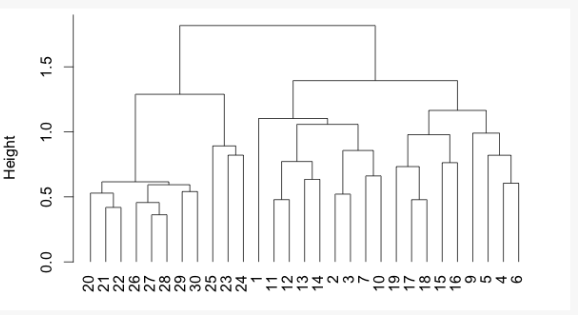
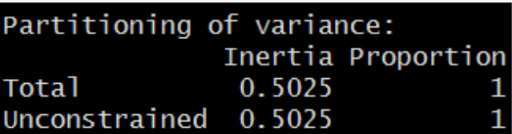
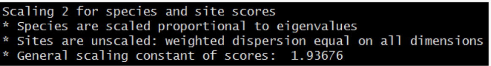

```{r setup2, echo = F}
## Setup for your presentation
knitr::opts_chunk$set(
  eval = T,
  cache = T,
  comment = "#",
  collapse = TRUE,
  warning = FALSE,
  message = FALSE,
  fig.width=5, fig.height=5, fig.retina=3,
  fig.align = 'center'
)
```

```{r, echo = F}
options(repos=structure(c(CRAN="http://cran.r-project.org")))
```

```{r, include = FALSE}
if (!require(vegan)) install.packages("vegan")
library(vegan)
if (!require(ape)) install.packages("ape")
library(ape)
if (!require(gclus)) install.packages("gclus")
library(gclus)
```

class: inverse, center, middle

# 1. Introduction
## What is ordination?


---
# One Dimension

What if we are interested in this response for different species of algae involved in the algal bloom density?

.center[]


---
# Two Dimensions

.center[]

---
# Three Dimensions

.center[
]


---
# 4,5,6, or more Dimensions

.center[]


---
# Ordination in reduced space

.center[]

---
# Ordination in reduced space


.center[]

- Matrix algebra is complex and hard to understand

- A global understanding is enough in order to use ordination methods adequately


---
# Methods for scientific research

--
- **Questions / Hypothesis**
--

- **Experimental design**

--
- **Data Collection**
--

- **Transformation / Distance**
--

- **Analysis**
--

- **Redaction**
--

- **Communication**


---
class: inverse, center, middle
# 2. Exploring data

---
# Doubs River Fish Dataset

.pull-left[

Verneaux (1973) dataset:
- characterization of fish communities
- 27 different species
- 30 different sites
- 11 environmental variables

]

.pull.right[

]

---
# Doubs River Fish Dataset

Load the Doubs River species data (Doubs.Spe.csv)

```{r}
spe <- read.csv("data/doubsspe.csv", row.names = 1)
spe <-  spe[-8] # remove site with no data
```

Load the Doubs River environmental data (Doubs.Env.csv)

```{r}
env <- read.csv("data/doubsenv.csv", row.names = 1) 
env <- env[-8] # remove site with no data
```

.alert[Proceed with caution, only execute once]


---
# Expore Doubs Dataset

Explore the content of the fish community dataset

```{r, eval = F}
names(spe) # Names of objects
dim(spe) # dimensions
str(spe) # structure of objects
summary(spe) # summary statistics
head(spe) # first 6 rows
```

```{r, echo = F}
head(spe) # first 6 rows
```

---
# Species Frequencies  

Take a look at the distribution of species frequencies  

```{r, fig.width=8, echo = -1}
par(mar = c(4,4,.5,.5), cex = 1.5)
ab <- table(unlist(spe))
barplot(ab, las = 1, col = grey(5:0/5),
        xlab = "Abundance class", ylab = "Frequency")
```

.alert[Note the proportion of 0s]

---
# Species Frequencies

How many zeros?

```{r}
sum(spe == 0)
```

What proportion of zeros?

```{r}
sum(spe == 0)/(nrow(spe)*ncol(spe))
```

---
# Total Species Richness

Visualize how many species are present at each site:

```{r, fig.width=10, fig.height=5, echo=-1}
par(mar = c(4,4,1,.5), cex = 1.5)
site.pre <- rowSums(spe > 0)
barplot(site.pre, main = "Species richness",
        xlab = "Sites", ylab = "Number of species",
        col = "grey ", las = 1)
```

---
# Understand your data!

.center[...to choose the appropiate transformation and distance]


- Are there many zeros?

- What do they mean?


.alert[A measured 0 (e.g 0mg/L, 0°C) is not the same than a 0 representing an absence observations]


---
# Before transforming your community data...

.alert[Important considerations:]

--
- relative abundances/counts/presence-absence?

--
- asymmetrical distributions?

--
- many rare species?

--
- overabundance of dominant species?

--
- double Zero problem?

---
# Transforming community data

.center[
]

---
# Transforming your community data

## Examples

Transforming counts into presence - absence
```{r}
spec.pa <- decostand(spe,method = "pa")
```

Reducing the weight of rare species

```{r}
spec.hel <- decostand(spe,method = "hellinger")
spec.chi <- decostand(spe,method = "chi.square")
```

Reducing the weight of very abundant species

```{r}
spe.pa <- decostand(spe,method = "log")
```


---
# Doubs Environmental Data

```{r, eval = F}
names(env) # Names of objects
dim(env) # dimensions
str(env) # structure of objects
summary(env) # summary statistics
head(env) # first 6 rows
```

```{r, echo = T}
head(env) # first 6 rows
```

Explore colinearity by visualizing correlations between variables

```{r, eval = F}
pairs(env, main = "Bivariate Plots of the Environmental Data")
```


---
# Doubs Environmental Data


---
# Standardization

Standardizing environmental variables is crucial as you cannot compare the effects of variables with different units

```{r, eval = -1}
?decostand
env.z <- decostand(env, method = "standardize")
```

This centers and scales the variables to make your downstream analysis more appropriate

```{r}
apply(env.z, 2, mean)
apply(env.z, 2, sd)
```


---
class: inverse, center, middle
# 3. Similarity / Dissimilarity


---
# Association measures

Matrix algebra is at the heart of all ordinations

.center[]

- Exploring various measures of distance between objects provides some understanding of the engine under the hood

---
# Breaking out of 1D

.pull-left[

- As you have seen, ecological datasets can sometimes be very large matrices

- Ordinations compute the relationships between species or between sites

- We can simplify these relationships using methods of dissimilarity
]

.pull-right[


]


---
# Similarity / Dissimilarity

- Useful to understand your dataset
- Appropriate measure required by some types of ordinations

.center[
Similarity: S = 1 - D
Distance: D = 1-S]


---
# Community distance measures

.pull-left[
- Euclidean
- Manhattan
- Chord
]

.pull-right[
- Hellinger
- Chi-square
- Bray-Curtis
]


--
<br/>
<br/>
<br/>

.alert[Each of these will be useful in different situations]

---
# Comparing Doubs Sites

The `vegdist()` function contains all common distances

```{r, eval = F}
?vegdist
```

How different is the community composition across the 30 sites of the Doubs River?

```{r}
spe.db.pa <- vegdist(spe, method = "bray")
```

---
# Comparing Doubs Sites

.center[]

---
# Comparing Doubs Sites

.center[]

---
# Visualization of distance matrices

.center[]

---
# Challenge #1 

<br/>

Discuss with your neighbor:

<br/>

.center[**How can we tell how similar objects are when we have multivariate data?**]

<br/>

- Make a list of all your suggestions


---
# And what about ordination?


With ordination methods, we order our objects (site) according to their similarity


- The more the sites are similar, the closer they are in the ordination space (smaller distances)


- In Ecology, we usually calculate the similarity between sites according to their species composition or their environmental conditions.


---
# Schematic analysis of multivariate analysis

.center[:scale 70%
]

---
# Clustering

- To highlight structures in the data by partitioning either objects or the descriptors

- Results are represented as dendrograms (trees)

- Not a statistical method

.center[
]

---
# Overview of 3 hierarchical methods

<br>

- Single linkage agglomerative clustering

<br>

- Complete linkage, agglomerative clustering

<br>

- Ward's minimum variance clustering

<br>

- Elements of lower are nested in higher ranking clusters
   - (e.g. species, genus, family, order)

---
# Hierarchical methods

A distance matrix is first sorted in increasing distance order


---
# Single linkage clustering  

.pull-left[


--

]

.pull-right[

- The two closest objects merge

- The next two closest objects/clusters merge

- and so on


]

---
# Complete linkage clustering

.pull-left[


]

.pull-right[

- The two closest objects merge

- The next two objects/cluster will agglomerate when linked to the furthest element of the group


]


---
# Comparison

Create a distance matrix from Hellinger transformed Doubs river data and compute the single linkage clustering

```{r, fig.width=7, echo = -1}
par(mar=c(.5,3.8,2,.5), cex = 1.5)
spe.dhe1 <- vegdist(spec.hel, method = "euclidean")
spe.dhe1.single <- hclust(spe.dhe1, method = "single")
plot(spe.dhe1.single)
```


---
# Comparison


.pull-left[

**Single linkage:**

Chains of objects occur (e.g. 19,29,30,26)
]

.pull-right[

**Complete linkage:**
Contrasted groups are formed of objects occur
]

---
# Ward's minimum variance method

- Uses the criterion of least squares to cluster objects into groups
  - At each step, the pair of clusters merging is the one leading to the minimum increase in total within-group sum of squares

---
# Ward's method  

Compute the Ward's minimum variance clustering and plot the dendrogram by using the square root of the distances:

```{r, fig.width=9, echo = -1}
par(mar=c(.5,3.8,2,.5), cex = 1.5)
spe.dhel.ward <- hclust(spe.dhe1, method = "ward.D2")
spe.dhel.ward$height <- sqrt(spe.dhel.ward$height)
plot(spe.dhel.ward, hang = -1) # hang = -1 aligns objects at the same level
```

---
# Ward's method

```{r, fig.width=9, echo = F}
par(mar=c(.5,3.8,2,.5), cex = 1.5)
plot(spe.dhel.ward, hang = -1) # hang = -1 aligns objects at the same level
```

Clusters generated using this method tend to be more spherical and to contain similar number of objects

---
# How to choose the right method?

- Depends on the objective
  - highlights gradients? contrasts?
- If more than on method seems appropriate, compare dendrograms
- Again: this is **not** an statistical method
 But! is possible to:
  - determine the optimal number of interpretable clusters
  - compute clustering statistics
  - combine clustering to ordination to distinguish groups of sites


---
class: inverse, center, middle
# 4. Unconstrained ordination


---
# Definitions

--

- **Variance:** measure of a variable **y** *j* dispersion from its mean
--

- **Co-variance:** measure of co-dispersion of variables **y** *j* et **y** *j* from their means

--
- **Correlation:** measure of the link strength between 2 variables: rij = (dij / dj . dk)

--
- **Eigenvalues:** Proportio of variance (dispersion) represented by one ordination axe.

--
- **Orthogonality:** right angle between 2 axis or 2 arrows which means that these 2 are independent = non correlated.

--
- **Score:** position of a dot on an axis. All the scores of a dot give its coordinates in the multidimensional space. They can be used as new variable for other analyses (e.g. linear combination of measured variables).

--
- **Dispersion** (inertia): Measure of the total variability of the scatter plot (descriptors) in the multidimensional space with regards to its center of gravity.

---
# Unconstrained ordination

- Asses relationships **within** a set of variables (species or environmental variables, not **between** sets, i.e. constrained analysis)

- Find key components of variation between samples, sites, species, etc... ç

- Reduce the number of dimensions in multivariate data without substantial loss of information

- Create new variables for use in subsequent analysis (such as regression)


---
# 4.1. Principal Component Analysis (PCA)

.center[
]

- Preserves, in 2D, the maximum amount of variation in the data
- The resulting, synthetic variables are orthogonal (and therefore uncorrelated)

---
# PCA - What you need

- A set of variables that are response variables (e.g. community composition) OR explanatory variables (e.g. environmental variables)

**NOT BOTH!**

.pull-left[
- Samples that are measured for the same set of variables
- Generally a dataset that is longer than it is wide is preferred
]

.pull-right[

]

---
# PCA - Walkthrough

<br/><br/>


|Site|Species 1| Species 2|
|---|------|------|
|A|7|3|
|B|4|3|
|C|12|10|
|D|23|11|
|E|13|13|
|F|15|16|
|G|18|14|


.alert[ A simplified example ]

---
# PCA - Walkthrough

.center[
]

.small[
.alert[In 2D, we would plot the sites like this... Notice the dispersion in the scatterplot]]

---
# PCA - Walkthrough

.center[
]

.small[
.alert[Our first component is essentially drawn trough the maximum amount of observed variation... or the best fit line through the points]]

---
# PCA - Walkthrough

.center[
]
.small[
.alert[A second principal component is then added perpendicular (90 degrees in 2D) to the first axis]]

---
# PCA - Walkthrough

.center[
]

.small[ The final plot then is the two PC axes rotated where the axes are now principal components as opposed to species]
---
# PCA - Multidimensional case

<br/><br/>

- **PC1** --> axis that maximizes the variance of the points that are projected perpendicularly onto the axis.
- **PC2** --> must be perpendicular to PC1, but the direction is again the one in which variance is maximized when points are perpendicularly projected
- **PC3** --> and so on: perpendicular to the first two axes

<br/>

.alert[When there are more than two dimensions, PCA produces a new spaces in which all PCA axes are orthogonal (i.e. non-correlated)  and where the PCA axes are ordered according to the percent of variance of the original data they explain]


---
# PCA - Let's try it on Fish Species!

- For both PCA and RDA, we will be using the `rda()` function in the vegan package

- Run a PCA on the Hellinger-transformed fish data and extract the results

```{r}
spe.h.pca <- rda(spec.hel)

summary(spe.h.pca)
```

---
# Function `rda()`

- RDA is in 2 steps

  - multiple regressions
  - PCA on regressed values

- If we give only one table to the function `rda()` it does directly a PCA without doing regression

.center[
.alert[ rda(Y~X)  RDA

rda(Y) or rda(X)  PCA ]]

---
#PCA - Interpretation of Output

.center[
]

- Total variance explained by the descriptors (here the fish species)
- In PCA, not that the "Total" and "Unconstrained" portion of the explained variance is identical

---
# PCA - Interpretation of Output

<br/>

.center[

]


- List the eigenvalues associated to each Principal Component (in this output there are 27 PCs, as this is the number of dimensions in the data)

<br/>

.alert[
An eigenvalue is the value of the change in the length of a vector, and for our purposes is the amount of variation explained by Principal Component
]

<br/>

.center[0.258 + 0.064 + ... = 0.5025 Total explained variance]

---
# PCA - Interpretation of Output


- List of the proportion of variance explained by each Principal Component (as well as cumulative)

<br/>

.center[51.3% of 0.5025 is 0.258]

---
# PCA - Interpretation of Output



- There are two ways to represent an ordination in 2D, here the output is informing us that it used the default scaling, which is type 2...

<br/><br/>

--

More on this later!

---
# PCA - Interpretation of Output


- Species refers to your descriptors (i.e. the columns in your dataset), which here are the Fish species
- Scores refer to the position of every species in the PC. Essentially they are the coordinates of each species along the principal component

---
# PCA - Interpretation of Output


- Site refers to the rows in your dataset, which here are the different sites along the Doubs river (but it can be points in time, etc)


---
# Accessing Parts of the Output

The output is very dense, but you can access specific information if needed. For example, you can access the eigenvalues associated contribution to variance :

```{r}
summary(spe.h.pca, display = NULL)
```

---
# Accessing Parts of the Output

You can calculate the eigenvalues from scratch

```{r}
eigen(cov(spec.hel))
```


---
# Accessing Parts of the Output

You may wish to extract the scores (either from species or sites) for use in subsequent analysis or for plotting

- Access the species scores along the 1st and 2nd PC:
```{r}
spe.scores <- scores(spe.h.pca,
                     display = "species",
                     choices = c(1,2))
```

- Access the site scores along the 1st and 2nd PC:

```{r}
site.scores <- scores(spe.h.pca,
                      display = "sites",
                      choices = c(1,2))
```

---
# Selecting Significant PCs

<br>

- The strength of PCA is that we can condense the variance contained in a huge dataset into a set of synthetic variables that is manageable

- In our case, there are still 27 Principal Components, but only the first few account for any significant amount of variance, while the rest can simply be discarded as noise...


--

.alert[How do we manage this?]

---
# Kaiser - Guttman criterion

Selects principal components which capture more variance than the average of all PCs

- Extract the eigenvalues associated to the PCs
```{r}
ev <- spe.h.pca$CA$eig
```

- Select all eigenvalues above average

```{r}
ev[ev>mean(ev)]
```


---
# Kaiser - Guttman criterion (visualization)

```{r, echo = -1, fig.width=10, fig.height = 5.5}
par(mar=c(4,4,2.5,.5), cex = 1.5)
n <- length(ev)
barplot(ev, main = "Eigenvalues", col = "grey", las = 2)
abline(h = mean(ev), col = "red3", lwd = 2)
legend("topright", "Average eigenvalue",
       lwd = 2, col = "red3" , bty = "n")
```


---
# PCA - environmental variables

We can also run PCAs on standardized environmental variables, to compare sites for example, or how variables are correlated...

- Run a PCA on the standardized environmental variables and extract the results
```{r}
env.pca <- rda(env.z)
summary(env.pca, scaling  = 2) # default
```


---
# PCA - environmental variables

- Extract the eigenvalues associated to the PCs:
```{r}
ev <- env.pca$CA$eig
```

- Select all the eigenvalues above average

```{r}
ev[ev>mean(ev)]
```

---
# PCA - environmental variables

- Plot the eigenvalues above average

```{r, echo = -1, fig.width=8, fig.height = 5}
par(mar=c(4,4,2.5,.5), cex = 1.5)
n <- length(ev)
barplot(ev, main = "Eigenvalues", col = "grey", las = 2)
abline(h = mean(ev), col = "red3", lwd = 2)
legend("topright", "Average eigenvalue",
       lwd = 2, col = "red3" , bty = "n")
```

---
# PCA - Visualization

The abundance of information produced by PCA is easier to understand and interpret using biplots to visualize patterns

- We can produce a quick biplot of the PCA using the function `plot()` in base R

```{r, echo = -1}
par(mar=c(4,4,.1,.1), cex = 1.5)
plot(spe.h.pca)
```

---
# PCA basic biplot with plot()

.center[
]


.comment[
`plot()` is quick but its hard to interpret the angles between species
]


---
# PCA basic `biplot()`

- Using the function `biplot()` from base R, arrows are plotted to show the directionality and angle of the descriptors in the ordination

.alert[
.small[
- Descriptors at 180 degrees of each other are negatively correlated
- Descriptors at 90 degrees of each other have zero correlation
- Descriptors at 0 degrees of each other are positively correlated
]]

```{r, echo = -1, fig.height=4, fig.width=4.5}
par(mar = c(4,4,0.05,0.05), cex = 1.2)
biplot(spe.h.pca)
```


---
# PCA scaling types


.pull_left[
.small[Type 2 scaling (DEFAULT): distances among objects are not approximations of Euclidean distances; angles between descriptor (species) vectors reflect their correlations.]

.alert[
.small[**Best for interpreting relationships among descriptors (species)!**]]]


.pull_right[
.small[Type 1 scaling: attempts to preserve the Euclidean distance (in multidimensional space)
among objects (sites): the angles among descriptor (species) vector are meaningless.]

.alert[
.small[**Best for interpreting relationships among objects (sites)!**]]]


---
# Advanced "biplotting"

- By extracting specific parts of the PCA output, we can build more detailed and aesthetic plots:

```{r, eval = F}
plot(spe.h.pca, scaling  = 1, type = "none",
     xlab = c("PC1 (%)", round(spe.h.pca$CA$eig[1]/sum(spe.h.pca$CAeig)*100,2)),
     ylab = c("PC2 (%)", round(spe.h.pca$CA$eig[2]/sum(spe.h.pca$CA$eig)*100,2)))
points(scores(spe.h.pca, display = "sites", choices = c(1,2), scaling = 1),
       pch=21, col = "black", bg = "steelblue" , cex  = 1.2)
text(scores(spe.h.pca, display = "species", choices = 1, scaling = 1),
     scores(spe.h.pca, display = "species", choices = 2, scaling = 1),
     labels = rownames(scores(spe.h.pca, display = "species", scaling = 1)),
     col = "red", cex = 0.8)
spe.cs <- scores(spe.h.pca, choices = 1:2, scaling = 1 , display = "sp")
arrows(0, 0, spe.cs[,1], spe.cs[,2], length = 0)
```

use the `arrows()` function in  `graphics` to add vectors


---
# Advanced "biplotting"

```{r, echo = F, fig.width=7,fig.height=7}
par(mar = c(4,4,0.05,0.05), cex = 1.2)
plot(spe.h.pca, scaling  = 1, type = "none",
     xlab = c("PC1 (%)", round(spe.h.pca$CA$eig[1]/sum(spe.h.pca$CAeig)*100,2)),
     ylab = c("PC2 (%)", round(spe.h.pca$CA$eig[2]/sum(spe.h.pca$CA$eig)*100,2)))
points(scores(spe.h.pca, display = "sites", choices = c(1,2), scaling = 1),
       pch=21, col = "black", bg = "steelblue" , cex  = 1.2)
text(scores(spe.h.pca, display="species", choices=c(1), scaling = 1),
     scores(spe.h.pca, display = "species", choices = c(2), scaling = 1),
     labels=rownames(scores(spe.h.pca, display = "species", scaling = 1)),
     col = "red", cex = 0.8)
spe.cs <- scores(spe.h.pca, choices = 1:2, scaling = 1 , display = "sp")
arrows(0,0,spe.cs[,1], spe.cs[,2], length = 0)
```

---
# EASTER EGG: ggvegan

- A set of tools for producing biplots using ggplot2

```{r, eval = F}
install.packages("devtools")
require("devtools")
install_github("ggvegan", "gavinsimpson")
require("ggvegan")
autoplot()
```

---
# EASTER EGG: rgl and vegan 3d

Interactive 3D biplots using rgl
```{r, eval = F}
require(rgl)
require(vegan3d)
ordirgl(spe.h.pca)
```


---
# Challenge # 3 

Using everything you have learned to execute a PCA on the mite species abundance data

```{r}
data(mite)
```

- What are the significant axes?
- Which groups of sites can you identify?
- Which groups of species are related to these groups of sites?

---
# Solution #3

- Compute PCA on the Hellinger-transformed species data

```{r}
mite.spe.hel <- decostand(mite, method = "hellinger")

mite.spe.h.pca <- rda(mite.spe.hel)
```

- Check significant axes using the Guttman-Kaiser criterion

```{r, eval = F}
ev <- mite.spe.h.pca$CA$eig
ev[ev>mean(ev)]
n <- length(ev)
barplot(ev, main = "Eigenvalues", col = "grey", las = 2)
abline(h = mean(ev), col = "red3", lwd = 2)
legend("topright", "Average eigenvalue", lwd = 2, col = "red3", bty = "n")
```

---
# Solution #3

```{r, echo = F, fig.width=10, fig.height=7}
par(mar=c(4,4,2,1), cex = 1.2)
ev <- mite.spe.h.pca$CA$eig
n <- length(ev)
barplot(ev, main = "Eigenvalues", col = "grey", las = 2)
abline(h = mean(ev), col = "red3", lwd = 2)
legend("topright", "Average eigenvalue", lwd = 2, col = "red3", bty = "n")
```


---
# Solution #3

```{r, echo = -1, fig.height=6.5, fig.width=7}
par(mar = c(4,4,0.05,0.05), cex = 1.5)
biplot(mite.spe.h.pca, col = c("red3", "grey15"))
```


---
# Warnings

- PCA is a linear method and thus relies on a few assumptions

--

  - multinormal distribution of the data (only if you wish to make inferences)

--

  - not too many zeros

--

  - the gradient of interest is causing the majority of the variance in the dataset

.alert[
.small[
Violation of these can cause a horseshoe shape in your biplots, where opposite ends of the horseshoe are close together but in reality represent opposite ends of a gradient]
]

---
# Warnings

- We can avoid some of these problems in PCA by choosing appropriate transformations for your community composition data or environmental data

- In some cases, such as studies that cover very large environmental gradients, it may be appropriate to use other types of unconstrained ordinations

---
# 4.1. Correspondance Analysis (CA)

## Euclidean vs Chi<sup>2</sup> distances

- PCA preserves **euclidean distances** between objects, and thus postulates **linear relationships** between species, and between species and environmental gradients.

- ... but in **some cases, species instead present unimodal responses** to environmental gradients

---
# Principles of CA

- In such cases, CA should be preferred compared to PCA as it preserves **Chi2 distances between sites**... and thus better represents uni modal relationships

---
# How to run a CA?

- CA is implemented in the `vegan` package using the function `cca()`:

```{r}
spe.ca <- cca(spe[-8,])
# only take columns which rowsums are > than 0.

```


- CA on fish species abundances

---
# CA: R output

- CA results are presented in the same way as PCA results and can be called using:

```{r}
summary(spe.ca)
```


---
# CA: Interpretation of results

.pull-left2[

]

.pull-right2[

26 CA axes identified

% CA1 = 51.50%

% CA2 = 12.37%
]


---
# CA: biplots

.center[
]

.small[
The group of sites on the left is characterized by the species *GAR*, *TAN*, *PER*, *ROT*, *PSO*, and *CAR*

The group of sites in the upper right corner is characterized by the species *LOC*, *VAI* and *TRU*
The group of sites in the lower right corner is characterized by the species *BLA*, *CHA*, and *OMB*
]


---
# Challenge #4 

Using everything you have learned to execute a CA on the mite species abundance data:

```{r}
mite.spe <- mite
```

- What are the significant axes?
- Which groups of sites can you identify?
- Which groups of species are related to these groups of sites?

---
# Solution #4

- Compute CA:

```{r}
mite.spe.ca <- cca(mite.spe)
```

- Check significant axes using the Guttman-Kaiser criterion

```{r, eval = F}
ev <- mite.spe.ca$CA$eig
ev[ev > mean(ev)]
n <- length(ev)
barplot(ev, main = "Eigenvalues", col = "grey", las = 2)
abline(h = mean(ev), col = "red3", lwd = 2)
legend("topright", "Average eigenvalue", lwd = 2, col = red3, bty = "n")
```

---
# Solution #4

```{r, echo = F, fig.width=10, fig.height=7}
par(mar=c(4,4,2,1), cex = 1.2)
ev <- mite.spe.ca$CA$eig
n <- length(ev)
barplot(ev, main = "Eigenvalues", col = "grey", las = 2)
abline(h = mean(ev), col = "red3", lwd = 2)
legend("topright", "Average eigenvalue", lwd = 2, col = "red3", bty = "n")
```

---
# 4.3. Principal Coordinates Analysis

.center[]

- In PCA, we preserve the maximum amount of variation in the data

- In PCoA, we preserve as best we can in 2D (Euclidean) distances between each object in multidimensional space

.alert[ PCoA can be especially useful when the dataset is wider than it is long (Typical problem in Genetics)]

---
# PCoA - Let's try it on Fish species!

- For computing PCoA, we can use the `cmdscale()` or the `pcoa()`functions from the **stats** and **ape** packages:

```{r, eval = F}
?cmdscale
?pcoa
```

- Run a PCoA on the Hellinger-distances of the fish dataset and extract the results
```{r}
spe.h.pcoa <- pcoa(dist(spec.hel))
summary(spe.h.pcoa)
```


---
# PCoA - Interpretation of Output

.center[]

- Eigenvalues
- Relative eigenvalues
- Broken stick model: to evaluate which axes are significant
- Cumulative eigenvalues: cumulative value of the relative eigenvalues
- Cumulative broken stick: cumulative value of the broken stick model

---
# PCoA - Interpretation of Output


- Vectors: the eigenvectors associated to each eigenvalue contain the coordinates, in Euclidean space, of each site.

.alert[ These are the most useful for subsequent analysis as they capture the distance among objects very well]


---
# PCoA biplot with `biplot.pcoa()`

We can display, in 2D, the distances between sites using the `biplot.pcoa()` function, as well as the species associated to each site

```{r, fig.height=5, fig.width=8}
biplot.pcoa(spe.h.pcoa, spec.hel)
```


---
# PCoA and non-metric distances

- PCoA can also be used to capture information contained in non-metric distances, such as the popular Bray-Curtis distance. Let's give it a try:

```{r}
spe.bray.pcoa <- pcoa(spe.db.pa)
# spe.bray.pcoa
```

- Examine the output and notice the negative eigenvalues. This is because non-metric distances cannot be represented in Euclidean space without corrections (*see* Legendre & Legendre 2012 for more details on this):

```{r}
spe.bray.pcoa <- pcoa(spe.db.pa, correction = "cailliez")
# spe.bray.pcoa
```

---
# PCoA and non-metric distances

- Now let's visualize this using a biplot without the species (more common approach for PCoA)

```{r, fig.width=6, fig.height=5.5, echo = -1}
par(mar=c(3,3,.5,1), cex = 1.2)
biplot.pcoa(spe.bray.pcoa)
```


---
# Challenge #5 

Execute a PCoA on the Hellinger-transformed mite species abundance data

- What are the significant axes?
- Which groups of sites can you identify?
- Which groups of species are related to these groups of sites
- How do the PCoA results compare with the PCA results?

---
# Solution #5

- Hellinger transform the species data
```{r}
mite.spe.hel <- decostand(mite.spe, method = "hellinger")
```

- Compute PCoA

```{r}
mite.spe.h.pcoa <- pcoa(dist(mite.spe.hel))
```

---
# Solution #5

- Build a biplot to visualize the data:
```{r, fig.width=6, fig.height=6}
biplot.pcoa(mite.spe.h.pcoa, mite.spe.hel)
```


---
# Non-metric Multidimensional scaling (NMDS)

- In PCA, CA and PCoA, objects are ordinated in a few number of dimensions (i.e. axis) generally > 2

- Consequently, 2D-biplots can fail to represent all the variation of the dataset

- In some cases, the objective is however to represent the data in a specified small number of dimensions

- Then, how do you plot the ordination space to represent all the variation in the data?

---
# Principles of NMDS

- NMDS
  - is the non-metric counterpart of PCoA
  - uses an iterative optimization algorithm to find the best representation of distances in reduced space
  - increasingly popular
- In NMDS, users can thus specify;
  - the number of dimensions
  - the distance measure

---
# How to run a NMDS

-  nMDS is implemented in the `vegan` package using function `metaMDS()` where
  - *distance* specifies the distance measure to use
  - *k* specifies the number of dimensions

```{r}
spe.nmds <- metaMDS(spe, distance = 'bray', k = 2)
```


---
# NMDS: goodness-of-fit

- NMDS applies an iterative procedure that tries to position the objects in the requested number of dimensions in such a way as to minimize a stress function (scaled from 0 to 1) which measure the goodness-of-fit of the distance adjustment in the reduced-space configuration.

- Consequently, the lower the stress value, the better the representation of objects in the ordination-space is.

---
# NMDS: goodness-of-fit

- The Shepard diagram and stress values can be obtained from:

```{r}
spe.nmds$stress
stressplot(spe.nmds, main = "Shepard plot")
```

---
# NMDS on fish abundances

- Run the NMDS and assess the goodness of fit

```{r, eval = F}
spe.nmds <- metaMDS(spe, distance = 'bray', k = 2)
spe.nmds$stress
stressplot(spe.nmds, main = "Shepard plot")
```

---
# NMDS on fish abundances

.pull-left[

]

.pull-right[
- The Shepard plot identifies a strong correlation between observed dissimilarity and ordination distance (R2 > 0.95) highlighting a high goodness of fit of the NMDS
]

---
# NMDS on fish abundances

- Construct the biplot

```{r, eval = F}
plot(spe.nmds, type = "none",
     main = paste("NMDS/Bray - Stress =",
                  round(spe.nmds$stress, 3)),
     xlab = c("NMDS1"), ylab = "NMDS2")

points(scores(spe.nmds, display = "sites",
              choiches = c(1,2),
              pch = 21,
              col = "black",
              g = "steelblue",
              cex = 1.2))
text(scores(spe.nmds, display = "species", choices = c(1)),
            scores(spe.nmds, display = "species", choices = c(2)),
            labels = rownames(scores(spe.nmds, display = "species")),
            col = "red", cex = 0.8)
```

---
# NMDS on fish abundances

.pull-left[

The biplot of the NMDS shows a group of closed sites characterized by the species BLA, TRU, VAI, LOC, CHA and OMB,
while the other species form a cluster of sites in the upper right part of the graph. Four sites in the lower part of the graph are strongly different from the others
]

.pull-right[

]


---
# Challenge #6 

<br>

- Run the NMDS of the mite species abundances in 2 dimensions based on a Bray-Curtis distance.

- Assess the goodness-of-fit of the ordination and interpret the biplot

---
# Solution #6

.pull-left[

]

.pull-right[
The correlation between observed dissimilarity and ordination distance (R2 > 0.91) and the stress value relatively low, showing together a good accuracy of the NMDS ordination
]

---
# Solution #6

.pull-left[

]

.pull-right[
No cluster of sites can be precisely defined from the NMDS biplot showing that most of the species occurred in most of the sites, i.e. a few sites shelter specific communities
]

---
# Conclusion

.alert[Many ordination techniques exist, but their specificity should guide your choices on which methods to use]

|   | Distance preserved | Variables | Maximum number of axis |
|---|---------|--------------|------|
|PCA| Euclidean | Quantitative data, linear relationships | p |
|CA| Chi2 | Non-negative, quantitative homogeneous data, binary data | p-1 |
|PCoA| User defined | Quantitative, semi-quantitative, mixed data| p-1|
|NMDS| User defined | Quantitative, semi-quantitative, mixed data| User defined|

---
# Prime time 4 quiz time

.alert[What does PCA stand for?]

--

Principal Component Analysis

--

.alert[Which one is the best way to visualize the *distances* between the community composition of many sites?]

--

Principal Coordinate Analysis (PCoA)

--

.alert[What does an eigenvalue represent in PCA?]

--

The proportion of variance explained by a principal component

---
# Prime time 4 quiz time

Spot what is sketchy


--
.alert[
- Data non centered, Yikes!
]

---
# Prime time 4 quiz time

Spot what is sketchy


--

.alert[
- 2 first PCs explain 100% of the variation!
]


---
# Live Long and Ordinate

.center[]


---
class: inverse, center, bottom

# Thank you for attending this workshop!


