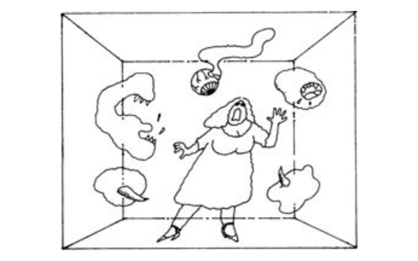
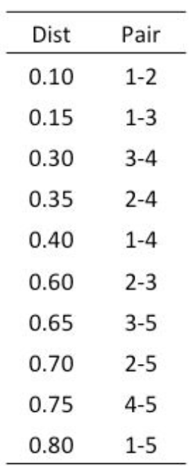

```{r setup2, echo = F}
## Setup for your presentation
knitr::opts_chunk$set(
  eval = T,
  cache = T,
  comment = "#",
  collapse = TRUE,
  warning = FALSE,
  message = FALSE,
  fig.width=5, fig.height=5,
  fig.align = 'center'
)
```

```{r, echo = F}
options(repos=structure(c(CRAN="http://cran.r-project.org")))
```

```{r, include = FALSE}
if (!require(vegan)) install.packages("vegan")
library(vegan)
if (!require(ape)) install.packages("ape")
library(ape)
if (!require(gclus)) install.packages("gclus")
library(gclus)
```

class: inverse, center, middle

# 1. Introduction
## Qu'est-ce que l'ordination?


---
# Une Dimension

Que se passe-t-il si nous voulons nous intéresser à la réponse de différentes espèces d'algues?

.center[]


---
# Deux Dimensions

.center[]

---
# Trois Dimensions

.center[
]


---
# 4,5,6, ou plus de Dimensions

.center[]


---
# Ordination en espace réduit

.center[]

---
# Ordination en espace réduit


.center[]

- L'algèbre matricielle est complexe et difficile à comprendre

- Une compréhension générale est suffisante pour utiliser efficacement les méthodes d'ordination

---
# Méthodes pour la recherche scientifique

--
- **Questions / Hypothèses**
--

- **Design expérimental**

--
- **Collecte de données**
--

- **Transformation / Distance**
--

- **Analyses**
--

- **Rédaction**
--

- **Communication**


---
class: inverse, center, middle
# 2. Exploration des données

---
# Données de poissons de la rivière Doubs

.pull-left[

Données de Verneaux (1973) :
- caractérisation des communautés de poissons
- 27 espèces
- 30 sites
- 11 variables environnementales

]

.pull.right[

]

---
# Données de poissons de la rivière Doubs

Chargement des données espèces (`Doubs.Spe.csv`)

```{r}
spe <- read.csv("data/doubsspe.csv", row.names = 1)
spe <-  spe[-8] # supprimer le site vide
```

Chargement des données environnementales (`Doubs.Env.csv`)

```{r}
env <- read.csv("data/doubsenv.csv", row.names = 1)
env <- env[-8] # remove site with no data
```

.alert[Attention, n'exécuter qu'une seule fois]


---
# Exporation des données

Explorer le contenu des données espèces :

```{r, eval = F}
names(spe) # noms des objets
dim(spe) # dimensions
str(spe) # structure des objets
summary(spe) # résumé statistique
head(spe) # 6 premières lignes
```

```{r, echo = F}
head(spe) # 6 premières lignes
```

---
# Fréquences des espèces

Observer la distribution de fréquence des espèces :

```{r, fig.width=7, fig.height=4.5, echo = -1}
par(mar = c(4,4,.5,.5), cex = 1.5)
ab <- table(unlist(spe))
barplot(ab, las = 1, col = grey(5:0/5),
        xlab = "Abondance des classes", ylab = "Fréquence")
```

.alert[Notez la proportion de 0]

---
# Fréquences des espèces

Combien de zéros?

```{r}
sum(spe == 0)
```

Quelle proportion de zéros?

```{r}
sum(spe == 0)/(nrow(spe)*ncol(spe))
```

---
# Richesse totale en espèce

Observer le nombre d'espèces présentes dans chaque site :

```{r, fig.width=10, fig.height=5, echo=-1}
par(mar = c(4,4,1,.5), cex = 1.5)
site.pre <- rowSums(spe > 0)
barplot(site.pre, main = "Richesse spécifique",
        xlab = "Sites", ylab = "Nombre d'espèces",
        col = "grey ", las = 1)
```

---
# Comprenez vos données!

.center[...pour choisir la transformation et la distance appropriée]


- Y-a-t-il beaucoup de zéros?

- Que veulent-ils dire?


.alert[Une mesure de 0 (e.g 0mg/L, 0°C) n'est pas équivalent à un 0 représentant une absence d'observation.]


---
# Avant de transformer vos données de composition des communautés...

.alert[Considérations importantes:]

--
- abondances/comptes/présence-absence relatives?

--
- distributions asymmétriques ?

--
- beaucoup d'espèces rares?

--
- surabondance d'espèces dominantes?

--
- problème de double Zéro?

---
# Transformer les données de composition des communautés

.center[
]

---
# Transformer les données de composition des communautés

## Exemples

Transformer des comptes en présence - absence
```{r}
spec.pa <- decostand(spe,method = "pa")
```

Réduire le poids des espèces rares

```{r}
spec.hel <- decostand(spe,method = "hellinger")
spec.chi <- decostand(spe,method = "chi.square")
```

Réduire le poids des espèces abondantes

```{r}
spe.pa <- decostand(spe,method = "log")
```

---
# Données sur l'environnement

```{r, eval = F}
names(env) # Names of objects
dim(env) # dimensions
str(env) # structure of objects
summary(env) # summary statistics
head(env) # first 6 rows
```

```{r, echo = T}
head(env) # first 6 rows
```
Explorer la colinéarité en visualisant les corrélations entre les variables

```{r, eval = F}
pairs(env, main = "Bivariate Plots of the Environmental Data")
```


---
# Données sur l'environnement


---
# Standardisation

Standardiser les variables environnementales est indispensable car il est impossible de comparer des variables d'unités différentes :

```{r, eval = -1}
?decostand
env.z <- decostand(env, method = "standardize")
```
Cette fonction centre-réduit les données pour permettre la fiabilité des analyses :

```{r}
apply(env.z, 2, mean)
apply(env.z, 2, sd)
```


---
class: inverse, center, middle
# 3. Similarité / Dissimilarité


---
# Mesure d'association

L'algébre matricielle est au coeur de plusieurs méthodes d'analyses multivariées

.center[]

- Explorer différentes mesures de distance entre objets permet de mieux comprendre le fonctionnement de l'ordination

---
# Au-délà de la 1ère dimension

.pull-left[

- Les jeux de données écologiques correspondent souvent à de grandes matrices

- L'ordination calcule les relations entre espèces, ou entre objets

- Ces relations peuvent être simplifiées par des mesures de dissimilarités
]

.pull-right[


]


---
# Similarité / Dissimilarité

- Utile pour comprendre vos données
- Certains types d'ordination ou de groupement nécessitent des mesures appropriées

.center[
Similarité: S = 1 - D
Distance: D = 1-S]


---
# Mesures de distance des communautés

.pull-left[
- Euclidienne
- Manhattan
- Corde
]

.pull-right[
- Hellinger
- Chi-carré
- Bray-Curtis
]


--
<br/>
<br/>
<br/>

.alert[Chaque mesure est utile dans différentes situations]

---
# Comparaison des sites de la rivière Doubs

La fonction `vegdist()` comprend les mesures de distances communes :

```{r, eval = F}
?vegdist
```
Comment la composition des communautés diffère-t-elle entre les 30 sites de la rivière Doubs?

```{r}
spe.db.pa <- vegdist(spe, method = "bray")
```

---
# Comparaison des sites

.center[]

---
# Comparaison des sites

.center[]

---
# Visualisation d'une matrice de distances

.center[]

---
# Défi #1 

<br/>

Discuter avec votre voisin:

<br/>

.center[**Comment savoir si deux objets caractérisés par des données multidimensionnelles sont similaires?**]

<br/>

- Faites une liste de vos suggestions


---
# Et qu'en est-il de l'ordination?

Avec des méthodes d'ordination, nous ordonnons vos objets (sites) en fonction de leur similarité

- Plus les sites sont similaires, plus ils sont proches dans l'espace d'ordination (plus petites distances)

- En écologie, on calcule habituellement la similarité entre sites en fonction de leur composition en espèces ou de leur conditions environnementales.


---
# Analyse schématique des analyses multivariées

.center[:scale 70%
]

---
# Groupement

- Permet de mettre en lumière des structures dans les données en partitionnant les objets

- Les résultats sont représentés sous forme de dendrogramme (arbre)

- Pas une méthode statistique!

.center[
]

---
# Aperçu de 3 méthodes hiérarchiques

<br>

- Groupement agglomératif à liens simples

<br>

- Groupement agglomératif à liens complets

<br>

- Groupement de Ward

<br>

- Les éléments de petits ensembles se regroupent en groupes plus vastes de rang supérieur
   - (e.g. espèces, genres, familles, ordres...)

---
# Groupement hiérarchique

À partir d'une matrice de distances, on classe les objets en ordre croissant


---
# Groupement à liens simples

.pull-left[


--

]

.pull-right[

- Les deux objets les plus proches se regroupent

- Ensuite les deux objets les plus proches suivants

- et ainsi de suite.


]

---
# Groupement à liens complet

.pull-left[



]

.pull-right[

- Les deux objets les plus proches se regroupent

- Ensuite les groupes se lient à la distance à laquelle les objets qu'ils contiennent sont tous liés


]


---
# Comparaison

Créer une matrice de distance à partir des données de la rivière Doubs transformées Hellinger et faire le groupement à liens simples :

```{r, fig.width=7, echo = -1}
par(mar=c(.5,3.8,2,.5), cex = 1.5)
spe.dhe1 <- vegdist(spec.hel, method = "euclidean")
spe.dhe1.single <- hclust(spe.dhe1, method = "single")
plot(spe.dhe1.single)
```


---
# Comparison


.pull-left[

**Liens simples :**

Les objets ont tendance à s'enchaîner (e.g. 19,29,30,26)
]

.pull-right[

**Liens complets :**
Les groupes sont plus distincts
]

---
# Groupement de Ward

- Utilise la méthode des moindres carrés pour lier les objets
  - les groupes fusionnent de façon à minimiser la variance intragroupe
  - à chaque étape, la paire de groupes à fusionner est celle qui résulte à la plus petite augmentation de la somme des carrés des écarts intra-groupes

---
# Groupement de Ward

Faire le groupement de Ward et dessiner le dendrogramme en utilisant la racine carrée des distances :

```{r, fig.width=9, echo = -1}
par(mar=c(.5,3.8,2,.5), cex = 1.5)
spe.dhel.ward <- hclust(spe.dhe1, method = "ward.D2")
spe.dhel.ward$height <- sqrt(spe.dhel.ward$height)
plot(spe.dhel.ward, hang = -1) # hang = -1 aligns objects at the same level
```

---
# Groupement de Ward

```{r, fig.width=9, echo = F}
par(mar=c(.5,3.8,2,.5), cex = 1.5)
plot(spe.dhel.ward, hang = -1) # hang = -1 permet d'afficher les objets sur la même ligne
```
Les objets ont tendance à former des groupes plus sphériques et homogènes

---
# Comment choisir la bonne méthode ?

- Dépend de votre objectif
  - démontrer des gradients? des contrastes?
- Si plus d'une méthode semble adéquate, comparer les dendrogrammes
- Encore une fois : ceci **n'est pas** une méthode statstique
 Mais! il est possible de:
  - déterminer le nombre de groupe optimal
  - faire des tests statistiques sur les résultats
  - combiner le groupement à l'ordination pour distinguer des groupes de sites
---
class: inverse, center, middle
# 4. Ordination non contrainte


---
# Définitions

--

- **Variance:** mesure de la dispersion d'une variable **y** *j* de sa moyenne
--

- **Co-variance:** mesure de co-dispersion des variables **y** *j* et **y** *i* de leur moyenne

--
- **Corrélation:** mesure de la force du lien entre 2 variables : $rij = (dij / dj . dk)$

--
- **Valeurs propres:** proportion de variance (dispersion) représentée par un axe d'ordination

--
- **Orthogonalité:** angle droit entre 2 axes ou 2 flèches, ce qui veut dire qu'ils sont indépendants = non corrélés

--
- **Score:** position d'un point sur un axe. Tous les scores d'un point donnent ses coordonnées dans l'espace multidimensionnel. Ils peuvent être utilisés pour d'autres analyses (e.g combinaison linéaire de variables mesurées)

--
- **Dispersion** (inertie): Mesure de la variabilité totale du diagramme de dispersion de l'espace multidimensionnel en fonction de son centre de gravité

---
# Ordination non contrainte


- Évalue la relation **dans** un ensemble de variables (espèces ou variables environnementales, et non **parmi** les ensembles, i.e analyse sous contraintes)

- Trouve les composants clés de la variation entre échantillons, sites, espèces, etc...

- Réduit le nombre de dimensions dans les données multivariées sans perte d'informations considérables

- Créer de nouvelles variables pour des analyses ultérieures (comme la régression)


---
# 4.1. Analyse en Composantes Principales (ACP ou PCA)

.center[
]

- Préserve, en 2 dimensions, le maximum de variation des données
- Il en résulte des variables synthétiques orthogonales entre elles (et donc non corrélées)

---
# PCA - Ce qu'il vous faut

- Un jeu de données correspondant à des variables réponses (eg. composition de communautés) OU à des variables explicatives (e.g variables environnementales)

**PAS LES DEUX!**

.pull-left[
- Échantillons correspondant à des mesures du même jeu de variables
- Généralement, un jeu de données plus long que large est préféré
]

.pull-right[

]

---
# PCA - Principes

<br/><br/>


|Site|Species 1| Species 2|
|---|------|------|
|A|7|3|
|B|4|3|
|C|12|10|
|D|23|11|
|E|13|13|
|F|15|16|
|G|18|14|


.alert[Un exemple simplifié]

---
# PCA - Principes

.center[
]

.small[
.alert[En 2D, les sites seraient disposés de cette façon... Notez la dispersion dans le diagramme de dispersion]]

---
# PCA - Principes

.center[
]

.small[
.alert[La première composantes principale est celle qui maximise la variation observée... la meilleure droite entre les sites]]

---
# PCA - Principes

.center[
]
.small[
.alert[La seconde composante principale est ajoutée perpendiculairement au premier axe]]

---
# PCA - Principes

.center[
]

.small[Le graphique final subit une rotation afin que les deux axes correspondent aux composantes principales (et non plus aux espèces)]
---
# PCA - Cas multidimensionnel

<br/><br/>

- **PC1** --> axe qui maximise la variance des points projetés perpendiculairement sur les axes.
- **PC2** --> doit être orthogonal à PC1, mamis sa direction maximise la variance des points projetés.
- **PC3** --> et ainsi de suite : orthogonale à PC1 et PC2...

<br/>

.alert[Quand il y a plus de deux dimensions, la PCA produit un nouvel espace dans lequel tous les axes sont orthogonaux (i.e. la corrélation entre les axes =0) et où les axes sont ordonnés selon le pourcentage de variation des données brutes qu'ils expliquent (valeur propre).]


---
# PCA - Essayons sur les données Poissons!

- La PCA (tout comme la RDA) est implémentée par la fonction `rda()` de la librairie vegan

- Effectuer une PCA sur les abondances de poissons transformées Hellinger

```{r}
spe.h.pca <- rda(spec.hel)

summary(spe.h.pca)
```

---
# Fonction `rda()`

- RDA en 2 étapes :

  - régressions multiples
  - PCA sur les valeurs régressées

- Si on donne seulement un tableau à la fonction `rda()` it does directly a PCA without doing regression

.center[
.alert[ rda(Y~X)  RDA

rda(Y) ou rda(X)  PCA ]]

---
# PCA - Interprétation des sorties

.center[
]

- Total de variance expliquée par les descripteurs (ici les espèces de poissons)
- Dans une PCA, la proportion "Total" et "Unconstrained" de variance expliquée est identique

---
# PCA - Interprétation des sorties

<br/>

.center[

]


- Liste des valeurs propores associées à chaque Composantes Principales (ici 27 PCs sont identifiées, soit le nombre de dimensions des données)

<br/>

.alert[
La valeur propre est la valeur du changement dans la longueur d'un vecteur, et ici représente la quantité de variation expliquée par chaque Composante Principale.
]

<br/>

.center[0.258 + 0.064 + ... = 0.5025 Variance totale expliquée]

---
# PCA - Interprétation des sorties


- Liste de la proportion de variance expliquée par chaque Composante Principale (et la proportion cumulée)

<br/>

.center[51.3% de 0.5025 égal 0.258]

---
# PCA - Interprétation des sorties


- Il existe deux façons principales de représenter une ordination en 2D... ici la sortie R nous informe que le cadrage utilisé par défaut est de type 2...

<br/><br/>

--

À suivre!

---
# PCA - Interprétation des sorties


- *Species* refère aux colonnes de votre jeu de données, ici différentes espèces de poissons
- Les scores correspondent aux coordonnées de chaque espèce le long de chaque PC

---
# PCA - Interprétation des sorties


- *Site* réfère aux lignes de votre jeu de données, ici différentes stations d'échantillonnage le long de la rivière,
- Les scores correspondent aux coordonnées de chaque site le long de chaque PC


---
# Accéder à une partie de la sortie R

La sortie R est très dense, mais vous pouvez accéder au besoin à des informations spécifiques. Par exemple, vous pouvez extraire les valeurs propres et leur contribution à la variance expliquée :

```{r}
summary(spe.h.pca, display = NULL)
```

---
# Accéder à une partie de la sortie R

Vous pouvez calculer les valeurs propres :

```{r}
eigen(cov(spec.hel))
```


---
# Accéder à une partie de la sortie R

Vous pouvez extraire les scores (des sites ou des espèces) pour réaliser des graphiques ou les utiliser dans de nouvelles analyses :

- Extraire le score des espèces pour PC1 et PC2 :
```{r}
spe.scores <- scores(spe.h.pca,
                     display = "species",
                     choices = c(1,2))
```

- Extraire le score des sites pour PC1 et PC2 :

```{r}
site.scores <- scores(spe.h.pca,
                      display = "sites",
                      choices = c(1,2))
```

---
# Sélection des PCs significatives

<br>

- La force de la PCA est de condenser la variance contenue dans un grand jeu de données en jeu de données synthétiques moins nombreuses

- Dans notre cas, 27 PCs sont identifiées mais seuls les premières contribuent de façon importante à la variance expliquée tandis que les autres représentent le bruit des données et peuvent être écartées...

--

.alert[Comment choisir les PCs significatives?]

---
# Critère de Kaiser - Guttman

Sélectionner les PCs qui capturent plus de variance que la moyenne de tous les PCs

- Extraire les valeurs propres de chaque PCs :
```{r}
ev <- spe.h.pca$CA$eig
```

- Sélectionner les valeurs propres supérieures à la moyenne :

```{r}
ev[ev>mean(ev)]
```


---
# Critère de Kaiser - Guttman (illustration)

```{r, echo = -1, fig.width=10, fig.height = 5.5}
par(mar=c(4,4,2.5,.5), cex = 1.5)
n <- length(ev)
barplot(ev, main = "Valeurs propres", col = "grey", las = 2)
abline(h = mean(ev), col = "red3", lwd = 2)
legend("topright", "Valeur propore moyenne",
       lwd = 2, col = "red3" , bty = "n")
```


---
# PCA - variables environnementales

Une PCA peut aussi être effectuée sur les variables environnementales standardisées pour comparer les sites ou évaluer les corrélations entre variables...

- Effectuer une PCA sur les variables environnementales standardisées
```{r}
env.pca <- rda(env.z)
summary(env.pca, scaling  = 2) # default
```


---
# PCA - variables environnementales

- Extraire les valeurs propres de chaque PC :
```{r}
ev <- env.pca$CA$eig
```

- Sélectionner les valeurs propres supérieures à la moyenne :

```{r}
ev[ev>mean(ev)]
```

---
# PCA - variables environnementales

- Créer le graphique :

```{r, echo = -1, fig.width=8, fig.height=4.5}
par(mar=c(4,4,2.5,.5), cex = 1.5)
n <- length(ev)
barplot(ev, main = "Eigenvalues", col = "grey", las = 2)
abline(h = mean(ev), col = "red3", lwd = 2)
legend("topright", "Average eigenvalue",
       lwd = 2, col = "red3" , bty = "n")
```

---
# PCA - Illustration graphique

L'abondante information produite par une PCA est plus facile à comprendre et à interpréter à l'aide de biplots permettant de visualiser les patrons présents dans les données.

- Un biplot peut être rapidement créé via la fonction `plot()`

```{r, echo = -1, fig.width=7, fig.height=4}
par(mar=c(4,4,.1,.1), cex = 1.5)
plot(spe.h.pca)
```

---
# Biplot de PCA avec plot()

.center[
]


.comment[
`plot()` est rapide mais il est difficile d'interpréter les angles entre espèces
]


---
# Basique `biplot()` de PCA

- Avec la fonction `biplot()` de base R, des flèches sont tracées pour montrer les directions et les angles entre descripteurs dans l'ordination

.alert[
.small[
- Descripteurs distants de 180 degrés : corrélation négative
- Descripteurs distants de 90 degrés : pas de corrélation
- Descripteurs distants de 0 degré : corrélation positive
]]

```{r, echo = -1, fig.height=3.5, fig.width=4.5}
par(mar = c(4,4,0.05,0.05), cex = 1.2)
biplot(spe.h.pca)
```


---
# Type de *scaling*


.pull_left[
.small[Cadrage 2 (DEFAULT): les distances entre objets ne sont pas des approximations de leurs distances euclidiennes, mais les angles entre descripteurs reflètnent leurs corrélations.]

.alert[
.small[**Meilleur cadrage pour interpréter les relations entre descripteurs (espèces) !**]]]


.pull_right[
.small[Cadrage 1 : préserve au maximum la distance euclidienne (dans l'espace d'ordination) entre objets (ex. sites); les angles entre descripteurs (ex. espèces) ne sont pas informatifs.]

.alert[
.small[**Meilleur cadrage pour interpréter les relations entre descripteurs (sites)!**]]]


---
# "Biplot" avancés

- En extrayant certaines parties de la sortie R, il est possible de créer des biplots plus détaillés et clairs :

```{r, eval = F}
plot(spe.h.pca, scaling  = 1, type = "none",
     xlab = c("PC1 (%)", round(spe.h.pca$CA$eig[1]/sum(spe.h.pca$CAeig)*100,2)),
     ylab = c("PC2 (%)", round(spe.h.pca$CA$eig[2]/sum(spe.h.pca$CA$eig)*100,2)))
points(scores(spe.h.pca, display = "sites", choices = c(1,2), scaling = 1),
       pch=21, col = "black", bg = "steelblue" , cex  = 1.2)
text(scores(spe.h.pca, display = "species", choices = 1, scaling = 1),
     scores(spe.h.pca, display = "species", choices = 2, scaling = 1),
     labels = rownames(scores(spe.h.pca, display = "species", scaling = 1)),
     col = "red", cex = 0.8)
spe.cs <- scores(spe.h.pca, choices = 1:2, scaling = 1 , display = "sp")
arrows(0, 0, spe.cs[,1], spe.cs[,2], length = 0)
```

voir la fonction `arrows()` de  `graphics` pour ajouter des vecteurs


---
# "Biplot" avancés

```{r, echo = F, fig.width=7,fig.height=7}
par(mar = c(4,4,0.05,0.05), cex = 1.2)
plot(spe.h.pca, scaling  = 1, type = "none",
     xlab = c("PC1 (%)", round(spe.h.pca$CA$eig[1]/sum(spe.h.pca$CAeig)*100,2)),
     ylab = c("PC2 (%)", round(spe.h.pca$CA$eig[2]/sum(spe.h.pca$CA$eig)*100,2)))
points(scores(spe.h.pca, display = "sites", choices = c(1,2), scaling = 1),
       pch=21, col = "black", bg = "steelblue" , cex  = 1.2)
text(scores(spe.h.pca, display="species", choices=c(1), scaling = 1),
     scores(spe.h.pca, display = "species", choices = c(2), scaling = 1),
     labels=rownames(scores(spe.h.pca, display = "species", scaling = 1)),
     col = "red", cex = 0.8)
spe.cs <- scores(spe.h.pca, choices = 1:2, scaling = 1 , display = "sp")
arrows(0,0,spe.cs[,1], spe.cs[,2], length = 0)
```

---
# OEUF DE PÂQUES : ggvegan

- Un ensemble d'outils pour créer des biplots avec ggplot2 :

```{r, eval = F}
install.packages("devtools")
require("devtools")
install_github("ggvegan", "gavinsimpson")
require("ggvegan")
autoplot()
```

---
# OEUF DE PÂQUES : rgl et vegan 3d

Biplot interactif avec rgl

```{r, eval = F}
require(rgl)
require(vegan3d)
ordirgl(spe.h.pca)
```


---
# Défi # 3 
Exécuter une PCA sur les données d'abondance d'acariens :

```{r}
data(mite)
```

- Quels sont les axes significatifs?
- Quels groupes de sites pouvez-vous identifier?
- Quelles espèces caractérisent ces groupes de sites?

---
# Solution #3

- Transformation Hellinger des données :

```{r}
mite.spe.hel <- decostand(mite, method = "hellinger")

mite.spe.h.pca <- rda(mite.spe.hel)
```

- Recherche des axes significatifs par critère de Gutman-Kaiser :

```{r, eval = F}
ev <- mite.spe.h.pca$CA$eig
ev[ev>mean(ev)]
n <- length(ev)
barplot(ev, main = "Valeurs propres", col = "grey", las = 2)
abline(h = mean(ev), col = "red3", lwd = 2)
legend("topright", "Valeur propre moyenne", lwd = 2, col = "red3", bty = "n")
```

---
# Solution #3

```{r, echo = F, fig.width=10, fig.height=7}
par(mar=c(4,4,2,1), cex = 1.2)
ev <- mite.spe.h.pca$CA$eig
n <- length(ev)
barplot(ev, main = "Valeurs propres", col = "grey", las = 2)
abline(h = mean(ev), col = "red3", lwd = 2)
legend("topright", "Valeur propre moyenne", lwd = 2, col = "red3", bty = "n")
```


---
# Solution #3

```{r, echo = -1, fig.height=6.5, fig.width=7}
par(mar = c(4,4,0.05,0.05), cex = 1.5)
biplot(mite.spe.h.pca, col = c("red3", "grey15"))
```


---
# Attention

- La PCA est une méthode linéaire basée sur quelques hypothèse clefs :

--

  - distribution multinormale des données (seulement pour faire des inférences)

--

  - nombre limité de zéros

--

  - le gradient d'intérêt doit causer la majorité de la variance dans le jeu de données

.alert[
.small[
Le non-respect de ces hypothèse peut causer une forme de fer à cheval sur les biplots (*horseshoe effect*), sur lesquels les extrémités du fer à cheval sont proches mais représentent en réalité des conditions opposées du gradient]
]

---
# Attention

- Certains de ces problèmes peuvent être réglés en utilisant des transformations appropriées des données avant d'effectuer une PCA

- Dans certains cas, tels que les études couvrant de longs gradients environnementaux, il est préférable d'utiliser d'autres méthodes d'ordination non-contraintes (ex. CA)

---
# 4.1. Analyse des Correspondances (CA)

## Distances euclidiennes vs distances de Chi<sup>2</sup>

- La PCA préserves les **distances euclidiennes** entre objets et postule une relation linéaire entre descripteurs

- ...mais dans certains cas (ex. gradients longs), **les espèces présentent une réponse unimodale** aux gradients environnementaux

---
# Principes de la CA

- Dans de tels cas, la CA devrait être préférée à la PCA car elle préserve les **distances de Chi2 entre objets**... et représente donc mieux les réponses unimodales

---
# Comment effectuer une CA?

- La CA est implémentée dans la librairie `vegan` par la fonction `cca()`:

```{r}
spe.ca <- cca(spe[-8,])
# prend seulement les colonnes dont rowsums est > à 0.

```

- CA effectuée sur les abondances de poissons

---
# CA: sortie de R

- Les résultats d'une CA sont présentés de la même manière qu'une PCA et peuvent être appelés par :

```{r}
summary(spe.ca)
```


---
# CA: Interprétation des résultats

.pull-left2[

]

.pull-right2[

26 axes CA identifiés

% CA1 = 51.50%

% CA2 = 12.37%
]


---
# CA: biplots

.center[
]

.small[
Ces biplots montrent qu'un groupe de sites (à gauche) possède des communautés similaires de poissons caractérisées par de nombreuses espèces dont *GAR*, *TAN*, *PER*, *ROT*, *PSO* et *CAR*

Dans le coin supérieur droit, un second groupe de sites se caractérise par les espèces *LOC*, *VAI* et *TRU*

Le dernier groupe de sites dans le coin inférieur droit montre des communautés abondantes en *BLA*, *CHA* et *OMB*
]


---
# Défi #4 

Exécuter une CA sur les données d'abondance des espèces d'acariens

```{r}
mite.spe <- mite
```

- Quels sont les axes importants?
- Quels groupes de sites se distinguent?
- Quelles espèces caractérisent chaque groupe de site?

---
# Solution #4

- Calcule de la CA:

```{r}
mite.spe.ca <- cca(mite.spe)
```

- Recherche des axes significatifs par critère de Guttman-Kaiser :

```{r, eval = F}
ev <- mite.spe.ca$CA$eig
ev[ev > mean(ev)]
n <- length(ev)
barplot(ev, main = "Valeurs propres", col = "grey", las = 2)
abline(h = mean(ev), col = "red3", lwd = 2)
legend("topright", "Valeur propre moyenne", lwd = 2, col = red3, bty = "n")
```

---
# Solution #4

```{r, echo = F, fig.width=10, fig.height=7}
par(mar=c(4,4,2,1), cex = 1.2)
ev <- mite.spe.ca$CA$eig
n <- length(ev)
barplot(ev, main = "Valeurs propres", col = "grey", las = 2)
abline(h = mean(ev), col = "red3", lwd = 2)
legend("topright", "Valeur propre moyenne", lwd = 2, col = "red3", bty = "n")
```

---
# 4.3. Analyse en Coordonnées Principales

.center[]

- En PCA, le maximum de la variation des données est préservée

- En PCoA, la distance entre objets est préservée autant que possible dans un espace multidimensionnel

.alert[ La PCoA est particulièrement consille pour des jeux de données plus larges que longs (problème typique en génétique)]

---
# PCoA - Essayons avec les données Poissons!

- Les fonctions `cmdscale()` et `pcoa()`, des librairies **stats** et **ape** permettent d'effectuer une PCoA:

```{r, eval = F}
?cmdscale
?pcoa
```

- Effectuer une PCoA sur les abondances de poissons transformées Hellinger

```{r}
spe.h.pcoa <- pcoa(dist(spec.hel))
summary(spe.h.pcoa)
```


---
# PCoA - Interprétation des sorties R

.center[]


- Valeurs propres
- Valeurs propres relatives
- Modèle broken stick: évalue les axes significatifs
- Valeurs propres cumulées: cumul des valeurs propres relatives
- Broken stick cumulés: cumul des valeurs du modèle broken stick

---
# PCoA - Interprétation des sorties R


-Vecteurs : Vecteurs propres associés à chaque valeur propre contenant les coordonnées de chaque site dans l'espace euclidien.

.alert[Ce sont les résultats les plus utiles pour des analyses subséquentes puisqu'ils capturent fidèlement la distance entre objets. ]


---
# Biplot de PCoA avec `biplot.pcoa()`

La fonction `biplot.pcoa()` permet de visualiser en 2D les distances entre sites, et les espèces associées à chaque site

```{r, fig.height=5, fig.width=8}
biplot.pcoa(spe.h.pcoa, spec.hel)
```


---
# PCoA et distances non-métriques

- La PCoA peut aussi être utilisée pour capturer de l'information à partir de distance non-métriques, telles que la distance de Bray-Curtis. Essayons :

```{r}
spe.bray.pcoa <- pcoa(spe.db.pa)
# spe.bray.pcoa
```

- Observer la sortie R et noter la présence de valeurs propres négatives. Elles sont liées à l'impossibilité de représenter des distances non-métriques dans un espace euclidien sans corrections (*voir* Legendre & Legendre 2012) :

```{r}
spe.bray.pcoa <- pcoa(spe.db.pa, correction = "cailliez")
# spe.bray.pcoa
```

---
# PCoA et distances non-métriques

- Construisons maintenant le biplot (sans espèces)

```{r, fig.width=6, fig.height=5.5, echo = -1}
par(mar=c(3,3,.5,1), cex = 1.2)
biplot.pcoa(spe.bray.pcoa)
```

---
# Défi #5 

Exécuter une PCoA sur les données d'abondances des espèces d'acariens transformées Hellinger.

- Quels sont les axes importants?
- Quels groupes de sites pouvez-vous identifier?
- Quelles espèces sont liées à chaque groupe de sites?
- Comment les résultats de cette PCoA se comparent-ils avec ceux de la PCA?

---
# Solution #5

- Transformation Hellinger pour les données espèces
```{r}
mite.spe.hel <- decostand(mite.spe, method = "hellinger")
```

- Calcul de la PCoA

```{r}
mite.spe.h.pcoa <- pcoa(dist(mite.spe.hel))
```

---
# Solution #5

- Biplot pour visualiser les données:
```{r, fig.width=6, fig.height=6}
biplot.pcoa(mite.spe.h.pcoa, mite.spe.hel)
```


---
# Positionnement multidimensionnel non-métrique (NMDS)


- En PCA, CA et PCoA, les objets sont ordonnés dans un petit nombre de dimensions (i.e. axes) généralement > 2

- En conséquence, les biplots 2D ne représentent pas toute la variation présente dans les données.

- Parfois, l'objectif est cependant de représenter les données dans un nombre défini de dimensions.

- Comment effectuer une ordination pour illustrer l'ensemble de la variation des données ?

---
# Principe du NMDS

- NMDS
  - équivalent non-métrique de la PCoA
  - basé sur un algorithme itératif d'optimisation pour identifier la meilleure représentation possible des données dans l'espace d'ordination
    de plus en plus populaire

- Dans un nMDS, l'utilisateur peut ainsi spécifier:
  - le nombre de dimensions
  - la mesure de distance

---
# Effectuer un NMDS

-  La fonction `metaMDS()` de la librairie `vegan` permet de réaliser un NMDS
  - *distance* spécifie la mesure de distance choisie
  - *k* spécifie le nombre de dimensions

```{r}
spe.nmds <- metaMDS(spe, distance = 'bray', k = 2)
```

---
# NMDS : qualité de l'ajustement

- Le NMDS applique une procédure itérative qui vise à positionner les objets dans le nombre spécifié de dimensions de façon à minimiser une fonction de stress (variant de 0 à 1) qui mesure la qualité de l'ajustement de la distance entre objets dans l'espace d'ordination.

- Ainsi, plus la valeur du stress sera faible, plus la représentation des objets dans l'espace d'ordination sera exacte.

---
# NMDS : qualité de l'ajustement

- La valeur de stress et le diagramme de Shepard peuvent être obtenus avec :

```{r}
spe.nmds$stress
stressplot(spe.nmds, main = "Shepard plot")
```

---
# NMDS sur les données Poissons

- Effectuer le NMDS et vérifier la qualité de l'ajustement

```{r, eval = F}
spe.nmds <- metaMDS(spe, distance = 'bray', k = 2)
spe.nmds$stress
stressplot(spe.nmds, main = "Shepard plot")
```

---
# NMDS sur les données Poissons

.pull-left[

]

.pull-right[
- Le diagramme de Shepard identifie une forte corrélation entre les distances observées et les distances de l'ordination (R2 > 0.95), et donc une bonne qualité de l'ajustement du NMDS.
]

---
# NMDS sur les données Poissons

- Construction du biplot

```{r, eval = F}
plot(spe.nmds, type = "none",
     main = paste("NMDS/Bray - Stress =",
                  round(spe.nmds$stress, 3)),
     xlab = c("NMDS1"), ylab = "NMDS2")

points(scores(spe.nmds, display = "sites",
              choiches = c(1,2),
              pch = 21,
              col = "black",
              g = "steelblue",
              cex = 1.2))
text(scores(spe.nmds, display = "species", choices = c(1)),
            scores(spe.nmds, display = "species", choices = c(2)),
            labels = rownames(scores(spe.nmds, display = "species")),
            col = "red", cex = 0.8)
```

---
# NMDS sur les données Poissons

.pull-left[
Le biplot du nMDS identifie un groupe de sites caractérisées par les espèces BLA, TRU, VAI, LOC, CHA et OMB, tandis que les autres espèces caractérisent un groupe de sites situés dans le coin supérieur droit du biplot.
]

.pull-right[

]


---
# Défi #6 

<br>

- Exécuter un NMDS sur les données d'abondance des espèces d'acariens en deux dimensions à partir de distances de Bray-Curtis.

- Évaluer la qualité de l'ajustement et interpréter le biplot

---
# Solution #6

.pull-left[

]

.pull-right[
La corrélation entre distance observée et distance d'ordination (R2 > 0.91) et la valeur de stress relativement faible identifient une bonne qualité de l'ajustement du NMDS.
]

---
# Solution #6

.pull-left[

]

.pull-right[
Aucun groupe de sites ne peut être précisément identifié à partir du biplot, ce qui montre que la plupart des espèces sont présentes dans la plupart des sites.
]

---
# Conclusion

.alert[Beaucoup de méthodes d'ordination existent mais leurs spécificités doivent guider le choix de la méthode à utiliser :]

|   | Distance preservée | Variables | Nombre maximum d'axes |
|---|---------|--------------|------|
|PCA| Euclidienne | Données quantitatives, relation linéaires | p |
|CA| Chi2 | Non-négatives, données quantitatives dimensionnellement homogènes, ou données binaires | p-1 |
|PCoA| Définie par l'utilisateur | Quantitatives, semi-quantitatives ou mixtes | p-1|
|NMDS| Définie par l'utilisateur | Quantitatives, semi-quantitatives ou mixtes | Définie par l'utilisateur |

---
# C'est l'heure du quiz !

.alert[Que signifie PCA?]

--

Principal Component Analysis

--

.alert[Laquelle de ces méthodes est la meilleure pour visualiser les *distances* entre composition des communautés de différents sites?]

--

Principal Coordinate Analysis (PCoA)

--

.alert[Que représente une valeur propre dans une PCA ?]

--

La proportion de variance expliquée par une composante principale

---
# C'est l'heure du quiz !

Trouvez l'erreur!


--
.alert[
- Données non centrées, Beurk!
]

---
# C'est l'heure du quiz !

Trouvez l'erreur!


--

.alert[
- Les 2 premiers axes expliquent 100% de la variation
]


---
# Live Long and Ordinate

.center[]

---
class: inverse, center, bottom

# Merci pour votre participation à cet atelier!


